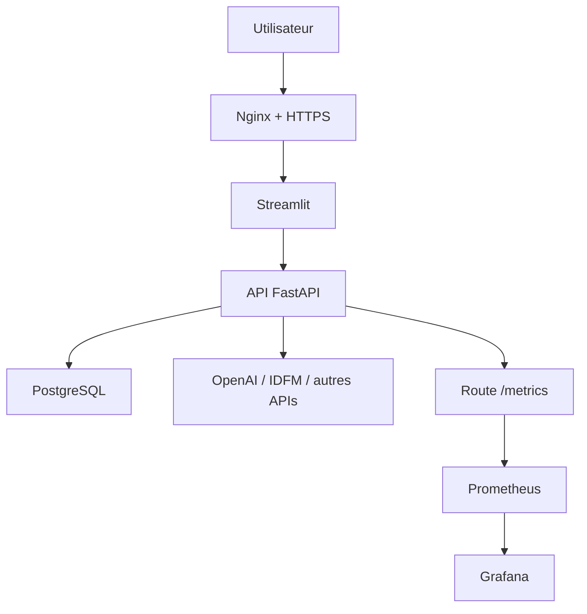

# Document mise en ligne VPS de l'application

## 1. Objectif du document

Ce document explique tout le processus que j'ai fait pour mettre mon
application en ligne sur un VPS.

Je parle du debut jusqu'a la fin :

- preparation du projet en local ;
- verification des donnees ;
- verification du modele IA ;
- preparation Docker ;
- mise sur GitHub ;
- GitHub Actions ;
- publication des images Docker ;
- preparation du VPS ;
- lancement avec Docker Compose ;
- configuration Nginx ;
- ajout du HTTPS ;
- monitoring avec Prometheus et Grafana ;
- commandes terminal utilisees.

L'application finale est en ligne ici :

```text
https://dvfvisionparis.fr
```

Le but etait de passer d'une application qui marche sur mon ordinateur a une
application disponible en ligne pour un utilisateur.

## 2. Resume simple de ce que j'ai fait

Au debut, l'application tournait seulement en local.

J'avais :

- une API FastAPI ;
- une interface Streamlit ;
- une base PostgreSQL ;
- des donnees DVF ;
- des annonces scrapees ;
- un modele IA de prediction ;
- des APIs externes comme IDFM et OpenAI ;
- des tests Python ;
- des fichiers Docker.

Pour la mettre en ligne, j'ai choisi d'utiliser :

- un VPS Ubuntu ;
- Docker ;
- Docker Compose ;
- GitHub Actions ;
- GitHub Container Registry ;
- Nginx ;
- Certbot pour HTTPS ;
- Prometheus et Grafana pour surveiller.

L'idee generale est :

1. je travaille en local ;
2. je pousse le code sur GitHub ;
3. GitHub Actions teste le projet ;
4. GitHub Actions construit les images Docker ;
5. GitHub Actions publie les images sur GitHub Container Registry ;
6. GitHub Actions se connecte au VPS en SSH ;
7. le VPS recupere les images Docker ;
8. Docker Compose relance les services ;
9. Nginx rend l'application accessible avec le domaine public.

## 3. Architecture finale en production

Sur le VPS, l'application tourne avec plusieurs services Docker.

| Service | Role | Adresse interne |
|---|---|---|
| `streamlit` | Interface utilisateur | `127.0.0.1:8501` |
| `api` | API FastAPI | `127.0.0.1:8002` |
| `database` | Base PostgreSQL | `127.0.0.1:5434` |
| `prometheus` | Collecte des metriques | `127.0.0.1:9090` |
| `grafana` | Tableaux de bord | `127.0.0.1:3000` |

Les visiteurs ne vont pas directement sur ces ports.

Ils vont sur :

```text
https://dvfvisionparis.fr
```

Ensuite Nginx redirige vers Streamlit.

## 4. Schema du fonctionnement



Dans ce schema :

- l'utilisateur arrive par le domaine ;
- Nginx gere l'acces public ;
- Streamlit affiche l'interface ;
- FastAPI traite les requetes ;
- PostgreSQL stocke les donnees ;
- Prometheus et Grafana servent a surveiller.

## 5. Preparation du projet en local

Avant de mettre en ligne, j'ai travaille dans le dossier du projet :

```bash
cd /Users/maleksilarbi/Documents/immobilier-paris-ia
```

J'ai verifie les fichiers importants :

```bash
ls
ls data/final
ls sql
ls monitoring
ls .github/workflows
```

Les fichiers importants pour la mise en ligne sont :

| Fichier | Role |
|---|---|
| `compose.yml` | Lancement local avec Docker. |
| `compose.prod.yml` | Lancement production sur le VPS. |
| `Dockerfile.api` | Image Docker de l'API. |
| `Dockerfile.streamlit` | Image Docker de Streamlit. |
| `requirements.txt` | Bibliotheques Python. |
| `sql/` | Scripts SQL pour la base. |
| `data/final/` | Donnees finales propres. |
| `monitoring/` | Prometheus et Grafana. |
| `.github/workflows/` | Workflows GitHub Actions. |

## 6. Donnees preparees pour la production

Les donnees finales sont dans :

```text
data/final/
```

Les fichiers importants sont :

| Fichier | Role |
|---|---|
| `dvf_paris_clean_2021_2025.csv` | Donnees DVF nettoyees. |
| `annonces_scraping_nettoyees_golden.csv` | Annonces scrapees nettoyees. |
| `commerces_paris_secours.json` | Donnees de secours pour les commerces. |

Ces fichiers sont utilises en production.

Le serveur ne refait pas tout le nettoyage au demarrage.
Il utilise les fichiers deja propres.

## 7. Scripts SQL prepares

Les scripts SQL sont dans :

```text
sql/
```

Les scripts importants sont :

| Fichier | Role |
|---|---|
| `creation_tables.sql` | Cree les tables DVF et scraping. |
| `import_dvf_docker.sql` | Importe les CSV dans PostgreSQL. |
| `creation_tables_utilisateurs.sql` | Cree les tables utilisateurs. |
| `requetes_analyse_DVF.sql` | Requetes d'analyse DVF. |
| `requetes_analyse_scraping.sql` | Requetes d'analyse scraping. |

Les tables principales sont :

- `dvf_paris_appartements` ;
- `source_data_scraping` ;
- `master_data_scraping` ;
- `golden_data_scraping` ;
- `users` ;
- `predictions` ;
- `exact_address_history`.

## 8. Tests locaux avant la mise en ligne

Avant de pousser sur GitHub, j'ai lance les tests.

Commandes :

```bash
python -m unittest discover -s tests -p "test_api.py" -v
python -m unittest discover -s tests -p "test_auth.py" -v
python -m unittest discover -s tests -p "test_streamlit_frontend.py" -v
python -m unittest discover -s tests -p "test_prediction.py" -v
python -m unittest discover -s tests -p "test_donnees_livraison.py" -v
```

Ces tests verifient :

- les routes API ;
- la connexion utilisateur ;
- les tokens JWT ;
- les routes admin ;
- la prediction du prix ;
- les donnees du modele ;
- le client Streamlit ;
- les erreurs possibles.

## 9. Verification Docker en local

J'ai verifie les fichiers Docker Compose.

Commandes :

```bash
docker compose -f compose.yml config
docker compose -f compose.prod.yml config
```

Ces commandes ne lancent pas l'application.
Elles verifient que les fichiers Compose sont corrects.

Ensuite, pour lancer en local :

```bash
docker compose up -d --build
docker compose ps
```

En local, les adresses sont :

- Streamlit : `http://localhost:8501` ;
- API : `http://localhost:8002` ;
- Prometheus : `http://localhost:9090` ;
- Grafana : `http://localhost:3000`.

## 10. Difference entre local et production

J'ai deux fichiers Compose.

`compose.yml` sert en local.
Il construit les images directement avec :

- `Dockerfile.api` ;
- `Dockerfile.streamlit`.

`compose.prod.yml` sert sur le VPS.
Il ne reconstruit pas les images.
Il recupere les images deja publiees dans GitHub Container Registry.

Exemple :

```yaml
image: ${REGISTRY:-ghcr.io}/${IMAGE_OWNER}/immobilier-paris-api:${IMAGE_TAG:-latest}
```

En production, les ports sont limites a `127.0.0.1`.

Exemples :

```text
127.0.0.1:8501
127.0.0.1:8002
127.0.0.1:5434
127.0.0.1:9090
127.0.0.1:3000
```

Cela evite d'exposer directement l'API, la base, Prometheus ou Grafana sur
Internet.

## 11. Mise sur GitHub

Quand le projet etait pret, j'ai pousse le code sur GitHub.

Commandes :

```bash
git status
git add .
git commit -m "prepare production deployment"
git push origin main
```

Le depot GitHub est :

```text
https://github.com/sabderma/immobilier-paris-ia.git
```

La branche principale est :

```text
main
```

Le `push` sur `main` declenche GitHub Actions.

## 12. GitHub Actions utilise

Les workflows sont dans :

```text
.github/workflows/
```

Les fichiers importants sont :

| Fichier | Role |
|---|---|
| `tests-application.yml` | Lance les tests de l'application. |
| `livraison-modele.yml` | Valide et livre le modele IA. |
| `livraison-application.yml` | Livre l'application complete. |

Le workflow principal pour la mise en ligne est :

```text
.github/workflows/livraison-application.yml
```

Il se lance sur :

- `push` sur `main` ;
- `pull_request` vers `main` ;
- lancement manuel avec `workflow_dispatch`.

## 13. Job 1 : tester l'application

Dans GitHub Actions, le premier job est :

```text
tester-application
```

Il utilise :

```text
runner : ubuntu-latest
```

Cela veut dire que GitHub lance les tests dans une machine Ubuntu propre.

Les commandes lancees sont :

```bash
python -m unittest discover -s tests -p "test_api.py" -v
python -m unittest discover -s tests -p "test_auth.py" -v
python -m unittest discover -s tests -p "test_streamlit_frontend.py" -v
```

Si ce job echoue, la livraison s'arrete.

## 14. Job 2 : valider le modele IA

Le deuxieme job est :

```text
valider-modele-ia
```

Il verifie les donnees puis entraine le modele.

Commandes importantes :

```bash
python -m unittest discover -s tests -p "test_donnees_livraison.py" -v
mkdir -p "$DOSSIER_LIVRAISON"
python -m src.prediction.entrainement_xgboost_prix \
  --input "$DONNEES_ENTRAINEMENT" \
  --output-model "$MODELE_LIVRE" \
  --output-metrics "$METRIQUES_LIVREES"
cp "$MODELE_LIVRE" models/xgboost_prix_dvf.joblib
cp "$METRIQUES_LIVREES" models/xgboost_prix_dvf_metrics.json
python -m unittest discover -s tests -p "test_prediction.py" -v
python scripts/generer_rapport_livraison_modele.py \
  --metrics "$METRIQUES_LIVREES" \
  --output "$RAPPORT_LIVRAISON" \
  --minimum-r2 0.80
```

Le seuil `R2` minimum est :

```text
0.80
```

Si le modele est trop mauvais, la livraison s'arrete.

## 15. Job 3 : construire et publier les images Docker

Le troisieme job est :

```text
construire-et-publier
```

Il commence seulement si :

- les tests application passent ;
- le modele IA est valide.

Il verifie d'abord Docker Compose :

```bash
docker compose -f compose.yml config
docker compose -f compose.prod.yml config
```

Ensuite, il construit deux images :

| Image | Fichier |
|---|---|
| API FastAPI | `Dockerfile.api` |
| Streamlit | `Dockerfile.streamlit` |

## 16. Image Docker de l'API

Le fichier :

```text
Dockerfile.api
```

construit l'image API.

Il fait :

- partir de `python:3.12-slim` ;
- installer `libgomp1` pour certaines bibliotheques IA ;
- installer `requirements.txt` ;
- copier `api/` ;
- copier `src/` ;
- copier `models/` ;
- copier le fichier de secours des commerces ;
- lancer un test de prediction pendant le build ;
- demarrer FastAPI avec Uvicorn.

Commande finale :

```bash
uvicorn api.main:app --host 0.0.0.0 --port 8000
```

## 17. Image Docker de Streamlit

Le fichier :

```text
Dockerfile.streamlit
```

construit l'image de l'interface.

Il fait :

- partir de `python:3.12-slim` ;
- installer les dependances ;
- copier `streamlit/` ;
- copier `src/` ;
- copier le GeoJSON des arrondissements ;
- lancer Streamlit.

Commande finale :

```bash
streamlit run app.py --server.address=0.0.0.0 --server.port=8501
```

## 18. Publication dans GitHub Container Registry

Les images sont publiees dans :

```text
ghcr.io
```

Images publiees :

```text
ghcr.io/sabderma/immobilier-paris-api:latest
ghcr.io/sabderma/immobilier-paris-api:<commit>
ghcr.io/sabderma/immobilier-paris-streamlit:latest
ghcr.io/sabderma/immobilier-paris-streamlit:<commit>
```

Le tag `latest` correspond a la derniere version validee.

Le tag `<commit>` permet de retrouver une version precise.

GitHub Actions utilise :

- `docker/setup-buildx-action@v3` ;
- `docker/login-action@v3` ;
- `docker/build-push-action@v6`.

## 19. Secrets GitHub pour le deploiement

Pour deployer sur le VPS, GitHub Actions utilise des secrets.

| Secret | Role |
|---|---|
| `DEPLOY_HOST` | Adresse du VPS. |
| `DEPLOY_USER` | Utilisateur SSH. |
| `DEPLOY_SSH_KEY` | Cle SSH privee. |
| `DEPLOY_PATH` | Dossier de production sur le VPS. |

J'ai aussi utilise la variable :

```text
DEPLOY_APPLICATION=true
```

Elle permet d'activer le deploiement automatique.

La connexion SSH est preparee avec :

```bash
mkdir -p ~/.ssh
printf '%s\n' "$DEPLOY_SSH_KEY" > ~/.ssh/deploy_key
chmod 600 ~/.ssh/deploy_key
ssh-keyscan -H "$DEPLOY_HOST" >> ~/.ssh/known_hosts
```

## 20. Preparation du VPS

Je me suis connecte au VPS avec SSH.

Commande :

```bash
ssh ubuntu@164.132.42.47
```

Ensuite, j'ai mis a jour le serveur :

```bash
sudo apt update
sudo apt upgrade -y
```

J'ai installe les outils necessaires :

```bash
sudo apt install -y docker.io docker-compose-plugin nginx certbot python3-certbot-nginx
```

J'ai active Docker et Nginx :

```bash
sudo systemctl enable --now docker
sudo systemctl enable --now nginx
```

J'ai ajoute l'utilisateur `ubuntu` au groupe Docker :

```bash
sudo usermod -aG docker ubuntu
```

Apres cette commande, il faut se reconnecter pour que le changement soit pris en
compte.

Verification :

```bash
docker --version
docker compose version
sudo systemctl status docker
sudo systemctl status nginx
```

## 21. Dossier de production sur le VPS

Le dossier de production est :

```text
/home/ubuntu/immobilier-paris-ia
```

Commandes :

```bash
mkdir -p /home/ubuntu/immobilier-paris-ia
cd /home/ubuntu/immobilier-paris-ia
```

Ce dossier contient :

- `compose.prod.yml` ;
- `sql/` ;
- `data/final/` ;
- `monitoring/` ;
- `.env`.

## 22. Fichier `.env` de production

Le fichier `.env` reste uniquement sur le VPS.

Commande :

```bash
nano /home/ubuntu/immobilier-paris-ia/.env
```

Exemple sans les vraies valeurs :

```env
DB_USER=postgres
DB_PASSWORD=mot_de_passe_fort
DB_NAME=immobilier_paris
API_KEY=cle_api_interne
JWT_SECRET_KEY=secret_jwt_long_et_fort
IDFM_API_KEY=cle_idfm
OPENAI_API_KEY=cle_openai
OPENAI_MODEL=gpt-5.4-mini
GRAFANA_ADMIN_PASSWORD=mot_de_passe_grafana
REGISTRY=ghcr.io
IMAGE_OWNER=sabderma
IMAGE_TAG=latest
```

Ce fichier ne doit pas etre envoye sur GitHub.

Il contient :

- les mots de passe ;
- les cles API ;
- les secrets JWT ;
- les variables de production.

## 23. Envoi des fichiers de production au VPS

GitHub Actions cree une archive avec les fichiers utiles :

```bash
tar --exclude='._*' --exclude='.DS_Store' -czf deploy-files.tar.gz \
  compose.prod.yml \
  sql \
  data/final \
  monitoring
```

Ensuite, l'archive est envoyee au VPS :

```bash
scp -i ~/.ssh/deploy_key deploy-files.tar.gz \
  "$DEPLOY_USER@$DEPLOY_HOST:/tmp/immobilier-paris-deploy-files.tar.gz"
```

Puis elle est extraite dans le dossier de production :

```bash
ssh -i ~/.ssh/deploy_key "$DEPLOY_USER@$DEPLOY_HOST" \
  "cd '$DEPLOY_PATH' && \
   tar -xzf /tmp/immobilier-paris-deploy-files.tar.gz && \
   find monitoring \( -name '._*' -o -name '.DS_Store' \) -delete && \
   rm /tmp/immobilier-paris-deploy-files.tar.gz"
```

Le fichier `.env` n'est pas envoye.
Il reste deja sur le VPS.

## 24. Lancement Docker sur le VPS

Une fois les fichiers presents, le VPS recupere les images Docker.

Commandes :

```bash
cd /home/ubuntu/immobilier-paris-ia
printf '%s\n' "$GHCR_TOKEN" | docker login ghcr.io -u sabderma --password-stdin
export REGISTRY=ghcr.io
export IMAGE_OWNER=sabderma
export IMAGE_TAG=latest
docker compose -f compose.prod.yml pull
docker compose -f compose.prod.yml up -d
docker compose -f compose.prod.yml ps
```

Explication :

| Commande | Role |
|---|---|
| `docker login ghcr.io` | Permet de lire les images GitHub. |
| `docker compose pull` | Recupere les nouvelles images. |
| `docker compose up -d` | Lance ou met a jour les conteneurs. |
| `docker compose ps` | Affiche l'etat des services. |

## 25. Import de la base PostgreSQL

Dans `compose.prod.yml`, PostgreSQL monte les scripts SQL et les CSV.

Au premier lancement, PostgreSQL execute les scripts dans :

```text
/docker-entrypoint-initdb.d/
```

Il cree les tables puis importe les donnees.

Fichiers montes :

- `sql/creation_tables.sql` ;
- `sql/import_dvf_docker.sql` ;
- `sql/creation_tables_utilisateurs.sql` ;
- `data/final/dvf_paris_clean_2021_2025.csv` ;
- `data/final/annonces_scraping_nettoyees_golden.csv`.

Point important : ces scripts se lancent automatiquement seulement quand le
volume PostgreSQL est cree pour la premiere fois.
Si le volume existe deja, PostgreSQL garde les donnees deja importees.

## 26. Verification des conteneurs

Pour verifier les services :

```bash
docker compose -f compose.prod.yml ps
```

Pour voir les logs :

```bash
docker compose -f compose.prod.yml logs -f
```

Pour voir seulement l'API :

```bash
docker compose -f compose.prod.yml logs -f api
```

Pour voir seulement Streamlit :

```bash
docker compose -f compose.prod.yml logs -f streamlit
```

Pour voir PostgreSQL :

```bash
docker compose -f compose.prod.yml logs -f database
```

## 27. Verification de l'API

Pour verifier que l'API fonctionne :

```bash
curl http://127.0.0.1:8002/health
```

Reponse attendue :

```json
{
  "status": "ok",
  "database": "connectee"
}
```

Pour verifier les commerces :

```bash
curl -H "X-API-Key: $API_KEY" http://127.0.0.1:8002/commerces/paris
```

Pour verifier quelques points DVF :

```bash
curl -H "X-API-Key: $API_KEY" "http://127.0.0.1:8002/dvf/points?limit=5"
```

## 28. Verification de PostgreSQL

Pour entrer dans PostgreSQL :

```bash
docker compose -f compose.prod.yml exec database psql -U "$DB_USER" -d "$DB_NAME"
```

Commandes SQL utiles :

```sql
\dt
SELECT COUNT(*) FROM dvf_paris_appartements;
SELECT COUNT(*) FROM golden_data_scraping;
SELECT COUNT(*) FROM users;
```

Cela permet de verifier que les tables existent et que les donnees sont bien
importees.

## 29. Configuration Nginx

Nginx sert a recevoir les visiteurs avec le domaine.

Commande :

```bash
sudo nano /etc/nginx/sites-available/dvfvisionparis.fr
```

Configuration type :

```nginx
server {
    listen 80;
    server_name dvfvisionparis.fr;

    location / {
        proxy_pass http://127.0.0.1:8501;
        proxy_http_version 1.1;
        proxy_set_header Upgrade $http_upgrade;
        proxy_set_header Connection "upgrade";
        proxy_set_header Host $host;
        proxy_set_header X-Forwarded-For $proxy_add_x_forwarded_for;
        proxy_set_header X-Forwarded-Proto $scheme;
    }
}
```

Activation :

```bash
sudo ln -s /etc/nginx/sites-available/dvfvisionparis.fr /etc/nginx/sites-enabled/dvfvisionparis.fr
sudo nginx -t
sudo systemctl reload nginx
```

La commande `nginx -t` verifie que la configuration est correcte.

## 30. HTTPS avec Certbot

Pour avoir HTTPS, j'ai utilise Certbot.

Commande :

```bash
sudo certbot --nginx -d dvfvisionparis.fr
```

Certbot installe un certificat Let's Encrypt.

Apres ca, le site est accessible avec :

```text
https://dvfvisionparis.fr
```

Verification :

```bash
curl -I https://dvfvisionparis.fr
```

## 31. Monitoring en production

Le VPS lance aussi :

- Prometheus ;
- Grafana.

Prometheus lit les metriques de l'API :

```text
http://api:8000/metrics
```

Les fichiers de monitoring sont :

| Fichier | Role |
|---|---|
| `monitoring/prometheus.yml` | Configuration Prometheus. |
| `monitoring/alerts.yml` | Alertes Prometheus. |
| `monitoring/grafana/provisioning/` | Configuration automatique de Grafana. |
| `monitoring/grafana/dashboards/` | Dashboards Grafana. |

Le monitoring permet de voir :

- si l'API repond ;
- si PostgreSQL est disponible ;
- si les erreurs 5xx augmentent ;
- si la latence augmente ;
- si le modele IA a des erreurs ;
- si OpenAI repond mal ;
- si l'application a un incident.

## 32. Verification du monitoring

Commandes utiles :

```bash
docker compose -f compose.prod.yml ps prometheus
docker compose -f compose.prod.yml ps grafana
docker compose -f compose.prod.yml logs -f prometheus
docker compose -f compose.prod.yml logs -f grafana
```

Pour verifier Prometheus :

```bash
curl http://127.0.0.1:9090/-/ready
```

Pour verifier les metriques API :

```bash
curl http://127.0.0.1:8002/metrics
```

## 33. Verification finale du site

Apres le deploiement, j'ai verifie le site :

```bash
curl -I https://dvfvisionparis.fr
```

Puis dans le navigateur :

```text
https://dvfvisionparis.fr
```

J'ai verifie :

- que Streamlit s'ouvre ;
- que l'API repond ;
- que la prediction fonctionne ;
- que les donnees DVF s'affichent ;
- que la carte fonctionne ;
- que la connexion utilisateur fonctionne ;
- que les analyses s'affichent ;
- que les logs ne montrent pas d'erreur bloquante.

## 34. Commandes de maintenance

Voir les services :

```bash
docker compose -f compose.prod.yml ps
```

Voir tous les logs :

```bash
docker compose -f compose.prod.yml logs -f
```

Redemarrer les services :

```bash
docker compose -f compose.prod.yml restart
```

Mettre a jour avec les dernieres images :

```bash
docker compose -f compose.prod.yml pull
docker compose -f compose.prod.yml up -d
```

Verifier Nginx :

```bash
sudo nginx -t
sudo systemctl reload nginx
sudo systemctl status nginx
```

## 35. Pourquoi Docker

J'ai utilise Docker parce que l'application a plusieurs parties.

Il y a :

- PostgreSQL ;
- FastAPI ;
- Streamlit ;
- Prometheus ;
- Grafana.

Docker Compose permet de lancer tout ensemble.

Cela evite d'installer chaque service a la main sur le VPS.

## 36. Pourquoi GitHub Actions

J'ai utilise GitHub Actions pour automatiser.

Avant de deployer, GitHub Actions verifie :

- les tests API ;
- les tests auth ;
- les tests Streamlit ;
- les donnees du modele ;
- le modele IA ;
- Docker Compose ;
- la construction des images.

Ensuite, GitHub Actions publie les images et met a jour le VPS.

Cela evite de faire toute la livraison manuellement a chaque fois.

## 37. Pourquoi Nginx

Nginx sert de porte d'entree publique.

Je n'expose pas directement Streamlit avec son port.

Le public utilise :

```text
https://dvfvisionparis.fr
```

Nginx redirige vers :

```text
http://127.0.0.1:8501
```

Nginx permet aussi d'utiliser Certbot pour le HTTPS.

## 38. Securite mise en place

J'ai fait plusieurs choix simples pour securiser :

- les ports internes restent sur `127.0.0.1` ;
- PostgreSQL n'est pas expose sur Internet ;
- l'API n'est pas exposee directement ;
- Prometheus et Grafana restent en local sur le VPS ;
- le fichier `.env` reste sur le VPS ;
- les secrets de deploiement sont dans GitHub Secrets ;
- HTTPS est active avec Certbot ;
- Streamlit appelle l'API avec une `API_KEY` ;
- les images Docker viennent de GHCR.

## 39. Resume complet du processus

Le processus complet est :

1. preparation du projet en local ;
2. nettoyage des donnees ;
3. preparation des scripts SQL ;
4. tests locaux ;
5. verification Docker Compose ;
6. push sur GitHub ;
7. lancement GitHub Actions ;
8. tests application ;
9. validation du modele IA ;
10. construction des images Docker ;
11. publication des images dans GHCR ;
12. connexion SSH au VPS ;
13. envoi de `compose.prod.yml`, `sql/`, `data/final/` et `monitoring/` ;
14. creation du fichier `.env` sur le VPS ;
15. `docker compose pull` ;
16. `docker compose up -d` ;
17. verification des conteneurs ;
18. configuration Nginx ;
19. installation HTTPS avec Certbot ;
20. verification du site ;
21. surveillance avec Prometheus et Grafana.

## 40. Conclusion

La mise en ligne de mon application s'est faite en plusieurs etapes.

Je n'ai pas juste lance Streamlit sur un serveur.
J'ai mis en place une vraie organisation :

- un VPS Ubuntu ;
- Docker Compose ;
- une base PostgreSQL ;
- une API FastAPI ;
- une interface Streamlit ;
- des images Docker publiees ;
- GitHub Actions pour automatiser ;
- Nginx pour le domaine ;
- HTTPS pour securiser ;
- Prometheus et Grafana pour surveiller.

Le resultat final est une application accessible en ligne :

```text
https://dvfvisionparis.fr
```

Cette organisation permet de refaire une livraison plus facilement quand le code
change.
