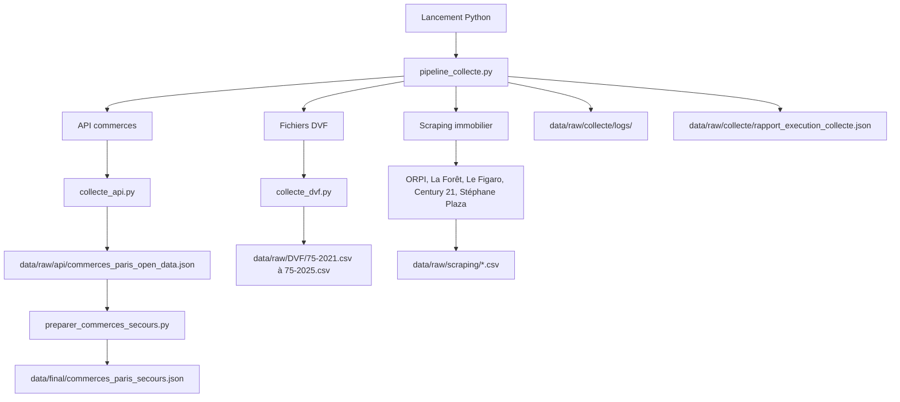

# Rapport compétence C1

## 1. Introduction

Dans cette compétence C1, le but est de montrer que je sais automatiser
l'extraction de données pour un projet en intelligence artificielle.

Dans mon projet, le sujet est l'immobilier à Paris. J'ai donc récupéré plusieurs
types de données :

- des annonces immobilières en ligne, avec du scraping ;
- des ventes réelles DVF, avec des fichiers CSV publics ;
- des données de commerces à Paris, avec une API REST open data.

J'ai choisi plusieurs sources parce que le projet ne doit pas dépendre d'une
seule donnée. Les annonces donnent une vision du marché affiché par les agences,
les DVF donnent une vision des ventes réelles, et les commerces donnent un peu
de contexte autour des quartiers.

Le langage utilisé est Python. Je l'ai choisi parce qu'il est adapté pour la
collecte de données, le traitement de fichiers CSV/JSON, les appels API, et
aussi parce qu'il est utilisé dans le reste du projet IA.

## 1.1 Technologies utilisées

Les technologies utilisées pour cette compétence sont :

- Python : langage principal pour automatiser la collecte ;
- API REST : utilisée pour récupérer les commerces depuis l'open data ;
- HTTP : utilisé pour faire les requêtes vers les sources externes ;
- CSV : format utilisé pour les données DVF et les annonces scrapées ;
- JSON : format utilisé pour la réponse API et les rapports d'exécution ;
- Selenium et Chrome : utilisés pour automatiser la navigation sur les sites
  immobiliers ;
- Git : utilisé pour versionner les scripts et garder l'historique.

J'ai choisi ces technologies car elles sont simples à utiliser dans un projet
data. Elles permettent aussi de relancer la collecte plus tard, au lieu de faire
les récupérations à la main.

## 2. Les fichiers Python de la C1

Les scripts de collecte sont dans le dossier :

`src/collecte/`

Ce dossier contient les fichiers qui servent à récupérer les données brutes.

| Fichier | Rôle dans la C1 |
| --- | --- |
| `src/collecte/pipeline_collecte.py` | Lance plusieurs scripts de collecte, garde les logs et crée un rapport JSON. |
| `src/collecte/main_scraping.py` | Point d'entrée simple pour lancer le pipeline. |
| `src/collecte/collecte_api.py` | Collecte les données commerces depuis une API REST. |
| `src/collecte/collecte_dvf.py` | Télécharge ou vérifie les fichiers DVF de Paris. |
| `src/collecte/preparer_commerces_secours.py` | Prépare un fichier local de secours à partir de la collecte API. |
| `src/collecte/scrapporpi.py` | Scrape les annonces ORPI. |
| `src/collecte/scrappforet.py` | Scrape les annonces La Forêt. |
| `src/collecte/scrapplefigaro.py` | Scrape les annonces Le Figaro Immobilier. |
| `src/collecte/scrappcentury21.py` | Scrape les annonces Century 21. |
| `src/collecte/scrappstephaneplazaimmobilier.py` | Scrape les annonces Stéphane Plaza Immobilier. |

## 3. Schéma général de la collecte



## 4. Sources utilisées et pourquoi

### 4.1 API Open Data Ile-de-France - commerces

Source :

`https://data.iledefrance.fr/api/explore/v2.1/catalog/datasets/les-commerces-par-commune-ou-arrondissement-base-permanente-des-equipements/records`

Fichier concerné :

`src/collecte/collecte_api.py`

Pourquoi j'ai choisi cette source :

- c'est une source open data ;
- elle fournit des données structurées en JSON ;
- elle permet d'enrichir l'analyse immobilière avec des informations autour des
  commerces ;
- l'API REST est facile à appeler avec Python.

Ce que le script fait :

- il prépare les paramètres de requête ;
- il filtre sur le département 75 ;
- il appelle l'API avec `requests.get()` ;
- il vérifie que l'API répond correctement ;
- il sauvegarde la réponse brute dans un fichier JSON.

Fichier produit :

`data/raw/api/commerces_paris_open_data.json`

J'ai choisi de garder ce fichier dans `data/raw/api/` parce que c'est une donnée
brute, directement récupérée depuis l'API, sans nettoyage important.

### 4.2 Fichiers DVF - ventes immobilières réelles

Source :

`https://files.data.gouv.fr/geo-dvf/latest/csv/{annee}/departements/75.csv.gz`

Exemple pour une année :

`https://files.data.gouv.fr/geo-dvf/latest/csv/2024/departements/75.csv.gz`

Fichier concerné :

`src/collecte/collecte_dvf.py`

Pourquoi j'ai choisi cette source :

- les DVF sont des données publiques officielles ;
- elles donnent les ventes réelles, pas seulement les prix affichés ;
- elles sont utiles pour entraîner ou comparer un modèle de prix immobilier ;
- elles sont disponibles par année et par département.

Ce que le script fait :

- il construit l'URL du fichier DVF selon l'année ;
- il télécharge le fichier `.csv.gz` ;
- il décompresse le fichier ;
- il sauvegarde un CSV normal ;
- il vérifie que les colonnes importantes existent ;
- il écrit un rapport JSON avec le statut des fichiers.

Fichiers produits :

- `data/raw/DVF/75-2021.csv`
- `data/raw/DVF/75-2022.csv`
- `data/raw/DVF/75-2023.csv`
- `data/raw/DVF/75-2024.csv`
- `data/raw/DVF/75-2025.csv`
- `data/raw/collecte/rapport_dvf.json`

J'ai stocké les CSV dans `data/raw/DVF/` parce que ce sont les fichiers de base,
avant nettoyage. Je garde une année par fichier pour pouvoir contrôler plus
facilement les données.

### 4.3 Sites immobiliers scrapés

J'ai aussi collecté des annonces immobilières depuis plusieurs sites. Le but est
d'avoir des prix affichés par les agences, pour comparer avec les prix DVF et
avoir une vision plus proche du marché visible par un utilisateur.

Les sources sont :

| Site | Lien utilisé | Script |
| --- | --- | --- |
| ORPI | `https://www.orpi.com/recherche/buy?transaction=buy&realEstateTypes%5B0%5D=maison&realEstateTypes%5B1%5D=appartement&locations%5B0%5D%5Bvalue%5D=paris` | `src/collecte/scrapporpi.py` |
| La Forêt | `https://www.laforet.com/acheter/rechercher?filter%5Btypes%5D%5B%5D=house&filter%5Btypes%5D%5B%5D=apartment&filter%5Bcities%5D%5B%5D=&filter%5Bcities%5D%5B%5D=75056&filter%5Barea%5D=&filter%5Bmin%5D=&filter%5Bmax%5D=&filter%5Bsurface%5D=0` | `src/collecte/scrappforet.py` |
| Le Figaro Immobilier | `https://immobilier.lefigaro.fr/annonces/immobilier-vente-maison-paris.html?types=villa,chalet,appartement,duplex` | `src/collecte/scrapplefigaro.py` |
| Century 21 | `https://www.century21.fr/annonces/f/achat-maison-appartement/v-paris/` | `src/collecte/scrappcentury21.py` |
| Stéphane Plaza Immobilier | `https://www.stephaneplazaimmobilier.com/acheter/departement/paris_75/appartement,maison/` | `src/collecte/scrappstephaneplazaimmobilier.py` |

Pourquoi j'ai choisi ces sources :

- elles sont connues dans l'immobilier ;
- elles ont beaucoup d'annonces ;
- elles permettent de récupérer des champs comme le prix, la surface, le nombre
  de pièces et la localisation ;
- elles complètent les DVF, parce que les DVF montrent les ventes réelles alors
  que les sites montrent les annonces publiées.

Fichiers produits :

- `data/raw/scraping/annonces_orpi_paris.csv`
- `data/raw/scraping/annonces_laforet_paris_complet.csv`
- `data/raw/scraping/annonces_lefigaro_paris.csv`
- `data/raw/scraping/annonces_century21_paris.csv`
- `data/raw/scraping/annonces_plaza_paris.csv`

J'ai stocké chaque site dans son propre CSV pour ne pas tout mélanger dès le
début. Comme ça, si un site change ou donne des données différentes, je peux
voir facilement quel fichier pose problème.

## 5. Contraintes techniques des sources

### 5.1 Contraintes de l'API commerces

L'API peut avoir plusieurs contraintes :

- elle dépend d'une connexion internet ;
- elle peut être lente ou indisponible ;
- elle peut renvoyer une erreur HTTP ;
- elle peut limiter le nombre de résultats ;
- son format JSON peut changer dans le futur.

Pour gérer ça, le script utilise :

- un timeout pour ne pas bloquer trop longtemps ;
- `response.raise_for_status()` pour arrêter le script si l'API répond mal ;
- un fichier JSON brut qui garde aussi l'URL, les paramètres et le code HTTP.

### 5.2 Contraintes des fichiers DVF

Les fichiers DVF ont aussi des contraintes :

- les fichiers sont compressés en `.gz` ;
- les fichiers peuvent être lourds ;
- les colonnes peuvent changer selon la source ;
- il faut vérifier que le fichier téléchargé est utilisable ;
- il faut garder les années séparées pour éviter de tout perdre si une année a
  un problème.

Pour gérer ça, le script :

- télécharge le fichier compressé ;
- le décompresse ;
- compte les lignes ;
- vérifie les colonnes attendues ;
- écrit un rapport `rapport_dvf.json`.

### 5.3 Contraintes du scraping

Le scraping est la partie la plus fragile, parce que les sites web changent.

Les contraintes principales sont :

- les pages utilisent du JavaScript ;
- il faut parfois accepter les cookies ;
- les cartes d'annonces ne sont pas toujours chargées directement ;
- les sélecteurs HTML peuvent changer ;
- les sites peuvent bloquer ou ralentir les robots ;
- la pagination peut changer ;
- certaines annonces n'ont pas toutes les informations.

Pour gérer ça, les scripts utilisent :

- Selenium pour contrôler Chrome ;
- `WebDriverWait` pour attendre les éléments ;
- des valeurs par défaut comme `"non disponible"` si une information manque ;
- des pauses avec `time.sleep()` quand il faut laisser la page charger ;
- une limite de pages pour éviter une boucle infinie.

### 5.4 Contraintes de confidentialité et RGPD

Dans cette collecte, je fais attention à ne pas récupérer des données inutiles.
Les scripts gardent surtout des informations de biens immobiliers : prix,
surface, nombre de pièces, localisation et détails de l'annonce.

Je ne collecte pas volontairement de nom de propriétaire, numéro de téléphone ou
adresse personnelle complète. Pour les DVF, les données viennent d'une source
publique. Pour les annonces, je garde seulement les champs utiles pour l'analyse
du marché immobilier.

## 6. Bibliothèques Python utilisées

### 6.1 `pipeline_collecte.py`

Bibliothèques :

- `argparse` : pour lancer le script avec des options comme `--only`,
  `--skip`, `--dry-run`.
- `json` : pour écrire le rapport d'exécution.
- `subprocess` : pour lancer les autres scripts Python.
- `sys` : pour récupérer l'interpréteur Python utilisé.
- `dataclasses` : pour organiser les informations des étapes.
- `datetime` : pour dater les logs et les rapports.
- `pathlib` : pour gérer les chemins de fichiers proprement.

Pourquoi :

Ce fichier doit organiser toute la collecte. Il ne récupère pas directement les
données, mais il lance les bons scripts et garde une trace de ce qui s'est passé.

### 6.2 `collecte_api.py`

Bibliothèques :

- `requests` : pour appeler l'API REST.
- `json` : pour écrire le fichier brut.
- `argparse` : pour choisir les options de lancement.
- `datetime` : pour dater la collecte.
- `pathlib` : pour écrire dans le bon dossier.
- `typing` : pour clarifier les types de données.

Pourquoi :

`requests` est simple pour faire un appel HTTP. Comme l'API renvoie du JSON,
`json` sert à sauvegarder la réponse de manière lisible.

### 6.3 `collecte_dvf.py`

Bibliothèques :

- `requests` : pour télécharger les fichiers depuis data.gouv.fr.
- `gzip` : pour lire les fichiers compressés `.gz`.
- `shutil` : pour copier le contenu décompressé vers le CSV final.
- `tempfile` : pour écrire d'abord dans un fichier temporaire.
- `json` : pour écrire le rapport DVF.
- `argparse` : pour choisir les années à télécharger.
- `dataclasses` : pour structurer le résultat d'une année.
- `datetime` : pour dater le rapport.
- `pathlib` : pour gérer les dossiers et fichiers.

Pourquoi :

Les DVF arrivent sous forme compressée, donc il faut gérer le téléchargement et
la décompression. Le fichier temporaire évite d'avoir un CSV incomplet si le
téléchargement coupe.

### 6.4 Scripts de scraping

Scripts concernés :

- `scrapporpi.py`
- `scrappforet.py`
- `scrapplefigaro.py`
- `scrappcentury21.py`
- `scrappstephaneplazaimmobilier.py`

Bibliothèques :

- `selenium.webdriver` : pour ouvrir Chrome et naviguer sur les sites.
- `Options` : pour configurer le navigateur.
- `By` : pour chercher des éléments HTML avec des sélecteurs CSS ou XPath.
- `WebDriverWait` : pour attendre que les annonces soient chargées.
- `expected_conditions` : pour attendre un bouton ou une liste d'annonces.
- `NoSuchElementException` et `TimeoutException` : pour gérer les éléments non
  trouvés ou les chargements trop longs.
- `csv` : pour écrire les annonces dans des fichiers CSV.
- `time` : pour attendre entre les actions.
- `re` : pour extraire une surface ou un nombre de pièces dans un texte.

Pourquoi :

J'ai utilisé Selenium parce que les sites immobiliers ne donnent pas toujours
les annonces directement dans un HTML simple. Avec Selenium, je peux ouvrir un
vrai navigateur, accepter les cookies, scroller et cliquer sur la page suivante.

### 6.5 `preparer_commerces_secours.py`

Bibliothèques :

- `json` : pour lire la collecte brute et écrire le fichier final.
- `argparse` : pour choisir les fichiers d'entrée et sortie.
- `datetime` : pour dater le snapshot.
- `pathlib` : pour manipuler les chemins.
- `typing` : pour rendre le code plus clair.

Pourquoi :

Ce script n'est pas la collecte principale, mais il prépare un fichier de secours
utilisé par l'application si l'API externe ne répond pas.

## 7. Où sont stockés les fichiers et pourquoi

### 7.1 Données brutes API

Dossier :

`data/raw/api/`

Fichier :

`data/raw/api/commerces_paris_open_data.json`

Pourquoi :

Je garde ici la réponse brute de l'API. Le but est de pouvoir prouver que la
donnée vient bien de la source externe, sans modification directe.

### 7.2 Données brutes DVF

Dossier :

`data/raw/DVF/`

Fichiers :

- `75-2021.csv`
- `75-2022.csv`
- `75-2023.csv`
- `75-2024.csv`
- `75-2025.csv`

Pourquoi :

Les fichiers DVF sont stockés par année pour faciliter le contrôle. Si une année
a un problème, je peux la retélécharger sans toucher aux autres.

### 7.3 Données brutes de scraping

Dossier :

`data/raw/scraping/`

Fichiers :

- `annonces_orpi_paris.csv`
- `annonces_laforet_paris_complet.csv`
- `annonces_lefigaro_paris.csv`
- `annonces_century21_paris.csv`
- `annonces_plaza_paris.csv`

Pourquoi :

Chaque site a son propre fichier parce que les sites n'ont pas exactement les
mêmes formats. C'est plus simple pour vérifier et nettoyer après.

### 7.4 Logs et rapports de collecte

Dossier :

`data/raw/collecte/`

Fichiers importants :

- `data/raw/collecte/rapport_execution_collecte.json`
- `data/raw/collecte/rapport_dvf.json`
- `data/raw/collecte/logs/`

Pourquoi :

Les logs et rapports servent de preuve d'exécution. On peut voir quel script a
été lancé, à quel moment, avec quel statut, et vers quel fichier de sortie.

### 7.5 Fichier final de secours

Dossier :

`data/final/`

Fichier :

`data/final/commerces_paris_secours.json`

Pourquoi :

Ce fichier n'est pas une donnée brute. Il sert à l'application pour continuer à
fonctionner si l'API commerces est indisponible. Je l'ai donc mis dans
`data/final/`.

## 8. Comment lancer les scripts avec Python

Avant de lancer les scripts, il faut se placer à la racine du projet :

```bash
cd /Users/maleksilarbi/Documents/immobilier-paris-ia
```

Installer les dépendances principales :

```bash
python -m pip install -r requirements.txt
```

Pour les scripts de scraping, il faut aussi avoir Selenium et Chrome :

```bash
python -m pip install selenium
```

### 8.1 Lancer tout le pipeline en simulation

Cette commande vérifie les scripts prévus sans vraiment les exécuter :

```bash
python src/collecte/pipeline_collecte.py --dry-run
```

### 8.2 Lancer tout le pipeline réellement

```bash
python src/collecte/pipeline_collecte.py
```

Le pipeline va lancer les étapes définies dans `ETAPES_COLLECTE`, puis créer :

- des fichiers de données dans `data/raw/` ;
- des logs dans `data/raw/collecte/logs/` ;
- un rapport dans `data/raw/collecte/rapport_execution_collecte.json`.

### 8.3 Lancer seulement la collecte API

```bash
python src/collecte/pipeline_collecte.py --only api_commerces
```

Ou directement :

```bash
python src/collecte/collecte_api.py --limit 20
```

### 8.4 Lancer seulement la collecte DVF

```bash
python src/collecte/pipeline_collecte.py --only dvf
```

Ou directement :

```bash
python src/collecte/collecte_dvf.py --years 2021 2022 2023 2024 2025
```

### 8.5 Lancer seulement un scraper

Exemple ORPI :

```bash
python src/collecte/scrapporpi.py
```

Exemple Le Figaro :

```bash
python src/collecte/scrapplefigaro.py
```

Même principe pour les autres scripts :

```bash
python src/collecte/scrappforet.py
python src/collecte/scrappcentury21.py
python src/collecte/scrappstephaneplazaimmobilier.py
```

### 8.6 Continuer même si une source échoue

Si un site bloque ou si une API répond mal, je peux continuer les autres
collectes :

```bash
python src/collecte/pipeline_collecte.py --continue-on-error
```

### 8.7 Lancer seulement certaines sources

Exemple avec API et DVF seulement :

```bash
python src/collecte/pipeline_collecte.py --only api_commerces dvf
```

Exemple pour éviter les scrapers :

```bash
python src/collecte/pipeline_collecte.py --skip orpi laforet lefigaro century21 stephaneplaza
```

## 9. Fonctionnement détaillé du pipeline

Le fichier `pipeline_collecte.py` contient une liste appelée `ETAPES_COLLECTE`.
Dans cette liste, chaque étape indique :

- le nom de la collecte ;
- le type de collecte ;
- le script Python à lancer ;
- le fichier ou dossier de sortie attendu ;
- le format de sortie.

Ensuite, le pipeline :

1. lit les options de lancement ;
2. choisit les scripts à lancer ;
3. lance chaque script avec Python ;
4. écrit un log pour chaque script ;
5. enregistre le statut `ok` ou `erreur` ;
6. crée un rapport JSON final.

Ce système est utile parce que je peux montrer que la collecte n'est pas juste
faite à la main. Elle est automatisée avec un point de lancement.

## 10. Preuve que les scripts sont versionnés avec Git

Le projet est dans un dépôt Git. Les scripts C1 sont suivis par Git.

Commande pour le vérifier :

```bash
git ls-files src/collecte
```

Cette commande retourne les fichiers de collecte :

```text
src/collecte/collecte_api.py
src/collecte/collecte_dvf.py
src/collecte/main_scraping.py
src/collecte/pipeline_collecte.py
src/collecte/preparer_commerces_secours.py
src/collecte/scrappcentury21.py
src/collecte/scrappforet.py
src/collecte/scrapplefigaro.py
src/collecte/scrapporpi.py
src/collecte/scrappstephaneplazaimmobilier.py
```

Le dépôt distant configuré est :

```text
https://github.com/sabderma/immobilier-paris-ia.git
```

Commande pour vérifier le dépôt distant :

```bash
git remote -v
```

Commande pour voir la branche :

```bash
git branch --show-current
```

Dans mon cas, la branche utilisée est :

```text
main
```

Pour montrer au jury que le travail est bien versionné, je peux aussi faire une
capture de la page GitHub ou montrer l'historique avec :

```bash
git log -- src/collecte
```

## 11. Conclusion personnelle

Pour moi, cette compétence C1 montre que j'ai automatisé la récupération des
données utiles au projet. J'ai utilisé plusieurs types de sources : API REST,
fichiers CSV publics et scraping web.

Les données ne sont pas juste copiées à la main. Elles sont récupérées avec des
scripts Python, stockées dans des dossiers précis, et le pipeline garde des logs
et des rapports. Cela permet de refaire la collecte, de vérifier les erreurs, et
de garder une trace propre pour le projet.

Il reste quand même une limite : les scrapers dépendent beaucoup des sites web.
Si un site change son HTML, il faudra peut-être adapter les sélecteurs. Mais
c'est normal dans un projet de scraping, et c'est pour ça que je garde les CSV
séparés par source.
