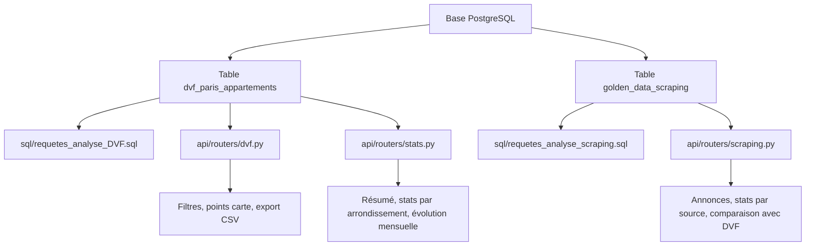

# Rapport compétence C2

## 1. Introduction

Dans la compétence C2, le but est de montrer que je sais écrire des requêtes SQL
pour extraire, contrôler et analyser des données stockées en base.

Dans mon projet immobilier Paris IA, j'ai utilisé SQL pour travailler sur deux
grandes familles de données :

- les données DVF, qui représentent les ventes réelles d'appartements à Paris ;
- les données issues du scraping, qui représentent les annonces immobilières
  récupérées sur les sites d'agences.

Dans ce rapport, je parle seulement de ce que j'ai fait pour la C2 : requêtes
SQL, filtres, conditions, extractions, contrôles et requêtes utilisées dans
l'API.

## 1.1 Pourquoi PostgreSQL et pas un système big data

Pour cette compétence, j'ai utilisé **PostgreSQL** comme système de base de
données principal.

Je n'ai pas utilisé un système big data comme Hadoop, Hive, Spark ou Impala,
parce que mon volume de données ne le nécessitait pas vraiment. Dans mon projet,
les données sont importantes pour un projet étudiant, mais elles restent encore
gérables dans une base relationnelle classique :

- les annonces scraping finales ont quelques milliers de lignes ;
- les données DVF finales ont environ 150 000 lignes ;
- les requêtes principales sont des filtres, des contrôles, des statistiques et
  des regroupements par arrondissement, année, source ou prix.

PostgreSQL est donc suffisant pour ce projet, car il permet :

- d'écrire des requêtes SQL propres ;
- d'utiliser `WHERE`, `GROUP BY`, `ORDER BY`, `COUNT`, `AVG`, `MIN`, `MAX` ;
- de calculer des médianes avec `PERCENTILE_CONT` ;
- de filtrer les données rapidement ;
- d'être utilisé directement par l'API FastAPI ;
- de lancer facilement les scripts SQL avec `psql`, Docker ou DBeaver.

J'ai aussi utilisé **DBeaver** pour ouvrir la base, visualiser les tables et
exécuter les requêtes SQL une par une. Pour moi, c'était plus pratique pour
vérifier les résultats, surtout quand je voulais voir les lignes suspectes avant
de supprimer ou corriger quelque chose.

Le big data aurait été plus utile si le projet avait eu des millions ou des
milliards de lignes, ou si les données venaient en flux massif. Ici, le besoin
était surtout de faire des requêtes SQL fiables sur une base bien structurée.
Donc PostgreSQL avec DBeaver correspondait mieux au niveau réel du projet.

## 2. Fichiers concernés par la C2

Les fichiers SQL principaux sont stockés dans le dossier :

`sql/`

Les fichiers principaux de la C2 sont :

| Fichier | Rôle |
| --- | --- |
| `sql/requetes_analyse_DVF.sql` | Requêtes SQL pour contrôler les données DVF. |
| `sql/requetes_analyse_scraping.sql` | Requêtes SQL pour contrôler les données issues du scraping. |

Il y a aussi des requêtes SQL dans l'API. Ces requêtes servent à extraire les
données depuis PostgreSQL pour les envoyer vers l'application :

| Fichier API | Rôle |
| --- | --- |
| `api/core.py` | Construit les clauses `WHERE` et exécute les requêtes SQL. |
| `api/routers/dvf.py` | Requêtes SQL pour les données DVF et l'export CSV. |
| `api/routers/scraping.py` | Requêtes SQL pour les annonces scrapées et les statistiques scraping. |
| `api/routers/stats.py` | Requêtes SQL pour les statistiques DVF. |

Ces fichiers sont importants parce qu'ils montrent que les données ne sont pas
juste stockées. Elles sont vraiment interrogées avec SQL selon des critères :
prix, surface, arrondissement, année, nombre de pièces, source, etc.

## 3. Schéma simple de la C2



## 4. Table DVF utilisée

La table principale pour les ventes réelles est :

`dvf_paris_appartements`

Cette table contient les ventes immobilières réelles à Paris. Les requêtes C2
utilisent surtout ces colonnes :

- `id_mutation` : identifiant de la vente ;
- `date_mutation` : date de la vente ;
- `annee_vente` : année de la vente ;
- `mois_vente` : mois de la vente ;
- `valeur_fonciere` : prix de vente total ;
- `prix_m2` : prix au mètre carré ;
- `surface_reelle_bati` : surface du logement ;
- `nombre_pieces_principales` : nombre de pièces ;
- `code_postal` : code postal ;
- `arrondissement` : arrondissement parisien ;
- `longitude` et `latitude` : coordonnées géographiques.

J'ai utilisé cette table pour extraire les ventes, faire des contrôles qualité,
calculer des statistiques, et filtrer les données selon les besoins de
l'application.

## 5. Table scraping utilisée

La table principale pour les annonces immobilières est :

`golden_data_scraping`

Cette table contient les annonces propres et exploitables après la collecte et le
nettoyage. Les requêtes C2 utilisent surtout ces colonnes :

- `id` : identifiant de l'annonce ;
- `source` : site d'origine de l'annonce ;
- `type` : type de bien ;
- `prix` : prix affiché ;
- `surface` : surface du bien ;
- `nb_pieces` : nombre de pièces ;
- `localisation` : code postal ou localisation ;
- `prix_m2` : prix au mètre carré ;
- `date_scraping` : date de récupération de l'annonce.

J'ai utilisé cette table pour extraire les annonces, vérifier les valeurs
incohérentes, produire des statistiques, et comparer les prix affichés avec les
prix DVF.

## 6. Requêtes du fichier `requetes_analyse_DVF.sql`

Ce fichier travaille uniquement sur la table :

`dvf_paris_appartements`

Il sert à contrôler la qualité des données DVF. Les requêtes utilisent surtout
`SELECT`, `FROM`, `WHERE`, `COUNT`, `UNION ALL` et `NULLIF`.

### 6.1 Contrôle du prix au mètre carré

Requête utilisée :

```sql
SELECT *
FROM dvf_paris_appartements
WHERE prix_m2 < 2000
   OR prix_m2 > 40000;
```

Ce que ça fait :

- `SELECT *` récupère toutes les colonnes des lignes suspectes ;
- `FROM dvf_paris_appartements` indique la table interrogée ;
- `WHERE` filtre seulement les ventes avec un prix au m² trop bas ou trop haut ;
- `OR` permet de garder les deux cas : trop bas ou trop haut.

Pourquoi je l'ai fait :

À Paris, un prix au m² inférieur à 2 000 euros ou supérieur à 40 000 euros est
suspect pour ce projet. Cette requête permet donc de repérer les ventes qui
peuvent fausser les statistiques.

### 6.2 Contrôle des surfaces

Requête utilisée :

```sql
SELECT *
FROM dvf_paris_appartements
WHERE surface_reelle_bati < 9
   OR surface_reelle_bati > 300;
```

Ce que ça fait :

- elle extrait les logements avec une surface trop petite ou trop grande ;
- le filtre `< 9` sert à trouver les surfaces très basses ;
- le filtre `> 300` sert à trouver les biens très rares ou peut-être mal
  renseignés.

Pourquoi je l'ai fait :

Une surface incohérente peut déranger l'entraînement du modèle ou les graphiques.
Donc je préfère repérer ces lignes avant d'utiliser les données.

### 6.3 Contrôle du prix total

Requête utilisée :

```sql
SELECT *
FROM dvf_paris_appartements
WHERE valeur_fonciere < 50000
   OR valeur_fonciere > 5000000;
```

Ce que ça fait :

- elle récupère les ventes avec un prix total anormal ;
- `valeur_fonciere` représente le prix de vente ;
- les conditions cherchent les ventes très basses ou très hautes.

Pourquoi je l'ai fait :

Ces ventes peuvent être des erreurs, des cas très particuliers, ou des données
qui ne correspondent pas au type de bien visé.

### 6.4 Contrôle du nombre de pièces

Requête utilisée :

```sql
SELECT *,
       surface_reelle_bati / NULLIF(nombre_pieces_principales, 0) AS surface_par_piece
FROM dvf_paris_appartements
WHERE nombre_pieces_principales <= 0
   OR surface_reelle_bati / NULLIF(nombre_pieces_principales, 0) < 8
   OR surface_reelle_bati / NULLIF(nombre_pieces_principales, 0) > 80;
```

Ce que ça fait :

- `SELECT *` récupère la ligne complète ;
- le calcul `surface_reelle_bati / nombre_pieces_principales` calcule la surface
  moyenne par pièce ;
- `AS surface_par_piece` donne un nom clair à ce calcul ;
- `NULLIF(nombre_pieces_principales, 0)` évite une division par zéro ;
- le `WHERE` cherche les lignes avec 0 pièce, ou une surface par pièce trop
  faible ou trop grande.

Pourquoi je l'ai fait :

Si un appartement de 50 m² a 0 pièce, ce n'est pas logique. Si une pièce fait 2
m² ou 200 m², c'est aussi suspect. Cette requête permet donc de contrôler la
cohérence entre la surface et le nombre de pièces.

### 6.5 Contrôle des coordonnées manquantes

Requête utilisée :

```sql
SELECT *
FROM dvf_paris_appartements
WHERE latitude IS NULL
   OR longitude IS NULL;
```

Ce que ça fait :

- elle extrait les ventes sans latitude ou sans longitude ;
- `IS NULL` sert à détecter les valeurs manquantes.

Pourquoi je l'ai fait :

Dans l'application, les ventes peuvent être affichées sur une carte. Si une
vente n'a pas de coordonnées, elle devient difficile à utiliser pour la partie
géographique.

### 6.6 Contrôle des coordonnées hors Paris

Requête utilisée :

```sql
SELECT *
FROM dvf_paris_appartements
WHERE latitude NOT BETWEEN 48.80 AND 48.90
   OR longitude NOT BETWEEN 2.20 AND 2.45;
```

Ce que ça fait :

- `BETWEEN` sert à vérifier une plage de valeurs ;
- `NOT BETWEEN` repère les coordonnées en dehors de cette plage ;
- les bornes choisies correspondent à une zone autour de Paris.

Pourquoi je l'ai fait :

Le projet concerne Paris. Donc si une vente est placée loin de Paris, je dois le
savoir, car cela peut être une erreur de donnée ou de géolocalisation.

### 6.7 Résumé global des anomalies DVF

Le fichier contient aussi une requête avec plusieurs `SELECT COUNT(*)` reliés
par `UNION ALL`.

Ce que ça fait :

- chaque `SELECT` compte un type d'anomalie ;
- `COUNT(*)` compte le nombre de lignes concernées ;
- `AS type_anomalie` donne un nom à chaque type de contrôle ;
- `UNION ALL` regroupe les résultats dans un seul tableau.

Pourquoi je l'ai fait :

Au lieu de regarder chaque anomalie séparément, cette requête donne une synthèse
rapide. Cela permet de voir si le problème principal vient des prix, des
surfaces, des coordonnées ou du nombre de pièces.

## 7. Requêtes du fichier `requetes_analyse_scraping.sql`

Ce fichier travaille uniquement sur la table :

`golden_data_scraping`

Il sert à contrôler les annonces récupérées par scraping. Il contient une partie
avec des `SELECT` pour afficher les lignes suspectes, puis une partie avec des
`DELETE` pour supprimer les lignes incohérentes.

Pour la C2, la partie la plus importante est la partie extraction et contrôle
avec `SELECT`. Les `DELETE` montrent aussi que les requêtes peuvent servir à
nettoyer, mais je garde l'explication centrée sur les contrôles.

### 7.1 Contrôle des prix d'annonces

Requête utilisée :

```sql
SELECT *
FROM golden_data_scraping
WHERE prix < 50000
   OR prix > 10000000;
```

Ce que ça fait :

- elle extrait les annonces avec un prix trop faible ou trop élevé ;
- `prix < 50000` repère les biens très bas ;
- `prix > 10000000` repère les biens très chers ou possiblement faux.

Pourquoi je l'ai fait :

Les annonces avec des prix extrêmes peuvent fausser les moyennes et les
graphiques. Je les contrôle donc avant de les exploiter.

### 7.2 Contrôle des surfaces d'annonces

Requête utilisée :

```sql
SELECT *
FROM golden_data_scraping
WHERE surface < 9
   OR surface > 500;
```

Ce que ça fait :

- elle récupère les annonces avec une surface trop petite ou trop grande ;
- elle permet de repérer les erreurs de scraping ou de format.

Pourquoi je l'ai fait :

Pendant le scraping, une surface peut être mal lue si le texte du site change.
Cette requête aide à détecter ce genre d'erreur.

### 7.3 Contrôle du prix au m² des annonces

Requête utilisée :

```sql
SELECT *
FROM golden_data_scraping
WHERE prix_m2 < 2000
   OR prix_m2 > 50000;
```

Ce que ça fait :

- elle extrait les annonces avec un prix au m² incohérent ;
- `WHERE` garde seulement les lignes en dehors des bornes définies.

Pourquoi je l'ai fait :

Le prix au m² est une donnée importante dans l'immobilier. Si cette valeur est
fausse, les comparaisons entre annonces deviennent mauvaises.

### 7.4 Contrôle du nombre de pièces dans les annonces

Requête utilisée :

```sql
SELECT *,
       surface / NULLIF(nb_pieces, 0) AS surface_par_piece
FROM golden_data_scraping
WHERE nb_pieces <= 0
   OR surface / NULLIF(nb_pieces, 0) < 8
   OR surface / NULLIF(nb_pieces, 0) > 80;
```

Ce que ça fait :

- elle calcule la surface moyenne par pièce ;
- elle repère les annonces avec un nombre de pièces impossible ;
- elle évite la division par zéro avec `NULLIF`.

Pourquoi je l'ai fait :

Cette requête permet de vérifier que les informations récupérées dans les sites
sont logiques. Par exemple, 0 pièce ou une pièce trop grande peut montrer un
problème dans la donnée.

### 7.5 Résumé global des anomalies scraping

Comme pour DVF, le fichier utilise `UNION ALL` avec plusieurs `COUNT(*)`.

Ce que ça fait :

- compte les prix aberrants ;
- compte les surfaces aberrantes ;
- compte les prix au m² aberrants ;
- compte les nombres de pièces incohérents ;
- compte les localisations invalides.

Pourquoi je l'ai fait :

Cette requête donne une vue globale de la qualité des annonces. Elle aide à voir
ce qu'il faut corriger ou supprimer.

### 7.6 Requêtes `DELETE`

Le fichier contient ensuite des requêtes comme :

```sql
DELETE FROM golden_data_scraping
WHERE prix < 50000
   OR prix > 10000000;
```

Ce que ça fait :

- `DELETE FROM` supprime les lignes de la table ;
- `WHERE` limite la suppression aux lignes détectées comme incohérentes.

Pourquoi je l'ai fait :

Après avoir vérifié les lignes avec les `SELECT`, ces requêtes permettent de
retirer les lignes qui faussent l'analyse. Il faut les lancer avec prudence,
après avoir contrôlé les résultats.

## 8. Requêtes SQL dans l'API

En plus des fichiers `.sql`, j'ai aussi des requêtes SQL dans l'API FastAPI.
Ces requêtes permettent à l'application de demander les données à PostgreSQL.

Les requêtes sont lancées avec la fonction :

`lire_sql()`

Dans `api/core.py`, cette fonction utilise :

```python
pd.read_sql(text(query), engine, params=params or {})
```

Cela veut dire que l'API envoie une requête SQL à PostgreSQL, puis récupère le
résultat dans un DataFrame pandas.

## 9. Construction des clauses `WHERE` dans `api/core.py`

Dans `api/core.py`, j'ai deux fonctions importantes :

- `construire_where_dvf()`
- `construire_where_scraping()`

Leur rôle est de construire une clause `WHERE` selon les filtres envoyés par
l'utilisateur dans l'application.

### 9.1 `construire_where_dvf()`

Cette fonction prépare des conditions comme :

- `arrondissement = :arrondissement`
- `annee_vente = :annee_vente`
- `annee_vente >= :annee_min`
- `annee_vente <= :annee_max`
- `valeur_fonciere >= :prix_min`
- `valeur_fonciere <= :prix_max`
- `prix_m2 >= :prix_m2_min`
- `prix_m2 <= :prix_m2_max`
- `surface_reelle_bati >= :surface_min`
- `surface_reelle_bati <= :surface_max`
- `nombre_pieces_principales = :nombre_pieces`
- `code_postal = :code_postal`
- `latitude >= :min_lat`
- `latitude <= :max_lat`
- `longitude >= :min_lon`
- `longitude <= :max_lon`

Ce que ça permet :

- filtrer les ventes par année ;
- filtrer par arrondissement ;
- filtrer par prix ;
- filtrer par surface ;
- filtrer par nombre de pièces ;
- filtrer par zone géographique.

J'ai utilisé des paramètres comme `:prix_min` au lieu de mettre les valeurs
directement dans la requête. C'est mieux car la requête est plus propre et cela
évite de construire du SQL dangereux avec des valeurs collées directement.

### 9.2 `construire_where_scraping()`

Cette fonction prépare des conditions comme :

- `localisation = :localisation`
- `surface >= :surface_min`
- `surface <= :surface_max`
- `nb_pieces = :nombre_pieces`
- `source = :source`

Ce que ça permet :

- filtrer les annonces par arrondissement ;
- filtrer les annonces par surface ;
- filtrer les annonces par nombre de pièces ;
- filtrer les annonces par site d'origine.

Le `WHERE` commence par `1=1`. Ce n'est pas une vraie condition métier, mais ça
permet d'ajouter facilement des `AND` après, sans se demander si c'est la
première condition ou non.

## 10. Requêtes dans `api/routers/dvf.py`

Le fichier `api/routers/dvf.py` travaille sur :

`dvf_paris_appartements`

### 10.1 Route `/dvf/filtres`

Cette route utilise plusieurs requêtes.

Première requête :

```sql
SELECT
    MIN(annee_vente)::INTEGER AS annee_min,
    MAX(annee_vente)::INTEGER AS annee_max,
    MIN(valeur_fonciere)::FLOAT AS prix_min,
    MAX(valeur_fonciere)::FLOAT AS prix_max,
    MIN(prix_m2)::FLOAT AS prix_m2_min,
    MAX(prix_m2)::FLOAT AS prix_m2_max,
    MIN(surface_reelle_bati)::FLOAT AS surface_min,
    MAX(surface_reelle_bati)::FLOAT AS surface_max
FROM dvf_paris_appartements;
```

Ce que ça fait :

- `MIN` récupère la valeur minimale ;
- `MAX` récupère la valeur maximale ;
- `AS` renomme les colonnes pour l'API ;
- les conversions `::INTEGER` et `::FLOAT` forcent des formats simples pour le
  JSON.

Pourquoi je l'ai fait :

Cette requête sert à créer les filtres de l'application. Par exemple, elle donne
l'année minimale et maximale, le prix minimum et maximum, etc.

Autres requêtes :

```sql
SELECT DISTINCT arrondissement
FROM dvf_paris_appartements
ORDER BY arrondissement;
```

```sql
SELECT DISTINCT nombre_pieces_principales
FROM dvf_paris_appartements
ORDER BY nombre_pieces_principales;
```

Ce que ça fait :

- `DISTINCT` évite les doublons ;
- `ORDER BY` trie les valeurs ;
- ces requêtes donnent les listes disponibles pour les filtres.

### 10.2 Route `/dvf/points`

Cette route extrait les points à afficher sur une carte :

```sql
SELECT
    date_mutation::DATE::TEXT AS date_mutation,
    arrondissement,
    valeur_fonciere,
    prix_m2,
    surface_reelle_bati,
    nombre_pieces_principales,
    longitude,
    latitude
FROM dvf_paris_appartements
WHERE {where}
  AND longitude IS NOT NULL
  AND latitude IS NOT NULL
ORDER BY date_mutation DESC, id_mutation DESC
LIMIT :limit;
```

Ce que ça fait :

- `SELECT` choisit seulement les colonnes utiles pour la carte ;
- `WHERE {where}` applique les filtres choisis par l'utilisateur ;
- `longitude IS NOT NULL` et `latitude IS NOT NULL` évitent les points sans
  coordonnées ;
- `ORDER BY date_mutation DESC` affiche d'abord les ventes les plus récentes ;
- `LIMIT :limit` limite le nombre de résultats pour ne pas surcharger la carte.

### 10.3 Route `/dvf/export.csv`

Cette route utilise une requête plus complète pour exporter les données DVF :

```sql
SELECT
    id_mutation,
    date_mutation,
    annee_vente,
    mois_vente,
    valeur_fonciere,
    prix_m2,
    surface_reelle_bati,
    nombre_pieces_principales,
    type_local,
    code_postal,
    arrondissement,
    nom_commune,
    adresse_nom_voie,
    longitude,
    latitude
FROM dvf_paris_appartements
WHERE {where}
ORDER BY date_mutation DESC, id_mutation DESC;
```

Ce que ça fait :

- extrait les colonnes principales DVF ;
- applique les filtres de l'utilisateur ;
- trie les résultats du plus récent au plus ancien ;
- transforme ensuite le résultat en CSV.

Pourquoi je l'ai fait :

Cela permet à l'utilisateur de récupérer un extrait des données DVF filtrées.

## 11. Requêtes dans `api/routers/scraping.py`

Le fichier `api/routers/scraping.py` travaille surtout sur :

`golden_data_scraping`

### 11.1 Route `/scraping/filtres`

Cette route crée les filtres disponibles pour les annonces.

Exemples de requêtes :

```sql
SELECT
    MIN(surface)::FLOAT AS surface_min,
    MAX(surface)::FLOAT AS surface_max
FROM golden_data_scraping;
```

```sql
SELECT DISTINCT RIGHT(localisation, 2)::INTEGER AS arrondissement
FROM golden_data_scraping
WHERE localisation ~ '^750(0[1-9]|1[0-9]|20)$'
ORDER BY arrondissement;
```

```sql
SELECT DISTINCT nb_pieces
FROM golden_data_scraping
ORDER BY nb_pieces;
```

```sql
SELECT DISTINCT source
FROM golden_data_scraping
ORDER BY source;
```

Ce que ça fait :

- `MIN` et `MAX` récupèrent les bornes de surface ;
- `RIGHT(localisation, 2)` récupère les deux derniers chiffres du code postal ;
- `::INTEGER` transforme ces deux chiffres en nombre ;
- `~ '^750(0[1-9]|1[0-9]|20)$'` vérifie que la localisation est bien un code
  postal parisien entre 75001 et 75020 ;
- `DISTINCT` évite les doublons ;
- `ORDER BY` trie les résultats.

Pourquoi je l'ai fait :

Ces requêtes servent à alimenter les filtres de l'interface : arrondissement,
surface, nombre de pièces et source.

### 11.2 Route `/scraping/annonces`

Cette route extrait une liste d'annonces.

Elle commence par compter le total :

```sql
SELECT COUNT(*)::INTEGER AS nombre_total
FROM golden_data_scraping
WHERE {where};
```

Puis elle récupère les annonces :

```sql
SELECT
    id,
    source,
    type,
    prix::FLOAT AS prix,
    surface::FLOAT AS surface,
    nb_pieces,
    localisation,
    RIGHT(localisation, 2)::INTEGER AS arrondissement,
    prix_m2::FLOAT AS prix_m2,
    date_scraping::DATE::TEXT AS date_scraping
FROM golden_data_scraping
WHERE {where}
ORDER BY date_scraping DESC, prix_m2 ASC, id DESC
LIMIT :limit
OFFSET :offset;
```

Ce que ça fait :

- `COUNT(*)` compte le nombre total d'annonces correspondant aux filtres ;
- `SELECT` récupère les colonnes nécessaires pour l'affichage ;
- `RIGHT(localisation, 2)` calcule l'arrondissement depuis le code postal ;
- `WHERE {where}` applique les filtres ;
- `ORDER BY date_scraping DESC` met les annonces récentes en premier ;
- `prix_m2 ASC` met les prix au m² les plus bas avant les plus hauts quand les
  dates sont identiques ;
- `LIMIT` et `OFFSET` servent à la pagination.

Pourquoi je l'ai fait :

Cette requête permet d'afficher les annonces par page, sans charger toute la
base d'un coup.

### 11.3 Route `/stats/scraping/resume`

Requête utilisée :

```sql
SELECT
    COUNT(*)::INTEGER AS nombre_annonces,
    PERCENTILE_CONT(0.5) WITHIN GROUP (ORDER BY prix)::FLOAT AS prix_median,
    PERCENTILE_CONT(0.5) WITHIN GROUP (ORDER BY prix_m2)::FLOAT AS prix_m2_median,
    MAX(date_scraping)::DATE::TEXT AS date_mise_a_jour
FROM golden_data_scraping
WHERE {where};
```

Ce que ça fait :

- `COUNT(*)` compte les annonces ;
- `PERCENTILE_CONT(0.5)` calcule une médiane ;
- la médiane est utilisée pour le prix et le prix au m² ;
- `MAX(date_scraping)` donne la dernière date de mise à jour.

Pourquoi je l'ai fait :

La médiane est souvent plus utile qu'une moyenne, parce qu'elle est moins
influencée par les annonces très chères.

### 11.4 Route `/stats/scraping/arrondissement`

Requête utilisée :

```sql
SELECT
    RIGHT(localisation, 2)::INTEGER AS arrondissement,
    COUNT(*)::INTEGER AS nombre_annonces,
    PERCENTILE_CONT(0.5) WITHIN GROUP (ORDER BY prix_m2)::FLOAT AS prix_m2_median
FROM golden_data_scraping
WHERE {where}
GROUP BY arrondissement
ORDER BY arrondissement;
```

Ce que ça fait :

- calcule l'arrondissement depuis la localisation ;
- compte les annonces par arrondissement ;
- calcule le prix au m² médian par arrondissement ;
- `GROUP BY arrondissement` regroupe les annonces par arrondissement ;
- `ORDER BY arrondissement` trie du 1er au 20e.

Pourquoi je l'ai fait :

Cette requête permet de comparer les arrondissements entre eux.

### 11.5 Route `/stats/scraping/source`

Requête utilisée :

```sql
SELECT
    source,
    COUNT(*)::INTEGER AS nombre_annonces,
    PERCENTILE_CONT(0.5) WITHIN GROUP (ORDER BY prix_m2)::FLOAT AS prix_m2_median
FROM golden_data_scraping
WHERE {where}
GROUP BY source
ORDER BY nombre_annonces DESC, source;
```

Ce que ça fait :

- regroupe les annonces par site d'origine ;
- compte les annonces par source ;
- calcule le prix au m² médian par source ;
- trie d'abord par nombre d'annonces décroissant.

Pourquoi je l'ai fait :

Cela permet de voir quelles sources ont le plus d'annonces et si certaines
sources affichent des prix plus élevés que d'autres.

### 11.6 Route `/stats/scraping/comparaison-dvf-2025`

Cette route fait deux extractions SQL séparées :

1. une extraction depuis `golden_data_scraping` ;
2. une extraction depuis `dvf_paris_appartements`.

Requête scraping :

```sql
SELECT
    RIGHT(localisation, 2)::INTEGER AS arrondissement,
    PERCENTILE_CONT(0.5) WITHIN GROUP (ORDER BY prix_m2)::FLOAT AS prix_m2_scraping
FROM golden_data_scraping
WHERE {where_scraping}
GROUP BY arrondissement
ORDER BY arrondissement;
```

Requête DVF :

```sql
SELECT
    arrondissement,
    PERCENTILE_CONT(0.5) WITHIN GROUP (ORDER BY prix_m2)::FLOAT AS prix_m2_dvf
FROM dvf_paris_appartements
WHERE {where_dvf}
GROUP BY arrondissement
ORDER BY arrondissement;
```

Ensuite, la comparaison est faite dans Python avec :

```python
pd.merge(scraping, dvf, on="arrondissement", how="outer")
```

Point important :

Ici, je n'ai pas fait de `JOIN SQL`. J'ai préféré extraire les deux résultats
séparément avec SQL, puis les fusionner côté Python. C'est plus simple dans ce
cas car les deux sources n'ont pas exactement la même origine : les annonces
d'un côté, les ventes DVF de l'autre.

## 12. Requêtes dans `api/routers/stats.py`

Le fichier `api/routers/stats.py` travaille sur :

`dvf_paris_appartements`

### 12.1 Route `/stats/dvf/resume`

Requête utilisée :

```sql
SELECT
    COUNT(*)::INTEGER AS nombre_ventes,
    PERCENTILE_CONT(0.5) WITHIN GROUP (ORDER BY prix_m2)::FLOAT AS prix_m2_median,
    AVG(valeur_fonciere)::FLOAT AS prix_moyen_vente,
    AVG(surface_reelle_bati)::FLOAT AS surface_moyenne
FROM dvf_paris_appartements
WHERE {where};
```

Ce que ça fait :

- `COUNT(*)` compte les ventes ;
- `PERCENTILE_CONT(0.5)` calcule le prix au m² médian ;
- `AVG` calcule les moyennes ;
- `WHERE` applique les filtres.

Pourquoi je l'ai fait :

Cette requête donne un résumé rapide des ventes DVF selon les filtres choisis.

### 12.2 Route `/stats/dvf/arrondissement`

Requête utilisée :

```sql
SELECT
    arrondissement,
    COUNT(*)::INTEGER AS nombre_ventes,
    PERCENTILE_CONT(0.5) WITHIN GROUP (ORDER BY prix_m2)::FLOAT AS prix_m2_median,
    AVG(valeur_fonciere)::FLOAT AS prix_moyen_vente,
    AVG(surface_reelle_bati)::FLOAT AS surface_moyenne
FROM dvf_paris_appartements
WHERE {where}
GROUP BY arrondissement
ORDER BY arrondissement;
```

Ce que ça fait :

- regroupe les ventes par arrondissement ;
- calcule le nombre de ventes ;
- calcule le prix au m² médian ;
- calcule le prix moyen de vente ;
- calcule la surface moyenne ;
- trie les résultats par arrondissement.

Pourquoi je l'ai fait :

Cette requête sert à comparer les arrondissements entre eux avec des données
réelles de vente.

### 12.3 Route `/stats/dvf/evolution-mensuelle`

Requête utilisée :

```sql
SELECT
    DATE_TRUNC('month', date_mutation) AS mois,
    PERCENTILE_CONT(0.5) WITHIN GROUP (ORDER BY prix_m2)::FLOAT AS prix_m2_median
FROM dvf_paris_appartements
WHERE {where}
  AND prix_m2 IS NOT NULL
GROUP BY mois
ORDER BY mois;
```

Ce que ça fait :

- `DATE_TRUNC('month', date_mutation)` regroupe les ventes par mois ;
- `PERCENTILE_CONT(0.5)` calcule le prix au m² médian mensuel ;
- `prix_m2 IS NOT NULL` évite les valeurs vides ;
- `GROUP BY mois` regroupe par mois ;
- `ORDER BY mois` trie dans l'ordre chronologique.

Pourquoi je l'ai fait :

Cette requête permet de suivre l'évolution du prix au m² dans le temps.

### 12.4 Route `/stats/dvf/distribution`

Requête utilisée :

```sql
SELECT prix_m2
FROM dvf_paris_appartements
WHERE {where}
  AND prix_m2 IS NOT NULL
  AND prix_m2 >= 0
  AND prix_m2 <= 16000;
```

Ce que ça fait :

- extrait seulement la colonne `prix_m2` ;
- applique les filtres ;
- ignore les valeurs nulles ;
- limite les valeurs entre 0 et 16 000 euros.

Pourquoi je l'ai fait :

Cette extraction sert à construire une distribution des prix au m². Le découpage
en tranches est ensuite fait côté Python avec pandas.

## 13. Ce que j'ai utilisé comme SQL

Voici les principales notions SQL utilisées dans ma C2.

### 13.1 `SELECT`

Je l'utilise pour choisir les colonnes à extraire.

Exemple :

```sql
SELECT prix_m2
FROM dvf_paris_appartements;
```

Dans certains cas, j'utilise `SELECT *` pour afficher toute la ligne suspecte.
C'est utile pour contrôler une anomalie.

### 13.2 `WHERE`

Je l'utilise pour filtrer les lignes.

Exemples :

```sql
WHERE prix_m2 < 2000 OR prix_m2 > 40000
```

```sql
WHERE surface >= :surface_min
```

Le `WHERE` est très important dans mon projet car l'utilisateur peut filtrer par
arrondissement, année, surface, prix ou nombre de pièces.

### 13.3 `GROUP BY`

Je l'utilise pour regrouper les données avant de calculer des statistiques.

Exemples :

```sql
GROUP BY arrondissement
```

```sql
GROUP BY source
```

Cela permet d'avoir des statistiques par arrondissement ou par site de scraping.

### 13.4 `ORDER BY`

Je l'utilise pour trier les résultats.

Exemples :

```sql
ORDER BY arrondissement
```

```sql
ORDER BY date_mutation DESC, id_mutation DESC
```

Cela rend les résultats plus lisibles et plus utiles dans l'application.

### 13.5 `COUNT`, `MIN`, `MAX`, `AVG`

Je les utilise pour faire des calculs simples :

- `COUNT(*)` : compter les lignes ;
- `MIN()` : valeur minimale ;
- `MAX()` : valeur maximale ;
- `AVG()` : moyenne.

### 13.6 `PERCENTILE_CONT(0.5)`

Je l'utilise pour calculer la médiane.

Exemple :

```sql
PERCENTILE_CONT(0.5) WITHIN GROUP (ORDER BY prix_m2)
```

Pourquoi :

Pour l'immobilier, la médiane est intéressante car elle est moins sensible aux
valeurs extrêmes qu'une moyenne.

### 13.7 `UNION ALL`

Je l'utilise dans les fichiers d'analyse pour regrouper plusieurs comptages
d'anomalies dans un seul résultat.

### 13.8 `DISTINCT`

Je l'utilise pour récupérer des listes sans doublons, par exemple la liste des
arrondissements ou la liste des sources.

### 13.9 `LIMIT` et `OFFSET`

Je les utilise dans l'API pour la pagination des annonces.

- `LIMIT` limite le nombre de lignes ;
- `OFFSET` permet de passer les premières lignes.

### 13.10 Jointures

Dans la partie C2 métier du projet, je n'ai pas utilisé de vraie jointure SQL
entre les tables DVF et scraping.

La raison est simple : les deux tables n'ont pas une clé commune directe. Les
DVF sont des ventes réelles, alors que le scraping contient des annonces. Pour
les comparer, j'ai d'abord extrait les statistiques par arrondissement avec SQL,
puis j'ai fusionné les deux résultats côté Python avec `pd.merge`.

Donc pour cette C2, mes regroupements importants sont surtout faits avec
`GROUP BY`, pas avec `JOIN`.

## 14. Comment lancer les fichiers SQL

Avant de lancer les scripts, je me place à la racine du projet :

```bash
cd /Users/maleksilarbi/Documents/immobilier-paris-ia
```

### 14.1 Lancer avec `psql` en local

Si PostgreSQL est accessible en local sur le port Docker du projet :

```bash
psql -h localhost -p 5434 -U "$DB_USER" -d "$DB_NAME" -f sql/requetes_analyse_DVF.sql
```

```bash
psql -h localhost -p 5434 -U "$DB_USER" -d "$DB_NAME" -f sql/requetes_analyse_scraping.sql
```

### 14.2 Lancer avec Docker Compose

Si la base est lancée avec Docker Compose :

```bash
docker compose up -d database
```

Puis je peux exécuter un fichier SQL dans le conteneur PostgreSQL :

```bash
docker compose exec -T database psql -U "$DB_USER" -d "$DB_NAME" < sql/requetes_analyse_DVF.sql
```

```bash
docker compose exec -T database psql -U "$DB_USER" -d "$DB_NAME" < sql/requetes_analyse_scraping.sql
```

### 14.3 Lancer dans DBeaver

Je peux aussi ouvrir les fichiers `.sql` dans DBeaver, me connecter à la base
PostgreSQL, puis exécuter les requêtes une par une.

Pour `requetes_analyse_scraping.sql`, il faut faire attention : je lance d'abord
les `SELECT` pour voir les lignes, et seulement après je lance les `DELETE` si je
suis sûr de vouloir supprimer les lignes incohérentes.

## 15. Où sont stockés les fichiers SQL

Les fichiers SQL sont stockés dans :

`sql/`

Pourquoi :

- c'est un dossier séparé du code Python ;
- c'est plus clair pour retrouver les scripts SQL ;
- cela permet de versionner les requêtes avec Git ;
- cela permet de les lancer directement avec `psql` ou DBeaver.

Les requêtes API sont dans :

`api/routers/`

Pourquoi :

- elles sont liées aux routes de l'API ;
- elles servent à extraire les données quand l'utilisateur utilise
  l'application ;
- elles appliquent les filtres dynamiques envoyés par l'interface.

Les fonctions communes SQL sont dans :

`api/core.py`

Pourquoi :

- elles évitent de répéter le même `WHERE` partout ;
- elles centralisent la connexion PostgreSQL ;
- elles rendent les requêtes API plus simples à lire.

## 16. Preuve Git

Les fichiers C2 sont suivis par Git.

Commande utilisée pour vérifier :

```bash
git ls-files sql/requetes_analyse_DVF.sql sql/requetes_analyse_scraping.sql api/routers/dvf.py api/routers/scraping.py api/routers/stats.py api/core.py
```

Résultat :

```text
api/core.py
api/routers/dvf.py
api/routers/scraping.py
api/routers/stats.py
sql/requetes_analyse_DVF.sql
sql/requetes_analyse_scraping.sql
```

Cela montre que les fichiers utilisés pour la C2 sont bien dans le dépôt Git.

## 17. Conclusion personnelle

Pour cette compétence C2, j'ai utilisé SQL pour extraire et contrôler les
données de mon projet immobilier.

J'ai travaillé sur les données DVF et sur les annonces scrapées. J'ai écrit des
requêtes pour repérer les anomalies, filtrer les données, calculer des médianes,
compter les lignes, regrouper par arrondissement ou par source, et trier les
résultats.

Dans l'API, j'ai aussi utilisé des requêtes SQL dynamiques avec des paramètres.
Cela permet à l'application de filtrer les ventes et les annonces selon les
choix de l'utilisateur.

Je n'ai pas utilisé de jointure SQL principale pour cette C2, car les données DVF
et scraping ne partagent pas une clé directe. J'ai préféré faire des extractions
SQL propres, puis comparer les résultats côté Python quand c'était nécessaire.
