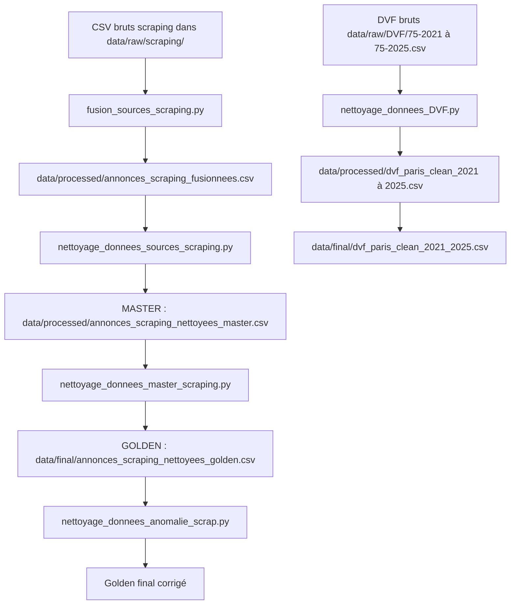

# Rapport compétence C3

## 1. Introduction

Dans la compétence C3, le but est de montrer que je sais agréger des données qui
viennent de plusieurs sources, les nettoyer, supprimer les lignes mauvaises, et
normaliser les formats pour obtenir un jeu de données final utilisable.

Dans mon projet immobilier Paris IA, j'ai travaillé sur deux familles de
données :

- les annonces immobilières récupérées par scraping ;
- les données DVF, qui correspondent aux ventes réelles d'appartements à Paris.

Pour les annonces, j'ai construit une logique en trois niveaux :

- **source** : données brutes ou fusionnées, encore proches des fichiers de
  scraping ;
- **master** : données nettoyées une première fois, avec formats plus propres ;
- **golden** : données finales, prêtes à être utilisées par l'application, l'API
  et les analyses.

Pour les DVF, j'ai nettoyé les fichiers annuels, puis j'ai fusionné les années
2021 à 2025 dans un seul fichier final.

## 2. Fichiers Python de la C3

Les fichiers principaux sont dans :

`src/nettoyage/`

| Fichier | Rôle |
| --- | --- |
| `src/nettoyage/fusion_sources_scraping.py` | Fusionne les CSV bruts de scraping et ajoute la colonne `source`. |
| `src/nettoyage/nettoyage_donnees_sources_scraping.py` | Nettoie les données fusionnées pour créer le fichier master. |
| `src/nettoyage/nettoyage_donnees_master_scraping.py` | Complète les valeurs manquantes avec le texte `details`, filtre Paris et crée le golden. |
| `src/nettoyage/nettoyage_donnees_anomalie_scrap.py` | Détecte et supprime les anomalies restantes du golden scraping. |
| `src/nettoyage/nettoyage_donnees_DVF.py` | Nettoie les fichiers DVF par année et crée le fichier DVF final 2021-2025. |

Il y a aussi deux fichiers d'analyse qui m'aident à comprendre les problèmes
avant nettoyage :

| Fichier | Rôle |
| --- | --- |
| `tests/analyse_nettoyage_scraping.py` | Analyse le fichier scraping fusionné avant nettoyage. |
| `tests/analyse_nettoyage_DVF.py` | Analyse les fichiers DVF bruts avant nettoyage. |

## 3. Schéma général source, master et golden



## 4. Pourquoi source, master et golden

J'ai utilisé cette organisation pour ne pas tout mélanger.

### 4.1 Niveau source

Le niveau source garde les données proches de ce qui vient des sites.

Dans mon projet, les fichiers bruts sont ici :

`data/raw/scraping/`

Les fichiers concernés sont :

- `data/raw/scraping/annonces_century21_paris.csv`
- `data/raw/scraping/annonces_laforet_paris_complet.csv`
- `data/raw/scraping/annonces_lefigaro_paris.csv`
- `data/raw/scraping/annonces_orpi_paris.csv`
- `data/raw/scraping/annonces_plaza_paris.csv`

Ensuite, je fusionne tout dans :

`data/processed/annonces_scraping_fusionnees.csv`

Ce fichier avait 4 965 lignes au moment de ma vérification.

### 4.2 Niveau master

Le niveau master est un fichier déjà nettoyé, mais qui garde encore la colonne
`details`.

Fichier :

`data/processed/annonces_scraping_nettoyees_master.csv`

Ce fichier avait 4 731 lignes au moment de ma vérification.

Pourquoi garder `details` dans le master :

- elle contient parfois des informations que les colonnes principales n'ont pas ;
- elle peut servir à retrouver un prix, une surface ou un nombre de pièces ;
- elle permet de faire une extraction simple de texte avant le fichier golden.

### 4.3 Niveau golden

Le niveau golden est le fichier final. Il garde seulement les colonnes utiles.

Fichier :

`data/final/annonces_scraping_nettoyees_golden.csv`

Ce fichier avait 4 375 lignes au moment de ma vérification.

Colonnes finales :

- `source`
- `type`
- `prix`
- `surface`
- `prix_m2`
- `nb_pieces`
- `localisation`

Pourquoi créer un golden :

- pour avoir un fichier propre ;
- pour éviter d'utiliser directement les données brutes ;
- pour alimenter plus facilement l'API, les graphiques et les analyses ;
- pour avoir des colonnes homogènes entre les sources.

## 5. `fusion_sources_scraping.py`

Emplacement :

`src/nettoyage/fusion_sources_scraping.py`

Bibliothèques utilisées :

- `pandas` : pour lire les CSV et fusionner les DataFrames ;
- `pathlib.Path` : pour gérer les chemins de fichiers.

Entrées :

- `data/raw/scraping/annonces_century21_paris.csv`
- `data/raw/scraping/annonces_laforet_paris_complet.csv`
- `data/raw/scraping/annonces_lefigaro_paris.csv`
- `data/raw/scraping/annonces_orpi_paris.csv`
- `data/raw/scraping/annonces_plaza_paris.csv`

Sortie :

`data/processed/annonces_scraping_fusionnees.csv`

Ce que le script fait :

1. Il définit le dossier des fichiers bruts : `data/raw/scraping`.
2. Il liste chaque fichier avec son nom de source : `century21`, `laforet`,
   `lefigaro`, `orpi`, `plaza`.
3. Il lit chaque CSV avec `pd.read_csv`.
4. Il ajoute une colonne `source` pour savoir d'où vient chaque annonce.
5. Il stocke chaque DataFrame dans une liste.
6. Il fusionne tout avec `pd.concat`.
7. Il sauvegarde le résultat dans `data/processed/`.

Pourquoi j'ai ajouté la colonne `source` :

Sans cette colonne, après fusion, je ne sais plus de quel site vient chaque
annonce. Avec `source`, je peux ensuite comparer les sites ou filtrer les
annonces par origine.

## 6. `nettoyage_donnees_sources_scraping.py`

Emplacement :

`src/nettoyage/nettoyage_donnees_sources_scraping.py`

Bibliothèques utilisées :

- `pandas` : pour manipuler les données en tableau ;
- `re` : pour extraire des chiffres avec des expressions régulières ;
- `pathlib.Path` : pour gérer les chemins.

Entrée :

`data/processed/annonces_scraping_fusionnees.csv`

Sortie :

`data/processed/annonces_scraping_nettoyees_master.csv`

Ce fichier correspond au passage vers le **master**.

### 6.1 Gestion des valeurs manquantes

Le script définit une liste de valeurs considérées comme manquantes :

- chaîne vide ;
- `non disponible` ;
- `n/a` ;
- `na` ;
- `null` ;
- `none` ;
- `nan` ;
- `non renseigné` ;
- `non renseigne`.

La fonction `est_valeur_manquante()` sert à reconnaître ces valeurs.

Pourquoi :

Les scrapers ne produisent pas toujours les mêmes textes. Par exemple un site
peut écrire `non disponible`, un autre peut mettre une valeur vide. Je normalise
ces cas pour les traiter pareil.

### 6.2 Nettoyage du prix

Fonction :

`clean_prix()`

Exemple :

`550 000 €` devient `550000.0`

Ce que la fonction nettoie :

- supprime le symbole euro ;
- supprime les espaces ;
- remplace la virgule par un point ;
- garde seulement les chiffres et le point ;
- convertit le résultat en nombre.

Pourquoi :

Le prix doit être numérique pour pouvoir faire des statistiques et des filtres.

### 6.3 Nettoyage de la surface

Fonction :

`clean_surface()`

Exemple :

`54 m²` devient `54.0`

Ce que la fonction nettoie :

- supprime `m²`, `m2` et `m` ;
- supprime les espaces ;
- remplace la virgule par un point ;
- convertit en nombre.

Pourquoi :

La surface est nécessaire pour comparer les biens et calculer le prix au m².

### 6.4 Nettoyage du prix au mètre carré

Fonction :

`clean_prix_m2()`

Exemple :

`10 185 €/m²` devient `10185.0`

Ce que la fonction nettoie :

- supprime `soit` ;
- supprime `€/m²`, `€/m2`, `/m²`, `/m2` ;
- supprime les espaces ;
- convertit en nombre.

Pourquoi :

Le prix au m² arrive dans des formats différents selon les sites. Il faut donc
le rendre homogène.

### 6.5 Nettoyage du type de bien

Fonction :

`clean_type()`

La fonction regarde à la fois :

- la colonne `type` ;
- la colonne `details`.

Elle transforme les textes en catégories plus simples :

- `Appartement`
- `Maison`
- `Locaux`

Elle considère aussi que :

- `studio`, `duplex`, `loft` sont des appartements ;
- `villa` est une maison.

Elle supprime ensuite les types non utiles :

- péniche ;
- viager ;
- hôtel ;
- immeuble ;
- propriété.

Pourquoi :

Le projet vise surtout les biens immobiliers comparables. Certains types comme
les péniches ou hôtels peuvent fausser l'analyse.

### 6.6 Nettoyage du nombre de pièces

Fonction :

`clean_nb_pieces()`

Exemples :

- `3 pièces` devient `3` ;
- `studio` devient `1`.

La fonction utilise une expression régulière pour récupérer le premier nombre.

Pourquoi :

Le nombre de pièces doit être un entier pour être utilisé par les filtres et les
statistiques.

### 6.7 Nettoyage de la localisation

Fonction :

`clean_localisation()`

Exemples :

- `PARIS 75018` devient `75018` ;
- `Paris 75006` devient `75006`.

La fonction cherche un code postal qui commence par `75`.

Pourquoi :

La localisation doit être standardisée pour pouvoir retrouver l'arrondissement.

### 6.8 Calcul du prix au m² manquant

Le script calcule `prix_m2` quand il manque, si le prix et la surface existent.

Formule :

`prix_m2 = prix / surface`

Pourquoi :

Certains sites donnent le prix et la surface, mais pas le prix au m². Dans ce
cas, je peux le recalculer.

### 6.9 Suppression des doublons

Le script utilise :

`drop_duplicates()`

Pourquoi :

Après fusion des sources, certaines annonces peuvent être identiques. Les
doublons faussent les statistiques, donc je les retire.

## 7. `nettoyage_donnees_master_scraping.py`

Emplacement :

`src/nettoyage/nettoyage_donnees_master_scraping.py`

Bibliothèques utilisées :

- `pandas` : pour manipuler le fichier master ;
- `re` : pour extraire des informations depuis le texte ;
- `pathlib.Path` : pour gérer les chemins.

Entrée :

`data/processed/annonces_scraping_nettoyees_master.csv`

Sortie :

`data/final/annonces_scraping_nettoyees_golden.csv`

Ce fichier correspond au passage de **master** vers **golden**.

### 7.1 Nettoyage de la colonne `details`

Fonction :

`nettoyer_details()`

Ce que ça fait :

- si la valeur est `non disponible`, elle devient une chaîne vide ;
- sinon, le texte est conservé mais nettoyé avec `strip()`.

Pourquoi :

La colonne `details` peut contenir du texte utile pour retrouver des valeurs
manquantes.

### 7.2 Petit NLP maison avec les détails

Dans le script, j'ai mis une partie appelée :

`NLP depuis details`

Ce n'est pas du NLP avancé avec une grosse bibliothèque comme spaCy. C'est plutôt
un petit traitement de texte maison avec des règles et des expressions
régulières.

Le but était de relire la colonne `details` pour essayer de compléter :

- le prix ;
- la surface ;
- le nombre de pièces ;
- le prix au m².

Fonctions utilisées :

- `extraire_prix()`
- `extraire_surface()`
- `extraire_nb_pieces()`
- `extraire_prix_m2()`

Exemples :

- chercher un nombre avant `€` pour retrouver un prix ;
- chercher un nombre avant `m²` ou `m2` pour retrouver une surface ;
- chercher `3 pièces` pour retrouver le nombre de pièces ;
- chercher `€/m²` pour retrouver le prix au m².

Pourquoi je l'ai fait :

Certaines annonces avaient des colonnes vides, mais l'information existait quand
même dans le texte `details`. J'ai donc essayé de récupérer ces informations
depuis le texte.

Limite :

Cette partie n'a pas énormément rempli de valeurs, car les textes des sites ne
sont pas tous écrits de la même façon. Mais je l'ai gardée car elle sera utile
pour les prochaines collectes. Si les futurs scrapers gardent plus de texte dans
`details`, cette partie pourra récupérer plus d'informations.

### 7.3 Nettoyage de la localisation Paris

Fonction :

`extraire_code_paris()`

Ce que ça fait :

- cherche un code postal de type `75001` à `75020` ;
- accepte aussi des écritures comme `1er`, `2ème`, etc. ;
- transforme l'arrondissement en code postal, par exemple `11` devient `75011`.

Ensuite le script :

- crée une colonne temporaire `loc_code` ;
- supprime les lignes qui ne correspondent pas à Paris ;
- remplace `localisation` par le code postal propre ;
- supprime la colonne temporaire.

Pourquoi :

Le projet concerne Paris. Une annonce hors Paris ou sans code postal exploitable
doit être retirée du fichier golden.

### 7.4 Suppression des lignes incomplètes

Le script vérifie ces colonnes :

- `prix`
- `surface`
- `nb_pieces`
- `prix_m2`

Si une de ces colonnes contient encore `non disponible`, la ligne est supprimée.

Pourquoi :

Le fichier golden doit être propre. Pour les analyses et l'application, il faut
avoir des valeurs complètes sur les colonnes principales.

### 7.5 Suppression de `details`

À la fin, le script supprime la colonne `details`.

Pourquoi :

Dans le fichier golden, je garde seulement les colonnes utiles et propres. La
colonne `details` a servi pendant le nettoyage, mais elle n'est plus nécessaire
pour l'exploitation finale.

## 8. `nettoyage_donnees_anomalie_scrap.py`

Emplacement :

`src/nettoyage/nettoyage_donnees_anomalie_scrap.py`

Bibliothèque utilisée :

- `pandas`

Entrée et sortie :

`data/final/annonces_scraping_nettoyees_golden.csv`

Ce script lit le golden, supprime les dernières anomalies, puis réécrit le même
fichier.

### 8.1 Conversion numérique

Le script convertit en numérique :

- `prix`
- `surface`
- `prix_m2`
- `nb_pieces`

Il utilise :

`pd.to_numeric(..., errors="coerce")`

Pourquoi :

Avant de tester les seuils, il faut être sûr que les colonnes sont numériques.
Si une valeur ne peut pas être convertie, elle devient `NaN`.

### 8.2 Anomalies détectées

Le script détecte :

- prix inférieur à 50 000 euros ;
- prix supérieur à 10 000 000 euros ;
- surface inférieure à 9 m² ;
- surface supérieure à 500 m² ;
- prix au m² inférieur à 2 000 euros ;
- prix au m² supérieur à 50 000 euros ;
- nombre de pièces inférieur ou égal à 0 ;
- surface par pièce inférieure à 8 m² ;
- surface par pièce supérieure à 80 m².

Pourquoi :

Ces valeurs peuvent être des erreurs de scraping ou des cas trop extrêmes. Elles
peuvent fausser les graphiques, les médianes et les comparaisons.

### 8.3 Suppression des anomalies

Le script combine toutes les anomalies dans un seul masque :

`anomalies = anomalie_prix | anomalie_surface | anomalie_prix_m2 | anomalie_pieces`

Puis il garde seulement les lignes sans anomalie :

`df = df[~anomalies]`

Pourquoi :

Cela permet de retirer toutes les lignes problématiques en une seule étape.

Note :

Ce script réécrit le CSV avec le séparateur par défaut de pandas, donc la virgule.
Le fichier golden actuel est donc séparé par des virgules.

## 9. Nettoyage DVF avec `nettoyage_donnees_DVF.py`

Emplacement :

`src/nettoyage/nettoyage_donnees_DVF.py`

Bibliothèques utilisées :

- `pandas` : pour lire, filtrer et transformer les CSV ;
- `pathlib.Path` : pour gérer les chemins.

Entrées :

- `data/raw/DVF/75-2021.csv`
- `data/raw/DVF/75-2022.csv`
- `data/raw/DVF/75-2023.csv`
- `data/raw/DVF/75-2024.csv`
- `data/raw/DVF/75-2025.csv`

Sorties intermédiaires :

- `data/processed/dvf_paris_clean_2021.csv`
- `data/processed/dvf_paris_clean_2022.csv`
- `data/processed/dvf_paris_clean_2023.csv`
- `data/processed/dvf_paris_clean_2024.csv`
- `data/processed/dvf_paris_clean_2025.csv`

Sortie finale :

`data/final/dvf_paris_clean_2021_2025.csv`

Ce fichier final avait 152 431 lignes au moment de ma vérification.

### 9.1 Normalisation des noms de colonnes

Le script fait :

`df.columns = df.columns.str.lower().str.strip()`

Pourquoi :

Cela évite les problèmes de majuscules, espaces ou noms de colonnes mal écrits.

### 9.2 Filtre sur Paris

Le script garde seulement :

`code_departement == "75"`

Pourquoi :

Le projet concerne uniquement Paris.

### 9.3 Filtre sur les ventes d'appartements

Le script garde seulement :

- `nature_mutation == "Vente"`
- `type_local == "Appartement"`

Pourquoi :

Je veux travailler sur des ventes réelles d'appartements. Cela évite de mélanger
avec des maisons, locaux ou autres mutations.

### 9.4 Conversion des colonnes numériques

Colonnes converties :

- `valeur_fonciere`
- `surface_reelle_bati`
- `nombre_pieces_principales`
- `longitude`
- `latitude`

La conversion utilise :

`pd.to_numeric(..., errors="coerce")`

Pourquoi :

Ces colonnes doivent être numériques pour les calculs, les filtres et les cartes.

### 9.5 Suppression des lignes inutilisables

Le script supprime les lignes sans :

- prix ;
- surface ;
- longitude ;
- latitude.

Puis il garde seulement les lignes avec :

- `valeur_fonciere > 0`
- `surface_reelle_bati > 0`
- `nombre_pieces_principales > 0`

Pourquoi :

Une vente sans prix, sans surface ou sans coordonnées n'est pas exploitable pour
mon projet.

### 9.6 Suppression des valeurs absurdes

Le script garde seulement :

- surface entre 9 et 300 m² ;
- valeur foncière entre 50 000 et 5 000 000 euros.

Pourquoi :

Ces seuils évitent les données extrêmes qui peuvent fausser le modèle et les
statistiques.

### 9.7 Création des colonnes utiles

Le script crée :

- `annee_vente` depuis `date_mutation` ;
- `mois_vente` depuis `date_mutation` ;
- `prix_m2` avec `valeur_fonciere / surface_reelle_bati`.

Pourquoi :

Ces colonnes sont utiles pour l'analyse dans le temps, les filtres et les
statistiques par prix au m².

### 9.8 Nettoyage du code postal et arrondissement

Le script :

- convertit `code_postal` en nombre puis en texte ;
- garde les codes postaux qui commencent par `75` ;
- crée `arrondissement` avec les deux derniers chiffres du code postal.

Exemple :

`75018` donne arrondissement `18`.

Pourquoi :

L'arrondissement est une variable très importante pour les analyses immobilières
à Paris.

### 9.9 Suppression des prix au m² absurdes

Le script garde seulement :

- `prix_m2 >= 3000`
- `prix_m2 <= 25000`

Pourquoi :

Les prix au m² très faibles ou très hauts peuvent être des erreurs ou des cas
extrêmes qui gênent l'analyse.

### 9.10 Colonnes finales DVF

Le fichier DVF final garde :

- `id_mutation`
- `date_mutation`
- `annee_vente`
- `mois_vente`
- `valeur_fonciere`
- `prix_m2`
- `surface_reelle_bati`
- `nombre_pieces_principales`
- `type_local`
- `code_postal`
- `arrondissement`
- `nom_commune`
- `adresse_nom_voie`
- `longitude`
- `latitude`

Pourquoi :

Ces colonnes suffisent pour les analyses, la prédiction, les cartes et les
statistiques.

## 10. Fichiers d'analyse avant nettoyage

### 10.1 `tests/analyse_nettoyage_scraping.py`

Ce fichier lit :

`data/processed/annonces_scraping_fusionnees.csv`

Il affiche :

- nombre de lignes ;
- nombre de colonnes ;
- noms des colonnes ;
- types des colonnes ;
- valeurs manquantes ;
- valeurs `non disponible` ;
- doublons ;
- aperçu des données ;
- statistiques.

Pourquoi :

Avant de nettoyer, je dois comprendre l'état du fichier. Ce script m'aide à voir
les colonnes les plus sales.

### 10.2 `tests/analyse_nettoyage_DVF.py`

Ce fichier lit les DVF bruts année par année.

Il affiche :

- nombre de lignes ;
- nombre de colonnes ;
- types des colonnes ;
- valeurs manquantes ;
- valeurs problématiques ;
- doublons ;
- répartition des natures de mutation ;
- répartition des types de locaux ;
- analyse des surfaces ;
- analyse des valeurs foncières ;
- répartition des codes postaux.

Pourquoi :

Les fichiers DVF sont grands. Avant de les nettoyer, je vérifie les colonnes, les
valeurs nulles et les données importantes.

## 11. Bibliothèques utilisées

### 11.1 `pandas`

J'utilise `pandas` dans tous les scripts C3.

Il sert à :

- lire les CSV ;
- filtrer les lignes ;
- convertir les colonnes ;
- supprimer les doublons ;
- concaténer plusieurs fichiers ;
- exporter les fichiers nettoyés.

### 11.2 `re`

J'utilise `re` dans les scripts scraping.

Il sert à :

- extraire un nombre dans un texte ;
- trouver une surface avec `m²` ;
- trouver un prix avec `€` ;
- retrouver un code postal parisien ;
- extraire un nombre de pièces.

### 11.3 `pathlib.Path`

J'utilise `Path` pour construire des chemins plus propres.

Pourquoi :

C'est plus lisible que d'écrire des chaînes de caractères partout.

## 12. Comment lancer les scripts C3

Avant de lancer les scripts, je me place à la racine du projet :

```bash
cd /Users/maleksilarbi/Documents/immobilier-paris-ia
```

Installer les dépendances :

```bash
python -m pip install -r requirements.txt
```

### 12.1 Lancer l'analyse scraping avant nettoyage

```bash
python tests/analyse_nettoyage_scraping.py
```

### 12.2 Fusionner les sources scraping

```bash
python src/nettoyage/fusion_sources_scraping.py
```

### 12.3 Créer le fichier master scraping

```bash
python src/nettoyage/nettoyage_donnees_sources_scraping.py
```

### 12.4 Créer le fichier golden scraping

```bash
python src/nettoyage/nettoyage_donnees_master_scraping.py
```

### 12.5 Supprimer les anomalies du golden scraping

```bash
python src/nettoyage/nettoyage_donnees_anomalie_scrap.py
```

### 12.6 Analyser les fichiers DVF bruts

```bash
python tests/analyse_nettoyage_DVF.py
```

### 12.7 Nettoyer les fichiers DVF

```bash
python src/nettoyage/nettoyage_donnees_DVF.py
```

## 13. Ordre conseillé d'exécution

Pour le scraping :

1. `python src/nettoyage/fusion_sources_scraping.py`
2. `python tests/analyse_nettoyage_scraping.py`
3. `python src/nettoyage/nettoyage_donnees_sources_scraping.py`
4. `python src/nettoyage/nettoyage_donnees_master_scraping.py`
5. `python src/nettoyage/nettoyage_donnees_anomalie_scrap.py`

Pour DVF :

1. `python tests/analyse_nettoyage_DVF.py`
2. `python src/nettoyage/nettoyage_donnees_DVF.py`

## 14. Preuve Git

Les fichiers C3 sont suivis par Git.

Commande utilisée :

```bash
git ls-files src/nettoyage tests/analyse_nettoyage_DVF.py tests/analyse_nettoyage_scraping.py
```

Résultat :

```text
src/nettoyage/fusion_sources_scraping.py
src/nettoyage/nettoyage_donnees_DVF.py
src/nettoyage/nettoyage_donnees_anomalie_scrap.py
src/nettoyage/nettoyage_donnees_master_scraping.py
src/nettoyage/nettoyage_donnees_sources_scraping.py
tests/analyse_nettoyage_DVF.py
tests/analyse_nettoyage_scraping.py
```

Cela montre que les scripts de nettoyage et d'agrégation sont versionnés.

## 15. Conclusion personnelle

Pour la C3, j'ai fait une chaîne de nettoyage complète.

Pour le scraping, j'ai :

- fusionné cinq sources différentes ;
- ajouté une colonne `source` ;
- nettoyé les prix, surfaces, prix au m², types, pièces et localisations ;
- recalculé des prix au m² manquants ;
- utilisé un petit NLP maison sur la colonne `details` ;
- filtré les annonces parisiennes ;
- supprimé les lignes incomplètes ;
- retiré les anomalies restantes.

Pour les DVF, j'ai :

- nettoyé les années 2021 à 2025 ;
- gardé seulement Paris ;
- gardé seulement les ventes d'appartements ;
- supprimé les valeurs nulles ou absurdes ;
- créé l'année, le mois, le prix au m² et l'arrondissement ;
- fusionné les années dans un seul fichier final.

Le résultat est que je pars de données brutes venant de plusieurs sources, et
j'arrive à des fichiers propres dans `data/final/`, prêts pour l'analyse, l'API
et le modèle.
