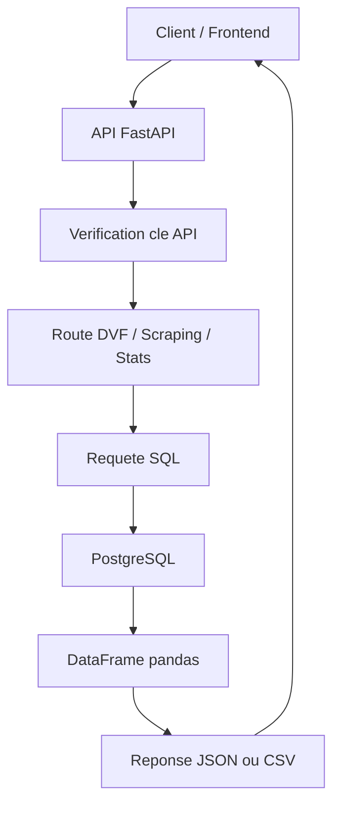

# Rapport competence C5

## 1. Objectif de la competence C5

Dans la competence C5, le but est de montrer que j'ai developpe une **API REST**
qui permet de mettre les donnees du projet a disposition.

Dans mon projet, l'API sert a eviter que le frontend ou un autre composant lise
directement dans PostgreSQL. A la place, le client appelle des routes HTTP, et
l'API retourne des reponses propres en JSON ou en CSV.

L'API donne acces surtout a :

- des donnees DVF nettoyees ;
- des annonces immobilieres nettoyees ;
- des statistiques sur les ventes ;
- des statistiques sur les annonces ;
- un export CSV ;
- quelques donnees de localisation utiles a l'application.

Je garde ce document uniquement sur la partie API REST de donnees. Je ne detaille
pas ici les traitements qui ne concernent pas la mise a disposition des donnees.

## 2. Fichiers concernes par la C5

Les fichiers principaux de la competence C5 sont dans le dossier `api/`.

| Fichier | Role dans la C5 |
| --- | --- |
| `api/main.py` | Cree l'application FastAPI, configure les routes, CORS, logs et metriques HTTP. |
| `api/core.py` | Contient la connexion PostgreSQL, la lecture SQL, les filtres SQL et la securite par cle API. |
| `api/routers/dvf.py` | Expose les donnees DVF : filtres, points cartographiques et export CSV. |
| `api/routers/scraping.py` | Expose les annonces scraping nettoyees et les statistiques sur les annonces. |
| `api/routers/stats.py` | Expose les statistiques DVF : resume, arrondissement, evolution et distribution. |
| `api/routers/location.py` | Expose quelques donnees de localisation, comme les commerces par arrondissement. |
| `api/services/commerces.py` | Recupere, met en cache et normalise les donnees commerces. |
| `api/services/address.py` | Appelle le geocodage et retourne une adresse normalisee. |
| `api/services/proximity.py` | Recupere les transports et equipements proches d'une adresse. |
| `tests/test_api.py` | Verifie les routes, la securite, les reponses et les erreurs. |
| `Dockerfile.api` | Permet de construire l'image Docker de l'API. |
| `compose.yml` | Permet de lancer l'API avec les autres services. |

## 3. Architecture simple de l'API

Le fonctionnement general est :



L'idee est simple :

1. le client appelle une route ;
2. l'API verifie la cle `X-API-Key` ;
3. l'API construit les filtres SQL ;
4. PostgreSQL retourne les lignes demandees ;
5. pandas transforme le resultat ;
6. FastAPI renvoie une reponse au client.

## 4. Bibliotheques Python utilisees

### FastAPI

J'utilise **FastAPI** pour creer l'API REST.

Pourquoi :

- les routes sont simples a ecrire avec `@router.get()` ou `@router.post()` ;
- FastAPI valide automatiquement une partie des parametres ;
- FastAPI genere automatiquement la documentation Swagger ;
- les erreurs HTTP sont faciles a gerer.

Exemple dans le code :

```python
@router.get("/dvf/points")
def get_dvf_points(...):
    ...
```

### Uvicorn

J'utilise **Uvicorn** pour lancer le serveur de l'API.

Commande :

```bash
uvicorn api.main:app --reload
```

En Docker, la commande est dans `Dockerfile.api` :

```bash
uvicorn api.main:app --host 0.0.0.0 --port 8000
```

### SQLAlchemy

J'utilise **SQLAlchemy** pour creer la connexion avec PostgreSQL.

Dans `api/core.py`, la fonction `construire_engine()` lit les variables
d'environnement puis cree un moteur SQLAlchemy.

SQLAlchemy me permet aussi d'utiliser des parametres nommes comme
`:arrondissement`, `:limit` ou `:surface_min`. C'est mieux que coller les valeurs
directement dans la requete.

### pandas

J'utilise **pandas** pour lire les resultats SQL.

Dans `api/core.py`, la fonction `lire_sql()` fait :

```python
pd.read_sql(text(query), engine, params=params or {})
```

Ensuite, les routes peuvent transformer le DataFrame en JSON avec :

```python
df.to_dict(orient="records")
```

### requests

J'utilise **requests** pour appeler certaines API externes de localisation.

Dans la C5, je le garde comme une partie secondaire. Le coeur de la competence
reste l'API REST que j'ai developpee et qui expose mes donnees.

### hmac.compare_digest

J'utilise `compare_digest` pour comparer la cle API.

Ce n'est pas juste un `==`. C'est une comparaison plus propre pour une valeur
sensible comme une cle API.

### prometheus-client

L'API utilise aussi **prometheus-client** pour exposer quelques metriques HTTP.

Dans le cadre de C5, cela montre surtout que l'API peut etre observee :

- nombre de requetes ;
- duree des requetes ;
- erreurs.

## 5. Lancement de l'API

### 5.1 Lancement en local

Avant de lancer l'API, il faut avoir les variables dans `.env`, surtout :

```env
API_KEY=ma-cle-api
DB_USER=postgres
DB_PASSWORD=...
DB_HOST=localhost
DB_PORT=5433
DB_NAME=immobilier_paris
```

Commande :

```bash
uvicorn api.main:app --reload
```

L'API est ensuite disponible en local, souvent ici :

```text
http://127.0.0.1:8000
```

### 5.2 Lancement avec Docker

Avec Docker, le service API est defini dans `compose.yml`.

Commande :

```bash
docker compose up -d api
```

Dans le `compose.yml`, l'API est exposee avec :

```text
8002:8000
```

Donc depuis la machine, je peux appeler :

```text
http://localhost:8002
```

## 6. Documentation OpenAPI / Swagger

FastAPI genere automatiquement une documentation technique.

Quand l'API est lancee, je peux ouvrir :

```text
http://127.0.0.1:8000/docs
```

ou, avec Docker :

```text
http://localhost:8002/docs
```

Cette page Swagger permet de voir :

- les routes disponibles ;
- les parametres attendus ;
- les types de reponse ;
- les erreurs possibles ;
- les tests directs depuis le navigateur.

Le fichier OpenAPI brut est disponible ici :

```text
/openapi.json
```

C'est important pour C5 parce que la documentation technique de l'API est une
preuve attendue.

## 7. Securite de l'API

Les routes de donnees importantes demandent une cle API.

La cle doit etre envoyee dans l'en-tete HTTP :

```http
X-API-Key: ma-cle-api
```

Dans le code, c'est gere dans `api/core.py` avec :

```python
api_key_header = APIKeyHeader(name="X-API-Key", auto_error=False)
```

Puis la fonction `verifier_cle_api()` controle la cle.

### Cas 1 : cle absente

Si le client n'envoie pas de cle, l'API retourne :

```text
401 - Cle API manquante
```

### Cas 2 : cle fausse

Si la cle est fausse, l'API retourne :

```text
403 - Cle API invalide
```

### Cas 3 : cle non configuree cote serveur

Si `API_KEY` n'existe pas dans l'environnement serveur, l'API retourne :

```text
500 - API_KEY n'est pas configuree sur le serveur
```

### Pourquoi cette securite

Cette securite est simple, mais elle est utile :

- elle evite de laisser les donnees ouvertes a tout le monde ;
- elle permet au frontend d'acceder aux donnees avec une cle connue ;
- elle evite de mettre directement PostgreSQL en acces public.

## 8. Routes principales de l'API

### 8.1 Route d'accueil

Route :

```http
GET /
```

Role :

- verifier que l'API demarre ;
- retourner un message simple.

Cette route est plutot une route de controle.

### 8.2 Route sante

Route :

```http
GET /health
```

Role :

- verifier que l'API fonctionne ;
- verifier que la base PostgreSQL repond.

Exemple de reponse :

```json
{
  "status": "ok",
  "database": "connectee"
}
```

## 9. Routes DVF

Les routes DVF travaillent sur la table :

```text
dvf_paris_appartements
```

Cette table contient les ventes immobilieres reelles nettoyees.

### 9.1 `GET /dvf/filtres`

Cette route retourne les valeurs utiles pour construire les filtres dans le
frontend.

Elle retourne par exemple :

- l'annee minimum ;
- l'annee maximum ;
- le prix minimum ;
- le prix maximum ;
- le prix au m2 minimum ;
- le prix au m2 maximum ;
- les arrondissements disponibles ;
- les nombres de pieces disponibles.

Requetes SQL utilisees :

- `MIN()` pour les valeurs minimum ;
- `MAX()` pour les valeurs maximum ;
- `SELECT DISTINCT` pour les listes de valeurs.

### 9.2 `GET /dvf/points`

Cette route retourne des points DVF pour afficher les ventes sur une carte.

Parametres possibles :

- `arrondissement`
- `annee_vente`
- `annee_min`
- `annee_max`
- `mois_vente`
- `prix_min`
- `prix_max`
- `prix_m2_min`
- `prix_m2_max`
- `surface_min`
- `surface_max`
- `nombre_pieces`
- `code_postal`
- `min_lat`
- `max_lat`
- `min_lon`
- `max_lon`
- `limit`

Le parametre `limit` est controle par FastAPI :

```python
limit: int = Query(800, ge=1, le=200000)
```

Cela veut dire :

- valeur par defaut : `800` ;
- minimum : `1` ;
- maximum : `200000`.

La route utilise un `WHERE` dynamique avec les filtres envoyes par le client.

Exemple de reponse :

```json
{
  "nombre_resultats": 1,
  "limite": 800,
  "data": [
    {
      "date_mutation": "2024-01-15",
      "arrondissement": 11,
      "valeur_fonciere": 450000,
      "prix_m2": 10000,
      "surface_reelle_bati": 45,
      "nombre_pieces_principales": 2,
      "longitude": 2.38,
      "latitude": 48.85
    }
  ]
}
```

### 9.3 `GET /dvf/export.csv`

Cette route permet de telecharger les donnees DVF au format CSV.

Si aucun filtre n'est donne et que le fichier CSV final existe, l'API renvoie le
fichier directement.

Si des filtres sont donnes, l'API fait une requete SQL puis genere un CSV avec
pandas.

C'est utile parce qu'un utilisateur peut recuperer un extrait des donnees sans
ouvrir PostgreSQL.

## 10. Routes annonces scraping

Les routes scraping travaillent surtout sur la table :

```text
golden_data_scraping
```

Cette table contient les annonces immobilieres finales et nettoyees.

### 10.1 `GET /scraping/filtres`

Cette route retourne les filtres disponibles pour les annonces :

- surface minimum ;
- surface maximum ;
- arrondissements ;
- nombre de pieces ;
- sources.

Elle utilise :

- `MIN(surface)` ;
- `MAX(surface)` ;
- `SELECT DISTINCT`.

### 10.2 `GET /scraping/annonces`

Cette route retourne les annonces immobilieres.

Parametres possibles :

- `arrondissement`
- `surface_min`
- `surface_max`
- `nombre_pieces`
- `source`
- `limit`
- `offset`

Le `limit` evite de renvoyer trop de lignes d'un coup.

Le `offset` sert a la pagination. Par exemple :

- `limit=30`
- `offset=0` pour la premiere page ;
- `offset=30` pour la page suivante.

La route retourne aussi `nombre_total`. Comme ca, le frontend sait combien
d'annonces existent avec les filtres.

Exemple de structure :

```json
{
  "nombre_resultats": 30,
  "nombre_total": 4375,
  "limite": 30,
  "offset": 0,
  "data": []
}
```

## 11. Routes statistiques DVF

Les routes statistiques DVF servent a ne pas renvoyer seulement des lignes
brutes. Elles retournent aussi des indicateurs deja calcules.

### 11.1 `GET /stats/dvf/resume`

Cette route retourne un resume global :

- nombre de ventes ;
- prix au m2 median ;
- prix moyen de vente ;
- surface moyenne.

Elle utilise :

- `COUNT()`
- `PERCENTILE_CONT(0.5)` pour la mediane ;
- `AVG()`
- `WHERE` pour les filtres.

### 11.2 `GET /stats/dvf/arrondissement`

Cette route groupe les ventes par arrondissement.

Elle utilise :

```sql
GROUP BY arrondissement
ORDER BY arrondissement
```

Elle permet d'afficher des comparaisons entre les arrondissements.

### 11.3 `GET /stats/dvf/evolution-mensuelle`

Cette route calcule l'evolution mensuelle du prix au m2.

Elle utilise :

```sql
DATE_TRUNC('month', date_mutation)
```

Puis elle transforme la date avec pandas pour avoir un format simple en JSON.

### 11.4 `GET /stats/dvf/distribution`

Cette route retourne une distribution des prix au m2.

Elle recupere les prix au m2 puis pandas cree des tranches :

- 0 a 1000 ;
- 1000 a 2000 ;
- etc.

Cela sert pour faire un graphique de repartition.

## 12. Routes statistiques scraping

Ces routes utilisent les annonces nettoyees.

### 12.1 `GET /stats/scraping/resume`

Cette route retourne :

- nombre d'annonces ;
- prix median ;
- prix au m2 median ;
- date de mise a jour.

### 12.2 `GET /stats/scraping/arrondissement`

Cette route groupe les annonces par arrondissement.

Elle utilise `GROUP BY` avec :

```sql
RIGHT(localisation, 2)::INTEGER AS arrondissement
```

Cela permet de transformer une localisation comme `75011` en arrondissement
`11`.

### 12.3 `GET /stats/scraping/source`

Cette route groupe les annonces par source.

Exemples de sources :

- orpi ;
- century21 ;
- laforet ;
- lefigaro ;
- stephaneplaza.

La route permet de voir combien d'annonces viennent de chaque source.

### 12.4 `GET /stats/scraping/distribution`

Cette route cree une distribution des prix d'annonces.

Les tranches sont creees avec pandas et `pd.cut()`.

### 12.5 `GET /stats/scraping/comparaison-dvf-2025`

Cette route compare les prix au m2 des annonces avec les prix au m2 DVF de 2025.

Elle fait deux requetes :

- une requete sur `golden_data_scraping` ;
- une requete sur `dvf_paris_appartements`.

Puis elle fusionne les deux resultats avec :

```python
pd.merge(scraping, dvf, on="arrondissement", how="outer")
```

Le but est de comparer les prix affiches dans les annonces et les prix de ventes
reelles.

## 13. Routes de localisation utiles aux donnees

### 13.1 `GET /commerces/paris`

Cette route retourne les donnees de commerces par arrondissement.

Parametre possible :

```text
arrondissement=11
```

Si aucun arrondissement n'est donne, la route retourne tous les arrondissements.

La route appelle `charger_commerces_paris()` dans :

```text
api/services/commerces.py
```

Ce service :

- essaye de lire les donnees depuis l'API open data ;
- utilise un cache local si possible ;
- utilise un fichier local de secours si l'API externe ne repond pas ;
- normalise les donnees pour retourner des champs propres.

### 13.2 `POST /geocodage/adresse`

Cette route recoit une adresse et retourne une adresse normalisee avec latitude
et longitude.

Exemple de corps JSON :

```json
{
  "adresse": "10 rue de Rivoli Paris"
}
```

La route verifie que le resultat correspond a une adresse exacte a Paris.

Elle ajoute aussi une partie `proximite`, qui peut contenir :

- les transports proches ;
- les commerces proches ;
- les lieux d'education proches ;
- les lieux de sante proches ;
- les erreurs si un service externe ne repond pas.

Cette partie utilise `api/services/proximity.py`.

Dans ce service, il y a deux sources principales :

- **Ile-de-France Mobilites** pour les arrets de transport ;
- **OpenStreetMap Overpass** pour les commerces, l'education et la sante autour
  de l'adresse.

Si l'API PRIM Ile-de-France Mobilites ne repond pas, le code essaye aussi une
source open data IDFM. Si un service externe est indisponible, l'API garde
l'erreur dans la reponse au lieu de tout faire planter.

Dans le cadre C5, ce qui est important ici est que l'API recoit une requete
client, valide l'acces, appelle des services de donnees et retourne une reponse
JSON exploitable.

## 14. Construction des filtres SQL

Dans `api/core.py`, j'ai deux fonctions importantes :

- `construire_where_dvf()`
- `construire_where_scraping()`

Ces fonctions servent a creer la partie `WHERE` des requetes SQL.

Exemple :

Si le client appelle :

```text
/dvf/points?arrondissement=11&surface_min=30&surface_max=60
```

L'API ajoute des conditions :

```sql
arrondissement = :arrondissement
surface_reelle_bati >= :surface_min
surface_reelle_bati <= :surface_max
```

Les valeurs sont stockees dans un dictionnaire `params`.

Cela permet de garder des requetes plus propres et de ne pas coller directement
les valeurs utilisateur dans le SQL.

## 15. Requetes SQL utilisees

Dans cette API, j'utilise plusieurs types de requetes.

### SELECT

`SELECT` sert a choisir les colonnes a retourner.

Exemple :

```sql
SELECT arrondissement, prix_m2, latitude, longitude
FROM dvf_paris_appartements
```

### WHERE

`WHERE` sert a filtrer.

Exemple :

```sql
WHERE arrondissement = :arrondissement
```

### GROUP BY

`GROUP BY` sert a regrouper les donnees.

Exemple :

```sql
GROUP BY arrondissement
```

### ORDER BY

`ORDER BY` sert a trier.

Exemple :

```sql
ORDER BY date_mutation DESC
```

### LIMIT et OFFSET

`LIMIT` limite le nombre de resultats.

`OFFSET` permet de commencer plus loin dans les resultats. C'est utile pour la
pagination.

### Fonctions statistiques

J'utilise aussi :

- `COUNT()` pour compter ;
- `AVG()` pour faire une moyenne ;
- `MIN()` et `MAX()` pour les bornes ;
- `PERCENTILE_CONT(0.5)` pour calculer une mediane.

## 16. Format des reponses

La plupart des routes retournent du JSON.

Exemple :

```json
{
  "nombre_resultats": 1,
  "data": []
}
```

Pour l'export DVF, la route retourne du CSV avec :

```text
media_type="text/csv"
```

Et un en-tete :

```http
Content-Disposition: attachment; filename="dvf_paris_clean_2021_2025.csv"
```

Cela force le telechargement du fichier.

## 17. Erreurs gerees

L'API gere plusieurs erreurs :

| Code | Cas |
| --- | --- |
| `401` | Cle API absente. |
| `403` | Cle API invalide. |
| `404` | Route inexistante. |
| `422` | Parametre invalide, par exemple `limit=0` alors que le minimum est `1`. |
| `500` | Probleme cote serveur, par exemple configuration absente. |
| `503` | Service externe indisponible pour certaines routes de localisation. |

FastAPI aide beaucoup pour les erreurs de validation, car il controle les types
et certaines bornes.

## 18. Tests de l'API

Les tests sont dans :

```text
tests/test_api.py
```

Ils verifient par exemple :

- une route protegee refuse une requete sans cle API ;
- une route protegee refuse une mauvaise cle API ;
- une route protegee accepte une bonne cle API ;
- `/dvf/points` retourne une reponse correcte ;
- `/scraping/annonces` utilise la table `golden_data_scraping` ;
- la pagination avec `limit` et `offset` fonctionne ;
- les routes statistiques retournent les indicateurs attendus ;
- les routes de localisation retournent les commerces et la proximite ;
- la proximite continue de repondre meme si un service externe est indisponible ;
- les routes inexistantes retournent `404`.

Commande pour lancer les tests API :

```bash
python -m pytest tests/test_api.py
```

ou avec unittest :

```bash
python -m unittest tests.test_api
```

## 19. Exemples d'appels API

### Appel DVF points

```bash
curl -H "X-API-Key: ma-cle-api" \
  "http://127.0.0.1:8000/dvf/points?arrondissement=11&limit=10"
```

### Appel annonces scraping

```bash
curl -H "X-API-Key: ma-cle-api" \
  "http://127.0.0.1:8000/scraping/annonces?arrondissement=11&limit=10&offset=0"
```

### Appel statistiques DVF

```bash
curl -H "X-API-Key: ma-cle-api" \
  "http://127.0.0.1:8000/stats/dvf/resume?arrondissement=11"
```

### Export CSV

```bash
curl -H "X-API-Key: ma-cle-api" \
  "http://127.0.0.1:8000/dvf/export.csv" \
  -o dvf_export.csv
```

## 20. Pourquoi avoir fait une API au lieu d'acceder directement a la base

J'ai fait une API parce que c'est plus propre que de laisser le frontend parler
directement a PostgreSQL.

Avec l'API :

- la base n'est pas exposee directement ;
- les filtres sont centralises ;
- les reponses ont toutes un format controle ;
- la securite est au meme endroit ;
- le frontend appelle seulement des URL HTTP ;
- la documentation Swagger est generee automatiquement.

Cela rend le projet plus simple a utiliser et plus propre techniquement.

## 21. Preuve Git

Les fichiers C5 doivent etre suivis par Git.

Commande possible :

```bash
git ls-files api/main.py api/core.py api/routers/dvf.py api/routers/scraping.py api/routers/stats.py api/routers/location.py api/services/commerces.py api/services/address.py api/services/proximity.py tests/test_api.py Dockerfile.api compose.yml requirements.txt
```

Les fichiers attendus sont :

```text
Dockerfile.api
api/core.py
api/main.py
api/routers/dvf.py
api/routers/location.py
api/routers/scraping.py
api/routers/stats.py
api/services/address.py
api/services/commerces.py
api/services/proximity.py
compose.yml
requirements.txt
tests/test_api.py
```

Le rapport C5 est aussi dans le dossier `docs`, donc il peut etre ajoute au Git :

```bash
git add "docs/Rapport competence C5.md"
```

## 22. Conclusion personnelle

Pour la competence C5, j'ai cree une API REST avec FastAPI pour mettre a
disposition les donnees du projet.

L'API permet de recuperer les ventes DVF, les annonces nettoyees, des statistiques
et des exports. Elle utilise PostgreSQL comme source principale, SQLAlchemy pour
la connexion, pandas pour manipuler les resultats et FastAPI pour creer les
routes HTTP.

J'ai aussi ajoute une securite simple avec `X-API-Key`, une documentation Swagger
automatique, et des tests pour verifier les routes importantes. Cela montre que
les donnees peuvent etre exploitees par d'autres composants sans ouvrir
directement la base de donnees.
