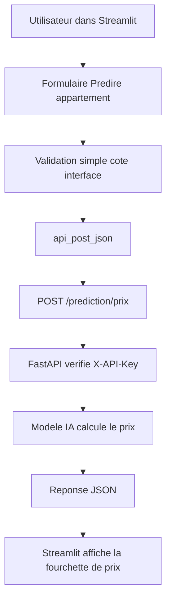

# Rapport competence C10 - Integrer l'API du modele IA dans l'application

## 1. Objectif de la competence C10

La competence C10 demande de montrer que j'ai integre l'API d'un modele ou d'un
service d'intelligence artificielle dans une application.

Dans mon projet `immobilier-paris-ia`, l'application est faite avec Streamlit.
Elle utilise l'API FastAPI pour appeler le modele de prediction.

La route utilisee est :

`POST /prediction/prix`

Donc, en tres simple :

**C10 = l'ecran Streamlit "Predire appartement" appelle l'API de prediction et
affiche le resultat a l'utilisateur.**

## 2. Difference entre C9 et C10

Je separe bien les deux competences :

| Competence | Explication |
|---|---|
| C9 | Je cree l'API REST qui expose le modele avec `/prediction/prix`. |
| C10 | J'utilise cette API dans mon application Streamlit. |

Pour C10, je ne documente pas l'entrainement du modele. Je documente surtout
l'integration entre l'application et l'API.

## 3. Ce que demande le referentiel

Dans le PDF, la competence C10 demande notamment :

- installer et faire fonctionner l'application ;
- programmer la communication avec les points de terminaison de l'API ;
- gerer les etapes d'authentification ou d'autorisation si besoin ;
- integrer les adaptations d'interface liees a l'IA ;
- tester l'integration ;
- prendre en compte l'accessibilite des interfaces modifiees ;
- versionner les sources avec Git.

Dans mon projet, cela correspond a :

- Streamlit lance l'application ;
- Streamlit appelle FastAPI ;
- l'en-tete `X-API-Key` est envoye ;
- le formulaire de prediction envoie les valeurs a l'API ;
- le resultat est affiche sous forme de fourchette de prix ;
- les erreurs API sont gerees ;
- le parcours peut etre verifie directement dans l'interface.

## 4. Fichiers concernes par la C10

| Fichier | Role dans la C10 |
|---|---|
| `streamlit/app.py` | Point d'entree de l'application Streamlit. |
| `streamlit/frontend/application.py` | Organise la navigation et affiche la page "Predire appartement". |
| `streamlit/frontend/views/prediction.py` | Formulaire de prediction, appel API et affichage du resultat. |
| `streamlit/frontend/api_client.py` | Client HTTP qui communique avec l'API FastAPI. |
| `streamlit/frontend/config.py` | Contient l'URL API, les endpoints et la cle `X-API-Key`. |
| `streamlit/frontend/styles.py` | Style visuel du resultat de prediction et de l'historique. |
| `streamlit/frontend/auth_ui.py` | Connexion utilisateur, utile pour l'historique connecte. |
| `api/routers/prediction.py` | Route FastAPI appelee par Streamlit. |
| `api/schemas.py` | Contrat d'entree et de sortie utilise par Streamlit. |

Le fichier le plus important pour C10 est :

`streamlit/frontend/views/prediction.py`

## 5. Schema de fonctionnement



## 6. Configuration de l'API cote Streamlit

La configuration se trouve dans :

`streamlit/frontend/config.py`

L'URL de l'API est :

```python
API_BASE_URL = os.getenv("API_BASE_URL", "http://127.0.0.1:8000")
```

Ca veut dire :

- en local, Streamlit appelle par defaut `http://127.0.0.1:8000` ;
- en Docker ou serveur, l'URL peut etre changee avec `API_BASE_URL`.

L'endpoint de prediction est :

```python
"prediction_prix": "/prediction/prix"
```

La cle API est envoyee avec :

```python
{"X-API-Key": api_key}
```

La cle vient de l'environnement :

```env
API_KEY=ma-cle-api
```

## 7. Client HTTP utilise par Streamlit

Le fichier :

`streamlit/frontend/api_client.py`

centralise les appels a FastAPI.

Il contient :

- `api_get_json()` pour les requetes GET ;
- `api_post_json()` pour les requetes POST ;
- `api_patch_json()` pour les modifications ;
- `api_delete()` pour les suppressions ;
- `_headers_api()` pour ajouter `X-API-Key` et le token utilisateur si besoin ;
- `ErreurApi` pour gerer les erreurs proprement.

Pour la C10, la fonction la plus importante est :

`api_post_json()`

Elle envoie le payload du formulaire vers :

`/prediction/prix`

## 8. Formulaire de prediction

Le formulaire est dans :

`streamlit/frontend/views/prediction.py`

L'utilisateur saisit :

| Champ | Utilite |
|---|---|
| Surface | Surface de l'appartement en m2. |
| Nombre de pieces | Nombre de pieces principales. |
| Arrondissement | Arrondissement de Paris. |

L'interface limite deja certaines valeurs :

- surface entre 9 et 300 m2 ;
- nombre de pieces entre 1 et 12 ;
- arrondissement entre 1 et 20.

Cela evite d'envoyer des valeurs impossibles a l'API.

## 9. Appel a l'API de prediction

Quand l'utilisateur clique sur **Predire le prix**, Streamlit appelle :

```python
resultat_prediction = api_post_json(
    API_ENDPOINTS["prediction_prix"],
    {
        "surface": surface,
        "nombre_pieces": nombre_pieces,
        "arrondissement": arrondissement,
    },
)
```

Cela correspond a :

```http
POST /prediction/prix
```

Le payload envoye ressemble a :

```json
{
  "surface": 45,
  "nombre_pieces": 2,
  "arrondissement": 11
}
```

## 10. Reponse API utilisee par l'interface

L'API retourne plusieurs valeurs :

| Valeur | Utilisation dans Streamlit |
|---|---|
| `prix_estime` | Afficher l'estimation centrale. |
| `mae_euros` | Expliquer l'erreur moyenne du modele. |
| `prix_min_indicatif` | Afficher le bas de la fourchette. |
| `prix_max_indicatif` | Afficher le haut de la fourchette. |
| `modele` | Indiquer le modele utilise si besoin. |

Dans l'interface, je n'affiche pas seulement un prix exact. J'affiche une
fourchette de prix, car une prediction IA reste une estimation.

## 11. Affichage du resultat

Le resultat est affiche dans une zone visuelle avec :

- une fourchette de prix indicative ;
- une estimation centrale ;
- un prix au m2 ;
- la surface ;
- le nombre de pieces ;
- l'arrondissement ;
- une phrase qui explique que la fourchette utilise la MAE.

Exemple d'affichage :

```text
Fourchette de prix indicative
408 921 euros - 631 078 euros
Estimation centrale : 520 000 euros.
```

Cette presentation est plus claire pour l'utilisateur qu'un simple JSON.

## 12. Gestion des erreurs

Si l'API ne repond pas, si la cle API est mauvaise ou si la requete est invalide,
le frontend affiche une erreur simple.

Dans `streamlit/frontend/api_client.py`, les erreurs HTTP sont transformees en
message lisible avec :

- `_message_erreur_api()` ;
- `_message_validation()` ;
- `_gerer_erreur_api()`.

Dans `streamlit/frontend/views/prediction.py`, si l'appel echoue, l'utilisateur
voit :

`Impossible de calculer la prediction`

Cela evite d'avoir une erreur Python brute dans l'interface.

## 13. Authentification et autorisation

L'API demande une cle :

`X-API-Key`

Streamlit ajoute cette cle grace a :

`headers_api()`

dans :

`streamlit/frontend/config.py`

Si l'utilisateur est connecte, `_headers_api()` ajoute aussi :

```text
Authorization: Bearer <token>
```

Cela permet :

- d'appeler les routes protegees de l'API ;
- d'enregistrer l'historique de prediction pour l'utilisateur connecte ;
- de recuperer l'historique de ses predictions.

## 14. Historique des predictions

Dans `streamlit/frontend/views/prediction.py`, la fonction
`afficher_historique_predictions()` recupere :

`GET /users/me/predictions`

Cela permet a un utilisateur connecte de revoir ses anciennes predictions.

L'utilisateur peut aussi supprimer une prediction avec :

`DELETE /users/me/predictions/{prediction_id}`

Ce n'est pas le coeur de C10, mais ca montre que l'application utilise aussi les
routes autour de la prediction.

## 15. Verification que l'API fonctionne

Dans `streamlit/frontend/application.py`, avant d'afficher l'application,
Streamlit verifie que l'API repond.

La fonction importante est :

`verifier_api()`

Si l'API ne repond pas, l'application affiche un message et s'arrete. C'est utile
car la prediction depend de FastAPI.

## 16. Accessibilite et interface

Le referentiel parle aussi des adaptations d'interface et de l'accessibilite.

Dans mon interface, j'ai fait simple :

- champs avec libelles clairs ;
- bouton clair : **Predire le prix** ;
- message d'information avant de lancer la prediction ;
- message d'erreur lisible si l'API echoue ;
- fourchette de prix expliquee en texte ;
- historique affiche sous forme de cartes ;
- navigation simple avec l'onglet **Predire appartement**.

Ce n'est pas un audit complet d'accessibilite, mais l'interface est lisible et
comprehensible pour l'utilisateur.

## 17. Verification du parcours utilisateur

Le parcours de prediction se verifie directement dans Streamlit : saisie du
formulaire, appel de l'API et affichage de la fourchette de prix. Les tests API
dans `tests/test_api.py` verifient separement la route de prediction.

## 18. Comment lancer l'application

### 18.1 Lancer l'API

Dans un terminal :

```bash
uvicorn api.main:app --reload
```

### 18.2 Lancer Streamlit

Dans un autre terminal :

```bash
streamlit run streamlit/app.py
```

### 18.3 Variables necessaires

Dans `.env`, il faut au minimum :

```env
API_KEY=ma-cle-api
API_BASE_URL=http://127.0.0.1:8000
```

Ensuite :

1. ouvrir Streamlit ;
2. se connecter ;
3. aller dans **Predire appartement** ;
4. remplir le formulaire ;
5. cliquer sur **Predire le prix** ;
6. verifier que la fourchette apparait.

## 19. Comment tester l'API appelee

```bash
python3 -m unittest discover -s tests -p 'test_api.py' -v
```

## 20. Bibliotheques utilisees

| Bibliotheque | Utilisation |
|---|---|
| `streamlit` | Construire l'interface utilisateur. |
| `requests` | Appeler l'API FastAPI depuis Streamlit. |
| `pandas` | Manipuler certains resultats sous forme de tableau. |
| `html.escape` | Eviter d'afficher du HTML utilisateur non protege dans l'historique. |

## 21. Elements principaux

Les elements principaux sont :

- l'ecran **Predire appartement** dans Streamlit ;
- l'appel `api_post_json(API_ENDPOINTS["prediction_prix"], payload)` ;
- la cle `X-API-Key` envoyee par le client ;
- l'affichage de la fourchette de prix ;
- les sources versionnees dans Git.

## 22. Versionnement Git

Commandes de versionnement :

```bash
git add "docs/bloc2/Rapport competence C10.md"
git add streamlit/app.py
git add streamlit/frontend/application.py
git add streamlit/frontend/views/prediction.py
git add streamlit/frontend/api_client.py
git add streamlit/frontend/config.py
git commit -m "docs: ajouter le rapport competence C10"
```

Verification Git :

```bash
git status --short
git ls-files "docs/bloc2/Rapport competence C10.md"
```

## 23. Conclusion

La competence C10 est couverte parce que l'application Streamlit utilise bien
l'API du modele IA.

L'utilisateur remplit un formulaire, Streamlit envoie les donnees a
`POST /prediction/prix`, l'API retourne une prediction, puis l'application
affiche le resultat sous forme de fourchette lisible.

Cette integration montre que le modele n'est pas seulement disponible dans l'API
C9 : il est vraiment utilise dans l'application finale.
