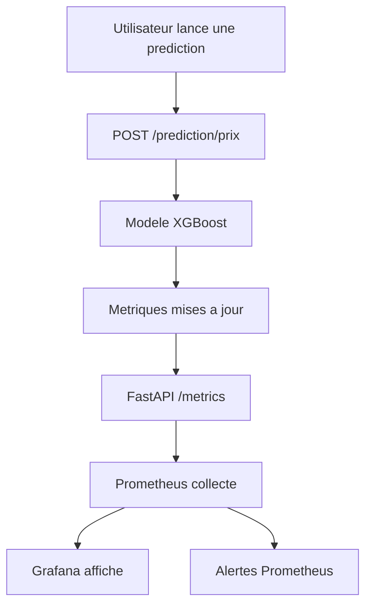

# Rapport competence C11 - Monitoring du modele IA

## 1. Objectif de la competence C11

La competence C11 demande de monitorer un modele d'intelligence artificielle.

Dans mon projet, le modele principal a surveiller est :

`XGBRegressor`

Il sert a predire le prix d'un appartement a Paris.

Le but du monitoring est simple : verifier que le modele fonctionne bien apres
son integration dans l'application.

## 2. Difference avec les autres competences

Pour ne pas melanger :

| Competence | Sujet |
|---|---|
| C9 | L'API expose le modele avec `POST /prediction/prix`. |
| C10 | Streamlit utilise cette API dans l'application. |
| C11 | Je surveille le modele avec des metriques, Prometheus et Grafana. |
| C20 | Je surveille l'application globale : API, base, logs, erreurs HTTP. |

Donc ici, je parle surtout du monitoring du modele IA, pas de tout le monitoring
applicatif.

## 3. Ce que demande le referentiel

Dans le PDF, la competence C11 demande notamment :

- lister les metriques du modele a surveiller ;
- expliquer pourquoi ces metriques sont importantes ;
- choisir un outil de monitoring adapte ;
- integrer les collecteurs de metriques ;
- proposer une restitution en temps reel, comme un dashboard ;
- tester que la chaine de monitoring fonctionne ;
- documenter l'installation, la configuration et l'utilisation ;
- versionner les sources avec Git.

Dans mon projet, j'utilise :

- FastAPI pour exposer les metriques sur `/metrics` ;
- Prometheus pour collecter les metriques ;
- Grafana pour afficher le dashboard ;
- Docker Compose pour lancer la chaine ;
- des tests API pour verifier que les metriques existent.

## 4. Outils choisis

| Outil | Role |
|---|---|
| FastAPI | Expose les metriques avec la route `/metrics`. |
| prometheus_client | Cree les compteurs, jauges et histogrammes en Python. |
| Prometheus | Recupere automatiquement les metriques de l'API. |
| Grafana | Affiche les metriques dans un dashboard lisible. |
| Docker Compose | Lance l'API, Prometheus et Grafana ensemble. |

J'ai choisi Prometheus et Grafana parce que ce sont des outils connus pour le
monitoring. Ils permettent de voir les chiffres en temps reel et de faire un
dashboard.

## 5. Fichiers concernes par C11

| Fichier | Role dans C11 |
|---|---|
| `api/metrics.py` | Definit les metriques Prometheus du modele. |
| `api/routers/system.py` | Expose la route `/metrics`. |
| `api/routers/prediction.py` | Met a jour les metriques quand une prediction est faite. |
| `models/xgboost_prix_dvf_metrics.json` | Contient les metriques de qualite du modele : MAE, RMSE, R2. |
| `monitoring/prometheus.yml` | Configure Prometheus pour lire `/metrics`. |
| `monitoring/alerts.yml` | Contient les regles d'alerte. |
| `monitoring/grafana/dashboards/immobilier-paris.json` | Dashboard Grafana C11 du modele IA. |
| `monitoring/grafana/provisioning/datasources/prometheus.yml` | Configure Prometheus comme source Grafana. |
| `monitoring/grafana/provisioning/dashboards/dashboards.yml` | Dit a Grafana ou trouver les dashboards. |
| `compose.yml` | Lance Prometheus et Grafana en local. |
| `compose.prod.yml` | Lance aussi Prometheus et Grafana en production. |
| `tests/test_api.py` | Verifie que les metriques sont exposees. |
| `docs/monitoring_modele.md` | Ancienne documentation de monitoring du modele. |

## 6. Schema de la chaine de monitoring



## 7. Metriques d'utilisation du modele

Ces metriques disent si le modele est utilise et comment il se comporte.

| Metrique | Explication simple | Pourquoi je la surveille |
|---|---|---|
| `model_predictions_total` | Nombre total de predictions. | Savoir si le modele est utilise. |
| `model_predictions_by_arrondissement_total` | Predictions par arrondissement. | Voir les zones les plus demandees. |
| `model_prediction_errors_total` | Nombre d'erreurs pendant la prediction. | Detecter si le modele plante. |
| `model_prediction_duration_seconds` | Temps de reponse du modele. | Voir si le modele devient lent. |
| `model_predicted_price_euros` | Dernier prix estime. | Voir les valeurs renvoyees. |
| `model_input_surface_m2` | Derniere surface envoyee. | Comprendre les demandes utilisateur. |

Ces metriques sont mises a jour dans :

`api/routers/prediction.py`

## 8. Metriques de qualite du modele

Ces metriques viennent du fichier :

`models/xgboost_prix_dvf_metrics.json`

Elles sont exposees par :

`api/metrics.py`

| Metrique | Explication simple |
|---|---|
| `model_evaluation_mae_euros` | Erreur moyenne du modele en euros. |
| `model_evaluation_rmse_euros` | Erreur qui penalise plus les grosses erreurs. |
| `model_evaluation_r2_score` | Score global du modele. |
| `model_evaluation_test_samples` | Nombre de ventes utilisees pour tester le modele. |

La MAE actuelle est de `111 078,36 euros` sur `30 487` ventes de test.

Ca veut dire qu'en moyenne, le modele peut se tromper d'environ 111 078 euros.
C'est pour ca que l'application affiche une fourchette indicative, pas un prix
absolu.

## 9. Monitoring du resume OpenAI

Le dashboard C11 surveille aussi le resume OpenAI, car c'est une fonctionnalite
IA visible par l'utilisateur.

Important :

- C8 explique comment OpenAI est configure ;
- C11 explique comment OpenAI est surveille.

Les metriques sont :

| Metrique | Explication |
|---|---|
| `openai_summary_service_configured` | Savoir si OpenAI est configure. |
| `openai_summary_calls_total` | Compter les appels OpenAI. |
| `openai_summary_errors_total` | Compter les erreurs OpenAI. |
| `openai_summary_request_duration_seconds` | Mesurer la duree des appels OpenAI. |

Ces metriques aident a voir si le resume IA fonctionne ou s'il devient lent.

## 10. Route `/metrics`

La route qui expose les metriques est dans :

`api/routers/system.py`

Route :

```http
GET /metrics
```

Quand cette route est appelee, elle retourne un texte lisible par Prometheus.

Exemples de metriques visibles :

```text
model_predictions_total{model="XGBRegressor"}
model_prediction_errors_total{model="XGBRegressor"}
model_evaluation_mae_euros{model="XGBRegressor"}
openai_summary_calls_total{model="gpt-5.4-mini",status="success"}
```

## 11. Configuration Prometheus

La configuration Prometheus est dans :

`monitoring/prometheus.yml`

Elle indique que Prometheus doit appeler :

```text
api:8000/metrics
```

Le fichier contient :

```yaml
scrape_configs:
  - job_name: "immobilier-paris-api"
    metrics_path: "/metrics"
    static_configs:
      - targets: ["api:8000"]
```

Prometheus collecte les metriques toutes les 5 secondes.

## 12. Dashboard Grafana

Le dashboard principal C11 est :

`monitoring/grafana/dashboards/immobilier-paris.json`

Son titre est :

`C11 - Monitoring modele IA`

Il affiche notamment :

- nombre total de predictions ;
- erreurs de prediction ;
- etat de l'API ;
- temps moyen de prediction ;
- predictions par arrondissement ;
- dernier prix estime ;
- derniere surface demandee ;
- predictions dans le temps ;
- latence P95 du modele ;
- taux d'erreur ;
- MAE du modele ;
- etat et erreurs OpenAI.

Grafana permet de voir ces informations dans un tableau de bord au lieu de lire
directement le texte de `/metrics`.

## 13. Alertes

Le fichier :

`monitoring/alerts.yml`

contient les alertes Prometheus.

Pour la partie IA, les alertes surveillent le modele XGBoost et le resume OpenAI :

- `ModelePredictionErreursElevees` ;
- `ModelePredictionLatenceElevee` ;
- `OpenAIResumeErreursElevees` ;
- `OpenAIResumeLatenceElevee`.

Ces alertes servent a detecter si le modele ou le resume IA commencent a faire
trop d'erreurs ou deviennent trop lents.

## 14. Docker Compose

Dans `compose.yml`, il y a les services :

- `prometheus` ;
- `grafana`.

Prometheus utilise :

```yaml
./monitoring/prometheus.yml:/etc/prometheus/prometheus.yml:ro
./monitoring/alerts.yml:/etc/prometheus/alerts.yml:ro
```

Grafana utilise :

```yaml
./monitoring/grafana/provisioning/datasources
./monitoring/grafana/provisioning/dashboards
./monitoring/grafana/dashboards
```

Cela permet de lancer toute la chaine avec Docker.

## 15. Comment lancer la chaine de monitoring

En local :

```bash
docker compose up -d --build
```

Ensuite :

- API : `http://127.0.0.1:8002`
- Metriques API : `http://127.0.0.1:8002/metrics`
- Prometheus : `http://127.0.0.1:9090`
- Grafana : `http://127.0.0.1:3000`

Dans Grafana, il faut ouvrir le dashboard :

`C11 - Monitoring modele IA`

## 16. Comment tester

Pour verifier que les metriques existent :

```bash
python3 -m unittest discover -s tests -p 'test_api.py' -v
```

Le test important est :

`test_metrics_expose_les_metriques_du_modele`

Il verifie que `/metrics` expose bien :

- les compteurs de prediction ;
- les erreurs du modele ;
- les durees de prediction ;
- MAE ;
- RMSE ;
- R2 ;
- nombre de lignes de test ;
- metriques OpenAI.

## 17. Accessibilite du monitoring

Le referentiel parle aussi de l'accessibilite.

Pour rendre le monitoring plus facile a lire :

- j'utilise Grafana au lieu de seulement des logs texte ;
- les panneaux ont des titres simples ;
- les metriques sont regroupees dans un dashboard C11 ;
- la documentation explique les metriques avec des mots simples ;
- le dashboard C20 est separe du dashboard C11 pour eviter la confusion.

## 18. Ce que je surveille vraiment

Avec C11, le monitoring permet de repondre a ces questions :

- Est-ce que le modele est utilise ?
- Combien de predictions sont faites ?
- Le modele fait-il des erreurs ?
- Le modele est-il lent ?
- Quels arrondissements sont les plus demandes ?
- La qualite du modele est-elle connue ?
- Le service OpenAI du resume fonctionne-t-il ?

## 19. Limites

Le monitoring est deja utile, mais il peut encore etre ameliore.

Limites actuelles :

- je ne detecte pas encore automatiquement le drift des donnees ;
- il n'y a pas encore de reentrainement automatique du modele ;
- les alertes sont simples ;
- le dashboard peut etre complete plus tard avec des vues plus detaillees.

Mais pour un projet etudiant, la chaine Prometheus + Grafana + FastAPI montre
deja une vraie surveillance du modele.

## 20. Versionnement Git

Commandes de versionnement :

```bash
git add "docs/bloc2/Rapport competence C11.md"
git add api/metrics.py
git add api/routers/system.py
git add api/routers/prediction.py
git add monitoring/prometheus.yml
git add monitoring/alerts.yml
git add compose.yml
git add compose.prod.yml
git add tests/test_api.py
git commit -m "docs: ajouter le rapport competence C11"
```

Verification Git :

```bash
git status --short
git ls-files "docs/bloc2/Rapport competence C11.md"
```

## 21. Conclusion

La competence C11 est couverte parce que le modele IA est surveille avec une
vraie chaine de monitoring.

FastAPI expose les metriques, Prometheus les collecte et Grafana les affiche.
Les tests verifient aussi que les metriques principales sont bien disponibles.

Avec ce monitoring, il est possible de suivre l'utilisation, les erreurs, la vitesse et la
qualite du modele IA.
