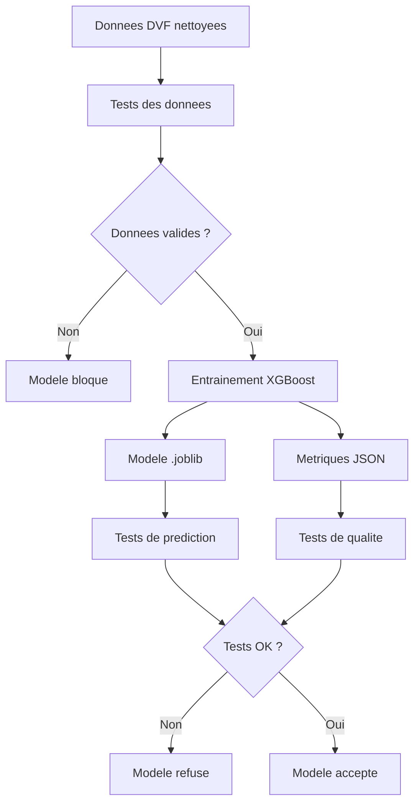

# Rapport competence C12 - Tests automatises du modele IA

## 1. Objectif de la competence C12

La competence C12 demande de programmer des tests automatises pour un modele
d'intelligence artificielle.

Dans mon projet, le modele concerne est :

`XGBRegressor`

Il sert a predire le prix d'un appartement a Paris avec les donnees DVF.

Le but de C12 est simple : avant de garder ou livrer le modele, je dois verifier
automatiquement qu'il fonctionne et que les donnees utilisees sont correctes.

## 2. Difference avec les autres competences

| Competence | Sujet |
|---|---|
| C7 | Je compare plusieurs modeles pour choisir le meilleur. |
| C9 | J'expose le modele dans une API. |
| C11 | Je surveille le modele avec Prometheus et Grafana. |
| C12 | Je teste automatiquement les donnees, l'entrainement et la prediction. |
| C13 | Je lance ces tests automatiquement dans GitHub Actions. |

Donc ici, je parle seulement des tests automatises du modele IA.

## 3. Ce que demande le referentiel

Pour C12, le referentiel demande notamment :

- lister les cas a tester ;
- definir ce qui est teste dans le modele ;
- choisir les outils de test ;
- configurer l'environnement de test ;
- integrer les tests avec des assertions, mocks ou fixtures ;
- verifier que les tests s'executent sans probleme ;
- documenter comment lancer les tests ;
- versionner les sources avec Git.

Dans mon projet, j'utilise surtout `unittest`, car c'est simple, deja integre a
Python et suffisant pour tester mon modele.

## 4. Schema simple de C12



## 5. Strategie de test

J'ai separe les tests en deux parties.

La premiere partie teste les donnees d'entrainement. Elle verifie que le fichier
DVF est present, qu'il contient assez de ventes et que les colonnes importantes
sont correctes.

La deuxieme partie teste le modele. Elle verifie que le nettoyage fonctionne,
que l'entrainement cree bien un fichier modele, que les metriques existent et
que le modele final peut predire un prix positif.

## 6. Tableau des tests C12

| Partie testee | Fichier de test | Ce que je verifie | Pourquoi c'est important | Resultat attendu |
|---|---|---|---|---|
| Fichier de donnees | `tests/test_donnees_livraison.py` | Le fichier DVF existe. | Sans fichier, le modele ne peut pas etre entraine. | Test reussi |
| Volume de donnees | `tests/test_donnees_livraison.py` | Il y a au moins `100000` ventes. | Un modele a besoin d'assez de donnees pour apprendre. | Test reussi |
| Colonnes obligatoires | `tests/test_donnees_livraison.py` | Les colonnes `surface_reelle_bati`, `nombre_pieces_principales`, `arrondissement`, `valeur_fonciere` existent. | Ce sont les colonnes utilisees par le modele. | Test reussi |
| Valeurs manquantes | `tests/test_donnees_livraison.py` | Les colonnes obligatoires ne sont pas vides. | Les valeurs vides peuvent casser l'entrainement. | Test reussi |
| Valeurs invalides | `tests/test_donnees_livraison.py` | Les surfaces, pieces et prix sont positifs. | Le modele ne doit pas apprendre sur des valeurs fausses. | Test reussi |
| Arrondissements | `tests/test_donnees_livraison.py` | Les arrondissements vont de 1 a 20. | Le projet concerne Paris. | Test reussi |
| Nettoyage modele | `tests/test_prediction.py` | Les lignes invalides sont supprimees. | Le modele doit recevoir des donnees propres. | Test reussi |
| Format prediction | `tests/test_prediction.py` | Les donnees de prediction ont les memes colonnes que l'entrainement. | Le modele attend un format precis. | Test reussi |
| Entrainement | `tests/test_prediction.py` | Le script cree un modele `.joblib` et des metriques `.json`. | Il faut verifier que l'entrainement marche vraiment. | Test reussi |
| Prediction finale | `tests/test_prediction.py` | Le modele sauvegarde retourne un prix positif. | Cela montre que le modele est utilisable. | Test reussi |
| Qualite du modele | `tests/test_prediction.py` | Le score `R2` est superieur ou egal a `0.80`. | Cela evite de garder un modele trop mauvais. | Test reussi |
| Fichier metriques | `tests/test_prediction.py` | Le fichier contient `R2`, `MAE`, `RMSE`, les features et les lignes de test. | Cela garde une trace de la qualite du modele. | Test reussi |

## 7. Fichiers concernes par C12

| Fichier | Role dans C12 |
|---|---|
| `tests/test_donnees_livraison.py` | Teste les donnees d'entrainement avant de lancer le modele. |
| `tests/test_prediction.py` | Teste le nettoyage, l'entrainement, les metriques et la prediction. |
| `src/prediction/entrainement_xgboost_prix.py` | Contient le code d'entrainement que les tests verifient. |
| `src/prediction/prediction.py` | Contient le code de prediction locale teste par C12. |
| `scripts/generer_rapport_livraison_modele.py` | Verifie le seuil `R2` et genere un rapport de livraison. |
| `models/xgboost_prix_dvf.joblib` | Modele final sauvegarde et teste. |
| `models/xgboost_prix_dvf_metrics.json` | Metriques finales du modele, aussi testees. |
| `.github/workflows/livraison-modele.yml` | Lance automatiquement les tests C12 dans la chaine C13. |

## 8. Donnees testees

Les donnees utilisees pour entrainer le modele sont stockees ici :

`data/final/dvf_paris_clean_2021_2025.csv`

J'utilise ce fichier parce qu'il contient les ventes DVF nettoyees pour Paris.
Les donnees sont deja preparees dans le projet avant l'entrainement du modele.

Les colonnes importantes pour le modele sont :

| Colonne | Role |
|---|---|
| `surface_reelle_bati` | Surface du logement. |
| `nombre_pieces_principales` | Nombre de pieces. |
| `arrondissement` | Arrondissement de Paris. |
| `valeur_fonciere` | Prix reel de vente, utilise comme cible. |

La cible du modele est :

`valeur_fonciere`

Les features du modele sont :

- `surface_reelle_bati` ;
- `nombre_pieces_principales` ;
- `arrondissement`.

## 9. Tests sur les donnees

Le fichier :

`tests/test_donnees_livraison.py`

verifie que les donnees sont utilisables avant de lancer un entrainement.

Il controle :

- que le fichier CSV existe ;
- qu'il contient au moins `100000` ventes ;
- que les colonnes obligatoires sont presentes ;
- qu'il n'y a pas de valeurs manquantes dans les colonnes importantes ;
- que les surfaces sont positives ;
- que le nombre de pieces est positif ;
- que les arrondissements sont entre 1 et 20 ;
- que les prix sont positifs ;
- que les 20 arrondissements sont representes.

Ce test est important parce qu'un modele peut donner de mauvais resultats si les
donnees sont fausses au depart.

## 10. Tests sur le modele

Le fichier :

`tests/test_prediction.py`

teste plusieurs parties du modele.

Il teste d'abord le nettoyage des donnees avec un petit jeu de donnees cree dans
le test. Dans ce jeu de donnees, il y a des lignes bonnes et des lignes fausses.
Le test verifie que les lignes fausses sont bien supprimees.

Ensuite, il teste la preparation d'une prediction. Le modele doit recevoir les
memes noms de colonnes que pendant l'entrainement.

Apres, il teste l'entrainement avec un petit modele rapide. Le but n'est pas de
refaire tout le gros entrainement, mais de verifier que le code cree bien :

- un fichier modele `.joblib` ;
- un fichier metriques `.json`.

Enfin, il teste le modele final sauvegarde dans `models/`.

## 11. Seuil de qualite

J'ai mis un seuil minimal :

`R2 >= 0.80`

Le score actuel du modele est :

`R2 = 0.8538`

Donc le modele respecte le seuil.

Les autres metriques sont :

| Metrique | Valeur | Explication simple |
|---|---:|---|
| `R2` | `0.8538` | Score global du modele. Plus c'est proche de 1, mieux c'est. |
| `MAE` | `111078.36` euros | Erreur moyenne du modele. |
| `RMSE` | `197974.42` euros | Erreur qui penalise plus les grosses erreurs. |
| `lignes_test` | `30487` | Nombre de ventes utilisees pour tester le modele. |

## 12. Bibliotheques utilisees

| Bibliotheque | Fichier | Pourquoi je l'utilise |
|---|---|---|
| `unittest` | `tests/test_prediction.py`, `tests/test_donnees_livraison.py` | Pour creer les tests automatiques. |
| `tempfile` | `tests/test_prediction.py` | Pour creer des fichiers temporaires pendant les tests. |
| `unittest.mock.patch` | `tests/test_prediction.py` | Pour remplacer le gros modele par un modele plus rapide pendant le test. |
| `pandas` | Tests et scripts prediction | Pour lire les CSV et creer les tableaux de donnees. |
| `joblib` | `tests/test_prediction.py`, scripts prediction | Pour charger ou sauvegarder le modele `.joblib`. |
| `scikit-learn` | `src/prediction/entrainement_xgboost_prix.py` | Pour le pipeline, le decoupage train/test et les metriques. |
| `xgboost` | `src/prediction/entrainement_xgboost_prix.py` | Pour entrainer le modele final. |
| `json` | Tests et scripts | Pour lire et ecrire les metriques du modele. |
| `pathlib` | Tests et scripts | Pour manipuler les chemins de fichiers proprement. |

## 13. Comment lancer les tests C12

Pour tester les donnees d'entrainement :

```bash
python3 -m unittest discover -s tests -p "test_donnees_livraison.py" -v
```

Pour tester le modele IA :

```bash
python3 -m unittest discover -s tests -p "test_prediction.py" -v
```

Pour lancer les deux parties :

```bash
python3 -m unittest discover -s tests -p "test_donnees_livraison.py" -v
python3 -m unittest discover -s tests -p "test_prediction.py" -v
```

## 14. Resultat des tests

Les tests C12 ont ete executes dans l'environnement du projet.

Resultat obtenu le 28 juin 2026 :

```text
test_donnees_livraison.py : Ran 5 tests - OK
test_prediction.py : Ran 6 tests - OK
```

Cela donne au total :

```text
11 tests C12 executes
OK
```

Ce resultat montre que les donnees et le modele passent les tests automatises.

## 15. Lien avec GitHub Actions

Le fichier :

`.github/workflows/livraison-modele.yml`

lance aussi les tests C12 automatiquement.

Important : ce fichier appartient surtout a la competence C13, parce que C13
parle de livraison continue. Il montre aussi que les tests C12
peuvent etre lances automatiquement dans une chaine.

Dans ce workflow, il y a deux etapes importantes pour C12 :

```yaml
python -m unittest discover -s tests -p "test_donnees_livraison.py" -v
python -m unittest discover -s tests -p "test_prediction.py" -v
```

## 16. Ce que les tests evitent

Les tests permettent d'eviter plusieurs problemes :

- entrainer un modele avec un fichier CSV absent ;
- entrainer un modele avec des colonnes manquantes ;
- utiliser des valeurs vides ;
- accepter des surfaces ou prix invalides ;
- garder un modele qui ne predit pas un prix positif ;
- garder un modele avec un score `R2` trop faible ;
- perdre la trace des metriques du modele.

## 17. Limites

Les tests couvrent les points les plus importants, mais ils peuvent encore etre
ameliores.

Par exemple, les ameliorations possibles sont :

- des tests sur des valeurs tres extremes ;
- un test de reproductibilite plus strict ;
- un test de derive des donnees ;
- un rapport de couverture automatique.

Mais pour mon projet, les tests actuels montrent deja que le modele, les donnees
et les metriques sont controles automatiquement.

## 18. Versionnement Git

Les fichiers C12 sont dans le depot Git du projet.

Commandes de versionnement :

```bash
git add "docs/bloc2/Rapport competence C12.md"
git add tests/test_donnees_livraison.py
git add tests/test_prediction.py
git add src/prediction/entrainement_xgboost_prix.py
git add src/prediction/prediction.py
git add scripts/generer_rapport_livraison_modele.py
git add .github/workflows/livraison-modele.yml
git commit -m "docs: ajouter le rapport competence C12"
```

Verification Git :

```bash
git status --short
git ls-files "tests/test_prediction.py"
git ls-files "tests/test_donnees_livraison.py"
```

## 19. Conclusion

La competence C12 est couverte parce que le modele IA n'est pas seulement
entraine. Il est aussi teste automatiquement.

Les tests verifient les donnees, le nettoyage, l'entrainement, la prediction, le
fichier de metriques et le seuil de qualite.

Cela permet de garder un modele plus fiable et d'eviter de livrer un modele qui
ne marche pas.
