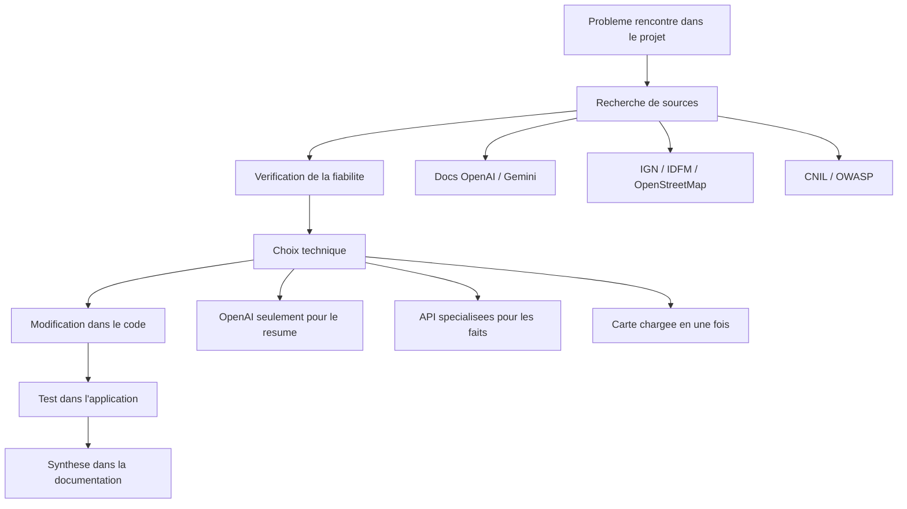
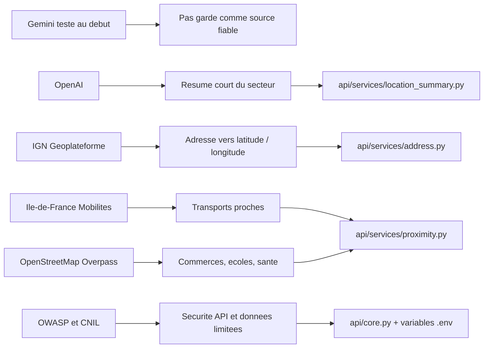

# Rapport competence C6 - Veille technique et reglementaire

## 1. Objectif de la competence C6

La competence C6 demande de montrer que j'ai fait une veille technique et
reglementaire pendant le projet. Pour moi, ca veut dire que je ne code pas au
hasard. Je regarde les technologies, les sources officielles, les limites, la
securite, la loi et les problemes rencontres dans mon application.

Dans mon projet `immobilier-paris-ia`, la veille m'a surtout servi pour :

- choisir les bonnes API pour analyser une adresse ;
- eviter que l'IA invente des informations ;
- ameliorer la fluidite de la carte ;
- suivre les regles sur les donnees et la securite des API ;
- garder une trace des choix techniques que j'ai change pendant le projet.

Au debut, ma veille n'etait pas tres bien organisee. Je faisais surtout des
recherches quand j'avais un blocage. Ensuite, je l'ai formalisee dans ce
document pour garder un suivi clair et relie au projet.

## 2. Theme de veille choisi

Le theme principal que j'ai suivi est :

**Comment utiliser des services externes et de l'IA dans une application
immobiliere sans perdre la fiabilite, la securite et la fluidite utilisateur.**

J'ai separe ce theme en 4 parties :

| Partie de veille | Pourquoi je l'ai suivie |
|---|---|
| IA generative | Pour savoir si Gemini ou OpenAI etait utile pour resumer un quartier. |
| API de donnees publiques | Pour recuperer des donnees plus fiables que du texte invente par une IA. |
| Performance de la carte | Pour eviter une carte lente quand l'utilisateur zoom ou navigue. |
| Securite et reglementation | Pour faire attention aux cles API, aux donnees personnelles et aux regles CNIL/RGPD. |

## 3. Organisation de ma veille

Au debut du projet, je n'avais pas un planning propre. Je cherchais les infos
quand j'avais besoin. Par exemple, quand Gemini ne donnait pas toujours le meme
resultat, j'ai commence a comparer avec d'autres solutions.

Apres, j'ai organise la veille comme ca :

| Moment | Duree | Ce que je fais |
|---|---:|---|
| Lundi soir | 1 heure | Je regarde les sources importantes : docs OpenAI, Gemini, IGN, IDFM, OpenStreetMap, CNIL, OWASP. |
| Pendant la semaine | 10 a 15 minutes si besoin | Je verifie une info quand un probleme apparait dans le code. |
| Fin de semaine | 20 a 30 minutes | J'ecris une petite synthese : ce que j'ai appris, ce que je garde, ce que je change. |

Le but n'etait pas juste de lire. Le but etait de prendre une decision dans le
projet apres la veille.

## 4. Outil utilise pour suivre la veille

Je n'ai pas utilise un gros outil professionnel. J'ai fait simple, car je suis
sur un projet etudiant.

J'ai utilise :

- des favoris dans le navigateur pour garder les liens importants ;
- la documentation officielle des services ;
- les fichiers Markdown dans mon dossier projet pour garder les syntheses ;
- le code du projet pour verifier si la decision est vraiment appliquee.

Le fichier principal de suivi est celui-ci :

`docs/bloc2/Rapport competence C6.md`

Comme il est dans le dossier du projet, la veille reste liee au code et aux
decisions techniques appliquees.

## 5. Criteres pour choisir une source fiable

Pour ne pas prendre n'importe quelle information, j'ai utilise ces criteres :

| Critere | Explication simple |
|---|---|
| Source officielle | Je prefere les docs officielles : OpenAI, Google, IGN, IDFM, CNIL, OWASP. |
| Date recente | Je regarde si la documentation est encore a jour. |
| Lien avec mon code | La source doit servir a une partie concrete du projet. |
| Donnees stables | Pour les transports ou les adresses, je prefere une API specialisee plutot qu'une IA generative. |
| Securite | Je regarde comment gerer les cles API, les timeouts, les erreurs et les donnees envoyees. |
| Verifiable | Je dois pouvoir retrouver le lien et expliquer pourquoi je l'ai utilise. |

## 6. Sources suivies

| Source | Lien | Pourquoi je l'ai choisie |
|---|---|---|
| OpenAI API | https://platform.openai.com/docs/overview | Pour generer un resume court du secteur a partir de donnees deja calculees. |
| Gemini API | https://ai.google.dev/gemini-api/docs | Pour comparer avec Gemini, que j'avais teste au debut. |
| Documentation IGN / Geoplateforme | https://geoservices.ign.fr/documentation/services/services-geoplateforme/geocodage | Pour geocoder une adresse exacte avec une source officielle francaise. |
| Ile-de-France Mobilites Open Data | https://data.iledefrance-mobilites.fr/ | Pour recuperer les transports autour d'une adresse. |
| OpenStreetMap / Overpass API | https://wiki.openstreetmap.org/wiki/Overpass_API | Pour chercher les commerces, ecoles et services de sante autour d'une adresse. |
| OpenStreetMap copyright | https://www.openstreetmap.org/copyright | Pour verifier les conditions de la source cartographique. |
| OWASP API Security | https://owasp.org/API-Security/ | Pour suivre les risques de securite d'une API. |
| CNIL - Intelligence artificielle | https://www.cnil.fr/fr/intelligence-artificielle | Pour faire attention aux donnees et a l'usage de l'IA. |

J'ai choisi surtout des sources officielles parce que le projet utilise des
donnees publiques et des API externes. Si je prends une source non fiable, je
peux faire un mauvais choix technique.

## 7. Premiere veille : Gemini ne me donnait pas une reponse stable

Au debut du projet, pour analyser une adresse, j'avais teste une approche avec
Gemini. L'idee etait simple : je donnais une adresse et l'IA devait me rediger
les informations autour : transports, commerces, sante, ecoles, etc.

Le probleme que j'ai vu, c'est que quand je rentrais deux fois la meme adresse,
le resultat pouvait changer. Pour une application immobiliere, ce n'est pas
assez fiable, car l'utilisateur peut croire que les informations sont des faits.

Ma decision apres cette veille :

- ne pas utiliser une IA generative comme source principale de verite ;
- utiliser des API specialisees pour les donnees factuelles ;
- garder l'IA seulement pour reformuler un texte a partir des donnees deja
  calculees par l'application.

Donc j'ai remplace la logique "l'IA invente/recherche tout" par une logique plus
controlee :

- IGN pour transformer l'adresse en latitude/longitude ;
- Ile-de-France Mobilites pour les transports ;
- OpenStreetMap Overpass pour les commerces, ecoles et sante ;
- OpenAI seulement pour faire un resume court avec les donnees deja trouvees.

## 8. Deuxieme veille : choix d'OpenAI pour le resume, mais avec limites

Apres avoir teste Gemini, j'ai regarde OpenAI pour faire seulement le resume du
secteur. Je n'ai pas garde OpenAI pour calculer les donnees. Je l'ai garde pour
rediger un texte clair, parce que c'est plus lisible pour l'utilisateur.

Dans le code, cette partie est dans :

`api/services/location_summary.py`

Ce que j'ai applique grace a la veille :

- OpenAI est optionnel : si la cle `OPENAI_API_KEY` n'existe pas, l'application
  continue de fonctionner ;
- le modele est configurable avec `OPENAI_MODEL` ;
- j'ai mis un timeout pour eviter que l'utilisateur attende trop longtemps ;
- j'ai limite le nombre de tokens avec `max_output_tokens=220` ;
- j'ai demande au modele de ne pas inventer d'informations ;
- j'envoie seulement les donnees utiles, pas toute la base ;
- dans le code, `store=False` est utilise pour ne pas stocker la requete cote
  OpenAI.

Pour moi, c'est un bon compromis : les donnees restent calculees par mes scripts
et mes API, et l'IA sert juste a rendre le resultat plus humain.

## 9. Troisieme veille : utiliser des API specialisees au lieu de tout demander a l'IA

J'ai compris que pour les donnees autour d'une adresse, il faut utiliser les
bonnes sources.

### 9.1 Geocodage avec IGN

Fichier concerne :

`api/services/address.py`

Le service IGN permet de transformer une adresse saisie en coordonnees GPS. Dans
mon code, j'utilise :

`https://data.geopf.fr/geocodage/search`

Pourquoi ce choix :

- c'est une source officielle francaise ;
- elle s'appuie sur la Base Adresse Nationale ;
- elle permet de verifier que l'adresse est bien une adresse exacte a Paris ;
- elle renvoie latitude et longitude, que j'utilise ensuite pour chercher les
  points autour.

### 9.2 Transports avec Ile-de-France Mobilites

Fichier concerne :

`api/services/proximity.py`

J'utilise Ile-de-France Mobilites pour les arrets et les lignes proches. C'est
plus logique que de demander a une IA, car les transports sont des donnees qui
doivent etre exactes.

Dans mon code, il y a aussi une solution de secours : si l'API PRIM ne repond
pas, je tente la source Open Data IDFM.

Pourquoi c'est important :

- l'application ne depend pas d'une seule reponse ;
- si une API ne marche pas, une autre source reste possible ;
- les donnees de transport viennent d'un acteur officiel.

### 9.3 Commerces, ecoles et sante avec OpenStreetMap Overpass

Fichier concerne :

`api/services/proximity.py`

J'utilise OpenStreetMap Overpass pour chercher les lieux autour de l'adresse :

- commerces ;
- ecoles ;
- universites ;
- pharmacies ;
- medecins ;
- cliniques et hopitaux.

J'ai ajoute plusieurs URLs Overpass dans le code. Comme ca, si un serveur est
indisponible, le script peut essayer un autre endpoint.

Limite de cette source :

- OpenStreetMap depend des contributions ;
- toutes les donnees ne sont pas toujours parfaites ;
- il faut filtrer les resultats pour ne pas afficher des lieux inutiles.

Mais pour mon besoin etudiant, c'est une bonne source ouverte et utilisable.

## 10. Quatrieme veille : probleme de fluidite de la carte

Au debut, la carte ne fonctionnait pas comme je voulais. Quand l'utilisateur
zoomait ou bougeait la carte, l'application devait refaire des appels pour
recuperer les points. Le resultat n'etait pas tres fluide.

J'ai donc change ma logique.

Avant :

- l'utilisateur ouvre la carte ;
- quand il zoom ou bouge, l'application recupere des points ;
- il y a plus d'allers-retours avec l'API ou la base ;
- la navigation peut devenir lente.

Apres :

- l'utilisateur clique sur **Generer la carte des appartements vendus** ;
- l'application charge beaucoup de points en une fois ;
- les points sont regroupes sur la carte ;
- ensuite la navigation est plus fluide.

Fichiers concernes :

- `streamlit/frontend/application.py` ;
- `streamlit/frontend/map_view.py` ;
- `streamlit/frontend/config.py`.

Dans `streamlit/frontend/config.py`, j'ai une limite :

`MAX_POINTS = 200000`

Dans `streamlit/frontend/map_view.py`, j'utilise `FastMarkerCluster` pour
regrouper les points et eviter d'afficher trop de marqueurs d'un coup.

Le compromis :

- le premier chargement peut etre plus lent ;
- mais apres, l'experience utilisateur est plus agreable ;
- l'utilisateur voit mieux les points quand il zoom.

Cette decision vient directement de ma veille et de mes tests sur l'usage de la
carte.

## 11. Veille securite API

Comme mon application utilise une API FastAPI et plusieurs services externes,
j'ai regarde les risques de securite API avec OWASP.

Ce que j'ai retenu pour mon projet :

- ne pas mettre les cles API directement dans le code ;
- utiliser des variables d'environnement comme `OPENAI_API_KEY` et `IDFM_API_KEY` ;
- mettre des timeouts sur les appels externes ;
- gerer les erreurs sans faire planter toute l'application ;
- verifier les donnees saisies par l'utilisateur ;
- ne pas envoyer plus de donnees que necessaire a un service externe ;
- garder l'API lisible et separee en routes/services.

Exemples dans le code :

- `api/services/proximity.py` gere les erreurs IDFM et Overpass ;
- `api/services/location_summary.py` gere l'absence de cle OpenAI ;
- `api/services/address.py` refuse les adresses qui ne sont pas des adresses
  exactes a Paris ;
- `api/core.py` charge les variables d'environnement.

## 12. Veille reglementaire : CNIL, RGPD et IA

Pour la partie reglementaire, j'ai surtout regarde la CNIL. Dans mon projet, il
y a des comptes utilisateurs et des adresses saisies. Donc je dois faire
attention aux donnees personnelles.

Ce que j'ai retenu :

- ne pas collecter plus d'informations que necessaire ;
- ne pas envoyer l'adresse brute partout si ce n'est pas utile ;
- proteger les mots de passe avec un hash ;
- expliquer les sources utilisees a l'utilisateur ;
- garder l'IA comme aide de redaction, pas comme decision automatique ;
- eviter de laisser croire que le resume OpenAI est une verite absolue.

J'ai mis la partie RGPD plus en detail dans un document separe du bloc 1, car ce
n'est pas seulement de la C6. Mais ici, je montre que la veille reglementaire a
influence mes choix.

Document lie :

`docs/bloc1/Rapport RGPD  c4.md`

## 13. Syntheses datees de ma veille

Ces syntheses reprennent les recherches et decisions que j'ai faites pendant le
projet. Au debut, elles n'etaient pas toutes ecrites proprement. Je les ai donc
formalisees ici pour montrer le suivi.

| Date | Sujet | Ce que j'ai remarque | Decision prise |
|---|---|---|---|
| 06/05/2026 | Test Gemini pour une adresse | Deux demandes avec la meme adresse peuvent donner des resultats differents. | Ne pas utiliser Gemini comme source principale des donnees. |
| 13/05/2026 | Comparaison IA generative / API specialisees | Une IA peut rediger, mais les faits doivent venir de sources verifiables. | Utiliser IGN, IDFM et OpenStreetMap pour les donnees factuelles. |
| 20/05/2026 | Geocodage adresse | L'IGN propose une API officielle pour transformer une adresse en coordonnees. | Ajouter le service `api/services/address.py`. |
| 27/05/2026 | Donnees de proximite | IDFM est adapte pour les transports, Overpass est utile pour les equipements. | Creer la logique de proximite dans `api/services/proximity.py`. |
| 03/06/2026 | Resume du quartier | OpenAI est utile si les donnees sont deja controlees par l'application. | Garder OpenAI uniquement pour un resume court et optionnel. |
| 10/06/2026 | Fluidite de la carte | Charger les points pendant les deplacements rend la carte moins agreable. | Charger les points en une fois et utiliser `FastMarkerCluster`. |
| 17/06/2026 | Securite API | Les cles et les services externes doivent etre controles. | Utiliser variables d'environnement, timeouts et erreurs propres. |
| 24/06/2026 | Donnees et reglementation | Les donnees utilisateur doivent rester limitees et expliquees. | Document RGPD separe + explication des sources dans l'application. |

## 14. Schema de la veille appliquee au projet



## 15. Schema source / decision / code



## 16. Ce que cette veille a change dans mon projet

Grace a la veille, j'ai fait plusieurs changements importants :

- j'ai abandonne l'idee de demander tous les faits a une IA ;
- j'ai choisi des API specialisees pour les donnees exactes ;
- j'ai garde OpenAI seulement pour rediger un resume ;
- j'ai limite les donnees envoyees au service IA ;
- j'ai ajoute des timeouts et des erreurs propres ;
- j'ai ameliore la carte avec un chargement en une fois ;
- j'ai documente les sources dans l'application ;
- j'ai separe la partie RGPD dans un document a part.

## 17. Fichiers du projet lies a la C6

| Fichier | Lien avec la veille |
|---|---|
| `docs/bloc2/Rapport competence C6.md` | Document principal de la veille. |
| `api/services/address.py` | Choix IGN pour geocoder une adresse. |
| `api/services/proximity.py` | Choix IDFM et OpenStreetMap pour les donnees autour de l'adresse. |
| `api/services/location_summary.py` | Choix OpenAI limite au resume du secteur. |
| `streamlit/frontend/application.py` | Changement de logique pour generer la carte. |
| `streamlit/frontend/map_view.py` | Regroupement des points avec `FastMarkerCluster`. |
| `streamlit/frontend/config.py` | Limite `MAX_POINTS` pour le chargement de la carte. |
| `streamlit/frontend/views/sources.py` | Explication des sources a l'utilisateur. |
| `docs/bloc1/Rapport RGPD  c4.md` | Document separe pour la partie donnees personnelles. |
| `docs/benchmark_services_ia_c7.md` | Document lie pour le choix des services IA, surtout C7. |

## 18. Versionnement Git

Comme ce document est stocke dans le projet, il peut etre ajoute dans Git avec :

```bash
git add "docs/bloc2/Rapport competence C6.md"
git commit -m "docs: ajouter le rapport competence C6"
```

Verification Git :

```bash
git status --short
git ls-files "docs/bloc2/Rapport competence C6.md"
```

L'interet de Git est de garder une trace du document dans le meme depot que le
code du projet.

## 19. Conclusion

Pour la competence C6, je montre que j'ai organise une veille technique et
reglementaire autour de mon projet immobilier. Cette veille n'etait pas parfaite
au debut, mais elle a vraiment influence mes choix.

Le point le plus important est que j'ai change ma facon de faire : au lieu de
laisser une IA generer toutes les informations autour d'une adresse, j'ai choisi
des sources fiables et specialisees. L'IA sert seulement a expliquer les donnees
de facon plus simple.

Cette competence est donc documentee par ce document, les sources citees, les
syntheses datees et les fichiers de code qui montrent les decisions appliquees.
