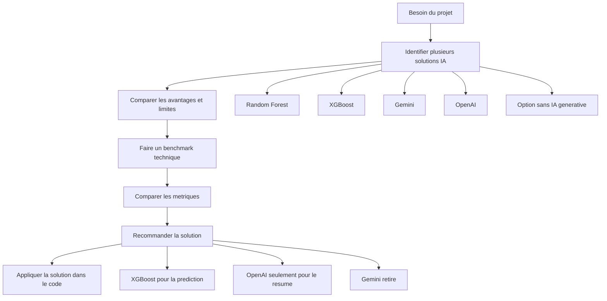
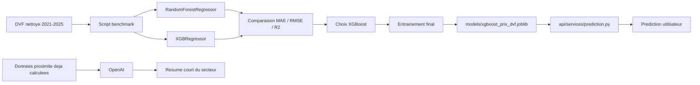

# Rapport competence C7 - Benchmark et recommandation de services IA

## 1. Objectif de la competence C7

La competence C7 demande de montrer que j'ai identifie plusieurs solutions
d'intelligence artificielle, que je les ai comparees, puis que j'ai recommande
la solution la plus adaptee a mon projet.

Dans mon projet `immobilier-paris-ia`, le but n'etait pas seulement de mettre
une IA pour dire qu'il y a une IA. Le but etait de choisir une solution utile,
testable et claire.

Pour moi, la C7 correspond donc a :

- comparer plusieurs solutions IA ;
- regarder leurs avantages et leurs limites ;
- tester au moins les solutions utiles sur mes donnees ;
- expliquer pourquoi une solution est gardee ou retiree ;
- montrer dans le code que la recommandation est appliquee.

## 2. C'est quoi un benchmark ?

Un benchmark, c'est une comparaison organisee.

Je prends plusieurs solutions, je les teste ou je les analyse avec les memes
criteres, puis je choisis la meilleure pour mon besoin.

Dans mon projet, le benchmark sert surtout a repondre a deux questions :

1. Quel modele utiliser pour predire le prix d'un appartement parisien ?
2. Est-ce qu'une IA generative comme Gemini ou OpenAI doit etre utilisee dans
   l'application ?

Le benchmark n'est pas juste un tableau. Il doit expliquer :

- le besoin ;
- les contraintes ;
- les solutions comparees ;
- les resultats ;
- la recommandation finale.

## 3. Besoin du projet

Mon application travaille sur l'immobilier a Paris. Elle utilise surtout les
donnees DVF pour analyser les ventes passees et estimer un prix.

Les besoins IA sont :

| Besoin | Explication |
|---|---|
| Predire un prix immobilier | Donner une estimation a partir de la surface, du nombre de pieces et de l'arrondissement. |
| Comparer plusieurs modeles | Ne pas choisir un modele au hasard. |
| Rediger un resume de quartier | Aider l'utilisateur a comprendre les transports et services proches d'une adresse. |
| Eviter les reponses inventees | Ne pas laisser une IA generative inventer des faits sur une adresse. |

La prediction du prix est le besoin le plus important. Si le modele est mauvais,
l'application perd beaucoup de valeur.

## 4. Contraintes du projet

Avant de choisir une IA, j'ai regarde mes contraintes.

| Contrainte | Pourquoi c'est important |
|---|---|
| Donnees tabulaires | Les donnees DVF sont des colonnes : surface, pieces, arrondissement, prix. |
| Projet etudiant | Le choix doit rester simple a expliquer. |
| Cout | Je voulais eviter de payer une API externe pour chaque prediction. |
| Donnees utilisateur | Une prediction peut contenir des informations saisies par l'utilisateur. |
| Reproductibilite | Il faut pouvoir relancer le modele et retrouver des resultats proches. |
| Deploiement | Le modele doit fonctionner dans l'application et dans Docker. |
| Performance | La prediction doit repondre rapidement. |

Ces contraintes m'ont pousse a garder la prediction en local, avec un modele
entraine dans le projet.

## 5. Sources consultees

| Source | Lien | Pourquoi je l'ai utilisee |
|---|---|---|
| Documentation XGBoost | https://xgboost.readthedocs.io/en/stable/python/python_api.html#xgboost.XGBRegressor | Pour utiliser `XGBRegressor`, un modele adapte a la regression. |
| Documentation scikit-learn RandomForestRegressor | https://scikit-learn.org/stable/modules/generated/sklearn.ensemble.RandomForestRegressor.html | Pour comparer XGBoost avec Random Forest. |
| Documentation scikit-learn Pipeline | https://scikit-learn.org/stable/modules/generated/sklearn.pipeline.Pipeline.html | Pour chainer preparation des donnees et modele. |
| Documentation OpenAI API | https://platform.openai.com/docs/overview | Pour utiliser OpenAI seulement comme aide de redaction. |
| Documentation Gemini API | https://ai.google.dev/gemini-api/docs | Pour comparer avec Gemini, que j'avais teste au debut. |
| Documentation MLflow | https://mlflow.org/docs/latest/ | Pour garder une trace optionnelle des essais de modeles. |

J'ai choisi des sources officielles parce que la C7 doit etre justifiee. Les
blogs peuvent aider, mais pour justifier un choix, la documentation officielle
est plus solide.

## 6. Solutions comparees

| Solution | Usage possible | Avantages | Limites | Decision |
|---|---|---|---|---|
| XGBoost local | Prediction du prix immobilier | Bon sur donnees tabulaires, rapide, utilisable localement, pas d'appel externe | Besoin d'entrainement et de suivi des metriques | Retenu pour la prediction |
| Random Forest local | Prediction du prix immobilier | Simple a expliquer, robuste, bon modele de comparaison | Resultats un peu moins bons dans mon benchmark | Ecarte pour le modele final |
| Service IA externe / AutoML cloud | Prediction du prix | Infrastructure geree, moins de code modele | Cout, dependance fournisseur, donnees envoyees dehors, moins simple a reproduire | Non retenu |
| Gemini | Resume d'adresse ou quartier | Facile pour generer du texte | Reponses variables pour la meme adresse, risque d'inventer | Non retenu dans l'application finale |
| OpenAI | Resume court du secteur | Bon pour transformer des donnees deja calculees en texte lisible | Cout API, dependance externe, il faut limiter les donnees envoyees | Retenu seulement pour le resume optionnel |
| Option sans IA generative | Texte fixe pour le quartier | Pas de cout externe, pas de dependance API | Texte moins naturel et moins adapte aux donnees | Garde-fou possible |

La solution finale est donc hybride :

- XGBoost local pour le calcul important ;
- OpenAI seulement pour rediger un resume ;
- pas de Gemini dans le code final ;
- pas de service AutoML cloud pour predire le prix.

## 7. Benchmark technique des modeles de prediction

Le benchmark technique est dans :

`src/prediction/comparaison_modeles_prix.py`

Ce fichier compare :

- `RandomForestRegressor` ;
- `XGBRegressor`.

Il travaille avec le fichier :

`data/final/dvf_paris_clean_2021_2025.csv`

La cible a predire est :

`valeur_fonciere`

Les variables utilisees sont :

| Variable | Role |
|---|---|
| `surface_reelle_bati` | Surface du bien en m2. |
| `nombre_pieces_principales` | Nombre de pieces principales. |
| `arrondissement` | Arrondissement de Paris, transforme en categorie. |

Je n'ai pas mis trop de variables pour ce benchmark, car je voulais un modele
simple a expliquer et stable.

## 8. Nettoyage fait avant le benchmark

Dans `charger_donnees()`, le script prepare les donnees avant d'entrainer les
modeles.

Ce qui est fait :

- les noms de colonnes sont mis en minuscules ;
- seules les colonnes utiles sont gardees ;
- les valeurs sont converties en nombres ;
- les lignes vides sont supprimees ;
- les surfaces invalides sont supprimees ;
- les nombres de pieces invalides sont supprimes ;
- les arrondissements doivent etre entre 1 et 20 ;
- les prix doivent etre superieurs a 0 ;
- l'arrondissement est transforme en texte pour etre encode comme categorie.

Ce nettoyage evite d'entrainer le modele avec des donnees fausses.

## 9. Separation entrainement / test

Le script utilise :

`train_test_split(test_size=0.2, random_state=42)`

Ca veut dire :

- 80 % des lignes servent a entrainer le modele ;
- 20 % servent a tester le modele ;
- `random_state=42` permet d'avoir une comparaison reproductible.

Dans mes resultats :

| Partie | Nombre de lignes |
|---|---:|
| Total | 152 431 |
| Entrainement | 121 944 |
| Test | 30 487 |

## 10. Preparation des variables

Les variables numeriques sont gardees directement :

- `surface_reelle_bati` ;
- `nombre_pieces_principales`.

L'arrondissement est une categorie. Le script utilise donc :

`OneHotEncoder(handle_unknown="ignore")`

Pourquoi :

- l'arrondissement 1, 2, 3, etc. n'est pas juste une valeur mathematique ;
- c'est une zone geographique ;
- l'encodage evite de dire au modele que le 20e est juste "plus grand" que le
  1er.

Le tout est mis dans un `Pipeline` scikit-learn. Comme ca, la preparation et le
modele restent ensemble.

## 11. Metriques utilisees

Pour comparer les modeles, j'utilise :

| Metrique | Explication simple |
|---|---|
| R2 | Score global. Plus il est proche de 1, mieux c'est. |
| MAE | Erreur moyenne en euros. Plus c'est bas, mieux c'est. |
| RMSE | Erreur qui penalise plus les grosses erreurs. Plus c'est bas, mieux c'est. |

Pour choisir le meilleur modele, j'ai surtout regarde le RMSE, car dans
l'immobilier, les grosses erreurs peuvent etre tres genantes.

## 12. Resultats du benchmark

Les resultats sont stockes dans :

- `models/comparaison_xgboost_random_forest_prix.json` ;
- `models/comparaison_xgboost_random_forest_prix.csv`.

Resultats obtenus :

| Modele | Lignes test | R2 | MAE | RMSE |
|---|---:|---:|---:|---:|
| RandomForestRegressor | 30 487 | 0.8425 | 114 790.87 euros | 205 470.48 euros |
| XGBRegressor | 30 487 | 0.8538 | 111 078.36 euros | 197 974.42 euros |

Le meilleur modele est `XGBRegressor`.

Pourquoi :

- son R2 est plus haut ;
- sa MAE est plus basse ;
- son RMSE est plus bas ;
- il est adapte aux donnees tabulaires ;
- il peut etre sauvegarde et recharge facilement dans l'application.

## 13. Entrainement du modele final

Le fichier pour entrainer le modele final est :

`src/prediction/entrainement_xgboost_prix.py`

Ce fichier ne compare plus les modeles. Il entraine directement XGBoost, car le
benchmark a deja montre que XGBoost est le meilleur choix pour ce projet.

Il cree deux fichiers :

| Fichier | Utilite |
|---|---|
| `models/xgboost_prix_dvf.joblib` | Modele sauvegarde pour l'API et la prediction. |
| `models/xgboost_prix_dvf_metrics.json` | Metriques du modele : R2, MAE, RMSE, lignes test, etc. |

Le modele final garde les memes variables que le benchmark :

- surface ;
- nombre de pieces ;
- arrondissement.

## 14. Utilisation du modele dans l'application

Le modele final est utilise cote API dans :

`api/services/prediction.py`

Ce fichier :

- charge le modele `.joblib` ;
- garde le modele en memoire pour eviter de le relire a chaque prediction ;
- lit la MAE dans `models/xgboost_prix_dvf_metrics.json` ;
- prepare un `DataFrame` avec les memes colonnes que pendant l'entrainement ;
- lance `modele.predict()` ;
- renvoie un prix estime.

La route API qui expose la prediction est :

`api/routers/prediction.py`

La route est :

`POST /prediction/prix`

Cette route n'est pas le coeur de C7, car la route API sera surtout utile pour
une autre competence. Je la cite ici comme trace de l'application de la
recommandation C7 dans le code.

## 15. Resume OpenAI du secteur

Le service OpenAI est utilise dans :

`api/services/location_summary.py`

OpenAI n'est pas utilise pour predire le prix. Il est utilise seulement pour
rediger un resume court du secteur.

Le code fait attention a plusieurs points :

- OpenAI est optionnel ;
- si `OPENAI_API_KEY` est absente, l'application retourne une erreur propre ;
- le modele est configurable avec `OPENAI_MODEL` ;
- le timeout est limite avec `TIMEOUT_OPENAI_SECONDES = 25` ;
- `max_output_tokens=220` limite la taille de la reponse ;
- `store=False` est utilise ;
- le prompt demande de rester factuel et de ne pas inventer ;
- seules les donnees utiles de proximite sont envoyees.

Pourquoi ce choix :

- l'IA generative est utile pour ecrire un texte clair ;
- mais les faits viennent deja de l'application ;
- ca evite de laisser l'IA inventer des transports ou des commerces.

## 16. Pourquoi Gemini n'est pas garde

Au debut, j'avais teste Gemini pour analyser une adresse. L'idee etait de donner
une adresse a l'IA et de lui demander les transports, commerces, sante, etc.

Le probleme observe :

- quand je mettais deux fois la meme adresse, les reponses pouvaient changer ;
- certaines informations etaient difficiles a verifier ;
- pour un projet immobilier, ce n'est pas assez fiable.

Decision :

- Gemini n'est pas garde dans le code final ;
- les faits viennent des API specialisees ;
- OpenAI sert seulement a reformuler les donnees deja calculees.

Ce point est important pour C7, car il montre qu'une solution peut etre testee
puis rejetee.

## 17. Option sans IA generative

J'ai aussi garde en tete une option sans IA generative.

Cette option serait de produire un resume avec des phrases fixes, par exemple :

> "Dans un rayon de 500 m, l'adresse contient X transports, X commerces et X
> services de sante."

Avantages :

- pas de cout API ;
- pas de dependance OpenAI ;
- pas d'envoi a un service externe.

Limites :

- texte plus simple ;
- moins agreable a lire ;
- moins adaptable.

Je ne l'ai pas choisie comme solution principale, mais elle reste une solution de
secours si OpenAI est indisponible.

## 18. Bibliotheques Python utilisees

### 18.1 `src/prediction/comparaison_modeles_prix.py`

| Bibliotheque | Utilisation |
|---|---|
| `argparse` | Lancer le script avec des options en ligne de commande. |
| `json` | Sauvegarder les resultats du benchmark en JSON. |
| `pathlib` | Gerer les chemins de fichiers proprement. |
| `pandas` | Charger et nettoyer les donnees DVF. |
| `sklearn.compose.ColumnTransformer` | Appliquer un traitement different selon les colonnes. |
| `RandomForestRegressor` | Modele de comparaison. |
| `mean_absolute_error`, `mean_squared_error`, `r2_score` | Calculer les metriques. |
| `train_test_split` | Separer entrainement et test. |
| `Pipeline` | Mettre preparation + modele dans un seul objet. |
| `OneHotEncoder` | Encoder l'arrondissement. |
| `XGBRegressor` | Modele candidat principal. |
| `mlflow` optionnel | Tracer les essais si MLflow est installe. |

### 18.2 `src/prediction/entrainement_xgboost_prix.py`

| Bibliotheque | Utilisation |
|---|---|
| `joblib` | Sauvegarder le modele entraine en `.joblib`. |
| `pandas` | Charger et preparer les donnees. |
| `scikit-learn` | Pipeline, encodage, split et metriques. |
| `xgboost` | Entrainer `XGBRegressor`. |
| `json` | Sauvegarder les metriques. |

### 18.3 `api/services/prediction.py`

| Bibliotheque | Utilisation |
|---|---|
| `joblib` | Recharger le modele XGBoost sauvegarde. |
| `pandas` | Creer les donnees d'entree avec les bonnes colonnes. |
| `FastAPI HTTPException` | Renvoyer une erreur propre si le modele manque. |
| `json` | Lire les metriques du modele. |

### 18.4 `api/services/location_summary.py`

| Bibliotheque | Utilisation |
|---|---|
| `openai` | Appeler OpenAI pour generer un resume. |
| `json` | Envoyer les donnees de proximite sous forme structuree. |
| `os` | Lire `OPENAI_API_KEY` et `OPENAI_MODEL`. |
| `time` | Mesurer la duree de l'appel. |
| `api.metrics` | Suivre appels, erreurs et temps de reponse OpenAI. |

## 19. Emplacement des fichiers et pourquoi

| Emplacement | Pourquoi |
|---|---|
| `src/prediction/` | Scripts de machine learning : benchmark, entrainement, prediction locale. |
| `models/` | Fichiers produits par l'entrainement : modele et metriques. |
| `api/services/` | Logique metier appelee par l'API. |
| `api/routers/` | Routes HTTP de l'application. |
| `tests/` | Tests qui verifient que le modele et l'API fonctionnent. |
| `docs/bloc2/` | Rapports des competences du bloc 2. |

Cette organisation est logique parce que le code d'entrainement, le modele
sauvegarde, l'API et la documentation sont separes.

## 20. Comment lancer les scripts

### 20.1 Lancer le benchmark Random Forest / XGBoost

```bash
python3 -m src.prediction.comparaison_modeles_prix --sans-mlflow
```

Avec MLflow, si l'environnement est pret :

```bash
python3 -m src.prediction.comparaison_modeles_prix
```

Resultats attendus :

- `models/comparaison_xgboost_random_forest_prix.json` ;
- `models/comparaison_xgboost_random_forest_prix.csv`.

### 20.2 Entrainer le modele XGBoost final

```bash
python3 -m src.prediction.entrainement_xgboost_prix
```

Resultats attendus :

- `models/xgboost_prix_dvf.joblib` ;
- `models/xgboost_prix_dvf_metrics.json`.

### 20.3 Tester une prediction en ligne de commande

```bash
python3 -m src.prediction.prediction --surface 50 --nombre-pieces 2 --arrondissement 11
```

Ce script charge le modele et affiche un prix estime.

### 20.4 Lancer les tests du modele

```bash
python3 -m unittest tests.test_prediction -v
```

### 20.5 Lancer les tests API utiles pour OpenAI et prediction

```bash
python3 -m unittest tests.test_api -v
```

## 21. Tests associes

Le fichier `tests/test_prediction.py` verifie notamment :

- que les lignes invalides sont supprimees ;
- que les colonnes utilisees par le modele sont bonnes ;
- que l'entrainement cree un modele et des metriques ;
- que le modele sauvegarde retourne un prix positif ;
- que le R2 du modele final respecte un seuil minimum de 0.80 ;
- que le fichier de metriques contient les champs obligatoires.

Le fichier `tests/test_api.py` verifie notamment :

- que la route de prediction retourne le modele `XGBRegressor` ;
- que OpenAI peut etre appele avec le modele configure ;
- que `store=False` est transmis ;
- que le resume OpenAI reste optionnel quand la cle API n'est pas configuree.

Ces tests montrent que la recommandation n'est pas seulement ecrite dans un
rapport. Elle est aussi controlee dans le code.

## 22. Demarche responsable

Pour moi, la solution retenue est responsable parce que :

- la prediction reste locale ;
- les donnees utilisateur ne partent pas vers un service externe pour predire le
  prix ;
- OpenAI est utilise seulement pour rediger un texte court ;
- les donnees envoyees a OpenAI sont limitees ;
- le modele est charge une seule fois en memoire ;
- les erreurs externes sont gerees proprement ;
- le benchmark permet d'eviter de choisir un modele au hasard.

Ce n'est pas parfait, car le modele peut encore etre ameliore avec plus de
variables. Mais pour mon projet, c'est un choix clair, teste et explique.

## 23. Schema de la competence C7



## 24. Schema du flux technique



## 25. Recommandation finale

Ma recommandation finale est :

1. Utiliser `XGBRegressor` pour predire le prix immobilier.
2. Garder `RandomForestRegressor` seulement comme modele de comparaison.
3. Ne pas utiliser Gemini dans l'application finale, car les reponses etaient
   trop variables pour des faits autour d'une adresse.
4. Utiliser OpenAI seulement pour rediger un resume du secteur, pas pour creer
   les donnees.
5. Garder une option de secours sans IA generative si OpenAI n'est pas
   disponible.

Cette recommandation est coherente avec mon projet, car elle separe :

- le calcul important, fait localement avec XGBoost ;
- la redaction, faite avec OpenAI mais de maniere controlee ;
- les donnees factuelles, qui viennent des sources et API specialisees.

## 26. Versionnement Git

Commandes de versionnement :

```bash
git add "docs/bloc2/Rapport competence C7.md"
git add src/prediction/comparaison_modeles_prix.py
git add src/prediction/entrainement_xgboost_prix.py
git add src/prediction/prediction.py
git add api/services/prediction.py
git add api/routers/prediction.py
git add api/services/location_summary.py
git add tests/test_prediction.py
git commit -m "docs: ajouter le rapport competence C7"
```

Verification Git :

```bash
git status --short
git ls-files "docs/bloc2/Rapport competence C7.md"
```

## 27. Conclusion

La competence C7 est documentee par le benchmark, les resultats chiffres, la
recommandation finale et le code qui applique le choix.

Je n'ai pas choisi XGBoost parce que le nom est connu. Je l'ai choisi parce que
dans mon test, il donne de meilleurs resultats que Random Forest sur mes donnees
DVF. Et je n'ai pas garde Gemini parce que les reponses pouvaient changer pour
la meme adresse.

Le choix final est donc simple :

- XGBoost pour predire ;
- OpenAI pour rediger ;
- les API specialisees pour les faits ;
- pas d'IA generative pour inventer les donnees.
