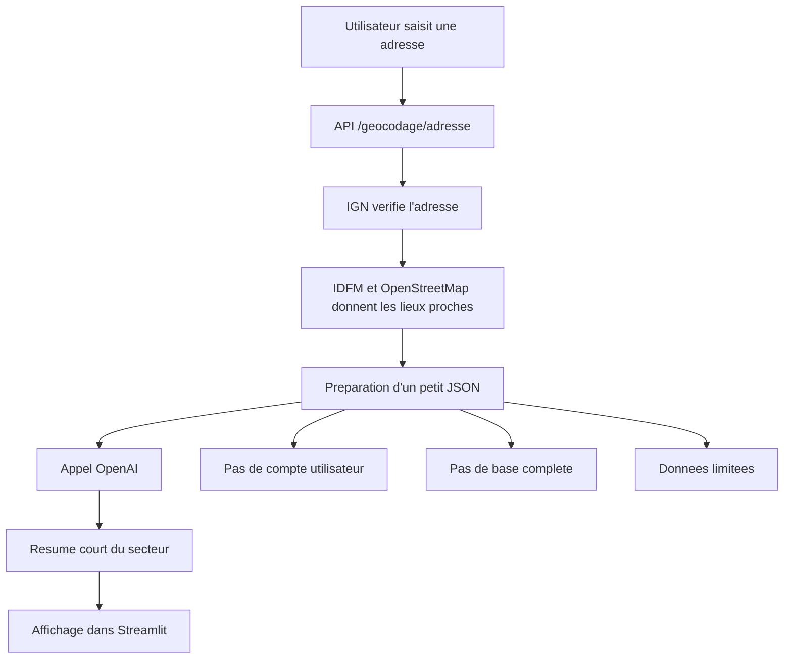

# Rapport competence C8 - Parametrer un service IA OpenAI

## 1. Objectif de la competence C8

La competence C8 demande de montrer que j'ai parametre un service
d'intelligence artificielle preexistant dans mon application.

Dans mon projet, le service IA parametre est **OpenAI**.

Important : dans ce rapport, je ne parle pas de XGBoost. XGBoost sert a la
prediction du prix et il est traite dans une autre competence. Ici, je parle
uniquement du service IA externe OpenAI, utilise pour rediger un resume du
secteur autour d'une adresse.

## 2. Difference entre C7 et C8

Pour ne pas melanger :

| Competence | Ce que je montre |
|---|---|
| C7 | Je compare plusieurs solutions IA et je choisis celles qui sont adaptees. |
| C8 | Je configure le service IA retenu, ici OpenAI. |

Donc en C8, le sujet principal est :

**Comment OpenAI est configure, appele, limite, securise, teste et affiche dans
l'application.**

## 3. Role d'OpenAI dans mon projet

OpenAI est utilise pour faire un texte court qui resume le quartier d'une
adresse.

L'utilisateur saisit une adresse parisienne. L'application recupere d'abord les
informations avec des sources specialisees :

- IGN pour verifier l'adresse et obtenir les coordonnees ;
- Ile-de-France Mobilites pour les transports ;
- OpenStreetMap pour les commerces, ecoles et services de sante.

Ensuite seulement, OpenAI redige un resume simple a partir de ces donnees.

OpenAI ne cree pas les donnees. Il les reformule.

## 4. Pourquoi OpenAI est limite au resume

J'ai choisi de limiter OpenAI au resume pour plusieurs raisons :

- les faits doivent venir de sources verifiables ;
- une IA generative peut inventer si on ne la controle pas ;
- le cout API doit rester limite ;
- je ne veux pas envoyer trop de donnees a un service externe ;
- si OpenAI ne marche pas, l'application doit continuer.

OpenAI sert donc seulement a rendre le resultat plus lisible pour
l'utilisateur.

## 5. Fichiers concernes par la competence C8

| Fichier | Role dans la C8 |
|---|---|
| `api/services/location_summary.py` | Fichier principal : configure OpenAI et genere le resume. |
| `api/routers/location.py` | Appelle OpenAI apres le geocodage et l'analyse de proximite. |
| `api/core.py` | Charge les variables du fichier `.env`, dont la cle OpenAI. |
| `api/metrics.py` | Cree les metriques OpenAI : appels, erreurs, duree, configuration. |
| `api/routers/system.py` | Met a jour l'etat de configuration OpenAI dans `/metrics`. |
| `streamlit/frontend/views/location_rating.py` | Affiche le resume OpenAI dans l'interface. |
| `streamlit/frontend/views/sources.py` | Explique a l'utilisateur que le resume vient d'OpenAI. |
| `tests/test_api.py` | Teste le parametrage OpenAI, `store=False`, les erreurs et l'absence de cle. |
| `compose.yml` | Passe `OPENAI_API_KEY` et `OPENAI_MODEL` au conteneur API. |

## 6. Parametres OpenAI utilises

Le parametrage principal est dans :

`api/services/location_summary.py`

Les parametres importants sont :

| Parametre | Valeur / usage | Pourquoi |
|---|---|---|
| `OPENAI_API_KEY` | Cle API lue depuis l'environnement | Ne pas mettre la cle directement dans le code. |
| `OPENAI_MODEL` | Modele configurable | Pouvoir changer le modele sans modifier le code. |
| `MODELE_RESUME_LIEU_PAR_DEFAUT` | `gpt-5.4-mini` | Modele par defaut si rien n'est precise. |
| `TIMEOUT_OPENAI_SECONDES` | `25` | Eviter que l'utilisateur attende trop longtemps. |
| `max_retries` | `1` | Eviter trop de tentatives si OpenAI ne repond pas. |
| `max_output_tokens` | `220` | Garder un resume court et limiter le cout. |
| `store` | `False` | Demander a ne pas stocker la requete cote OpenAI. |
| `reasoning` | `{"effort": "none"}` | Ne pas demander de raisonnement long pour un simple resume. |

Ce parametrage montre que le service IA n'est pas appele sans limite.

## 7. Variables d'environnement

Les variables importantes sont :

```env
OPENAI_API_KEY=ma_cle_openai
OPENAI_MODEL=gpt-5.4-mini
```

Je ne mets pas la vraie cle dans le code. Elle doit rester dans le fichier
`.env` local ou dans les variables d'environnement du serveur.

Dans `api/core.py`, la fonction `charger_env()` lit le fichier `.env` et ajoute
les variables dans l'environnement Python.

Dans Docker, `compose.yml` transmet aussi les variables :

```yaml
OPENAI_API_KEY: ${OPENAI_API_KEY}
OPENAI_MODEL: ${OPENAI_MODEL:-gpt-5.4-mini}
```

Comme ca, le meme code peut fonctionner en local et dans Docker.

## 8. Donnees envoyees a OpenAI

La fonction `construire_donnees_resume()` prepare les donnees envoyees a OpenAI.

Les donnees envoyees sont :

| Donnee | Pourquoi elle est envoyee |
|---|---|
| Adresse normalisee | Donner le contexte du lieu. |
| Rayon en metres | Expliquer le perimetre de recherche. |
| Methode de distance | Dire que c'est une distance a vol d'oiseau. |
| Totaux | Donner le nombre de transports, commerces, ecoles, sante. |
| Transports les plus proches | Resume plus utile pour l'utilisateur. |
| Commerces les plus proches | Donner des exemples concrets. |
| Ecoles les plus proches | Montrer les services autour. |
| Sante les plus proches | Montrer pharmacies, medecins, etc. |

Les donnees ne viennent pas de OpenAI. Elles viennent deja de mon application.

## 9. Donnees que je limite ou que je n'envoie pas

Pour limiter les donnees envoyees :

- je n'envoie pas toute la base DVF ;
- je n'envoie pas les comptes utilisateurs ;
- je n'envoie pas les emails ;
- je n'envoie pas les mots de passe ;
- je n'envoie pas l'historique complet ;
- je garde seulement quelques lieux proches ;
- les coordonnees brutes latitude/longitude des lieux ne sont pas envoyees dans
  le prompt OpenAI.

Dans `tests/test_api.py`, un test verifie justement que `latitude` et
`longitude` ne sont pas dans l'entree envoyee a OpenAI.

## 10. Prompt utilise

Le prompt est stocke dans la variable :

`INSTRUCTIONS_RESUME_LIEU`

Il demande a OpenAI :

- de rediger en francais ;
- de faire un resume court ;
- d'utiliser uniquement les donnees donnees par l'application ;
- de parler des transports et services du quotidien ;
- de ne pas inventer ;
- de rester neutre et factuel.

C'est important parce que le service IA doit rester controle. Je ne veux pas que
le modele invente des choses sur la securite, le calme, les prix ou la qualite
de vie.

## 11. Fonctionnement technique

Le fonctionnement est simple :

1. L'utilisateur saisit une adresse dans l'application.
2. La route `POST /geocodage/adresse` est appelee.
3. L'adresse est verifiee avec l'IGN.
4. Les transports et equipements proches sont recuperes.
5. `generer_resume_lieu()` appelle OpenAI.
6. OpenAI retourne un texte court.
7. Le texte est renvoye dans la reponse API avec la cle `resume_ia`.
8. Streamlit affiche le resume dans la page utilisateur.

Le fichier principal est :

`api/services/location_summary.py`

La route qui appelle ce service est :

`api/routers/location.py`

L'affichage est fait dans :

`streamlit/frontend/views/location_rating.py`

## 12. Schema du flux C8



## 13. Gestion des erreurs

OpenAI peut ne pas fonctionner pour plusieurs raisons :

- cle absente ;
- service indisponible ;
- timeout ;
- reponse vide ;
- erreur API.

Dans le code, ces cas sont geres :

- si `OPENAI_API_KEY` manque, le service retourne :

```json
{"erreur": "Le résumé OpenAI n'est pas configuré."}
```

- si OpenAI ne repond pas, le service retourne une erreur controlee ;
- si la reponse est vide, le service retourne aussi une erreur controlee ;
- l'application continue de fonctionner sans le resume.

Dans Streamlit, si le resume est indisponible, l'utilisateur voit seulement :

`Le résumé OpenAI est temporairement indisponible.`

Donc l'application ne plante pas.

## 14. Securite et RGPD

Pour la securite :

- la cle OpenAI est dans `.env`, pas dans le code ;
- la cle ne doit pas etre poussee sur Git ;
- l'appel a un timeout ;
- les erreurs sont controlees ;
- les donnees envoyees sont limitees ;
- le service reste optionnel.

Pour le RGPD :

- je n'envoie pas les informations du compte utilisateur a OpenAI ;
- je n'envoie pas l'historique complet ;
- je n'envoie pas les mots de passe ;
- j'utilise `store=False` dans l'appel OpenAI ;
- j'explique dans l'application que le resume est genere par OpenAI.

Ce point est important car une adresse peut etre une donnee sensible selon le
contexte. Je limite donc ce qui part vers le service externe.

## 15. Monitoring OpenAI

Dans `api/metrics.py`, j'ai ajoute des metriques pour OpenAI.

| Metrique | Utilite |
|---|---|
| `openai_summary_calls_total` | Compter les appels OpenAI avec succes ou erreur. |
| `openai_summary_errors_total` | Compter les erreurs OpenAI. |
| `openai_summary_request_duration_seconds` | Mesurer le temps de reponse OpenAI. |
| `openai_summary_service_configured` | Savoir si la cle OpenAI est configuree. |

Dans `api/routers/system.py`, la route `/metrics` actualise aussi l'etat de
configuration du service OpenAI.

Ca permet de verifier si le service est disponible et s'il commence a avoir trop
d'erreurs.

## 16. Tests

Les tests sont dans :

`tests/test_api.py`

Les tests verifient que :

- OpenAI utilise le modele configure ;
- la cle API est bien lue depuis l'environnement ;
- `timeout` et `max_retries` sont bien utilises ;
- `store=False` est envoye ;
- `latitude` et `longitude` ne sont pas envoyees dans l'input ;
- si la cle OpenAI est absente, l'application ne plante pas ;
- les erreurs OpenAI sont visibles dans les metriques Prometheus.

Ces tests sont importants parce qu'ils montrent que le parametrage C8 est
controle.

## 17. Comment lancer et verifier

### 17.1 En local

Ajouter les variables dans `.env` :

```env
OPENAI_API_KEY=ma_cle_openai
OPENAI_MODEL=gpt-5.4-mini
```

Lancer l'API :

```bash
uvicorn api.main:app --reload
```

Lancer Streamlit :

```bash
streamlit run streamlit/app.py
```

Ensuite, dans l'application :

1. aller dans **Analyser votre endroit** ;
2. saisir une adresse parisienne complete ;
3. verifier que le resume OpenAI apparait.

### 17.2 Avec Docker

Verifier que `.env` contient :

```env
OPENAI_API_KEY=ma_cle_openai
OPENAI_MODEL=gpt-5.4-mini
```

Puis lancer :

```bash
docker compose up -d --build
```

Le fichier `compose.yml` transmet les variables au conteneur API.

### 17.3 Verifier les metriques

Quand l'API tourne :

```bash
curl http://127.0.0.1:8000/metrics
```

Ou selon Docker :

```bash
curl http://127.0.0.1:8002/metrics
```

Il faut chercher :

- `openai_summary_service_configured` ;
- `openai_summary_calls_total` ;
- `openai_summary_errors_total` ;
- `openai_summary_request_duration_seconds`.

### 17.4 Lancer les tests

```bash
python3 -m unittest discover -s tests -p 'test_api.py' -v
```

## 18. Bibliotheques utilisees

| Bibliotheque | Utilisation |
|---|---|
| `openai` | Appeler le service OpenAI. |
| `os` | Lire `OPENAI_API_KEY` et `OPENAI_MODEL`. |
| `json` | Envoyer les donnees a OpenAI en JSON. |
| `time` | Mesurer la duree de l'appel. |
| `fastapi` | Exposer la route qui declenche le resume. |
| `prometheus_client` | Suivre les appels, erreurs et temps de reponse. |
| `streamlit` | Afficher le resume dans l'interface. |
| `unittest.mock` | Tester OpenAI sans faire de vrai appel externe. |

## 19. Elements principaux

Les elements les plus importants pour C8 sont :

- `api/services/location_summary.py` : parametres OpenAI ;
- `api/routers/location.py` : appel du service IA ;
- `tests/test_api.py` : verification de `store=False`, cle optionnelle et
  erreurs ;
- `api/metrics.py` : suivi du service ;
- `compose.yml` : variables OpenAI dans Docker ;
- `streamlit/frontend/views/location_rating.py` : affichage du resume.

## 20. Versionnement Git

Commandes de versionnement :

```bash
git add "docs/bloc2/Rapport competence C8.md"
git add api/services/location_summary.py
git add api/routers/location.py
git add api/metrics.py
git add api/routers/system.py
git add streamlit/frontend/views/location_rating.py
git add tests/test_api.py
git commit -m "docs: ajouter le rapport competence C8"
```

Verification Git :

```bash
git status --short
git ls-files "docs/bloc2/Rapport competence C8.md"
```

## 21. Conclusion

La competence C8 est documentee par le parametrage du service OpenAI dans
l'application.

OpenAI est configure avec une cle API, un modele, un timeout, une limite de
tokens, une gestion d'erreur, des metriques et des tests.

Le service reste limite : il ne calcule pas le prix, il ne remplace pas les
sources de donnees, et il ne sert pas a inventer des informations. Il sert
seulement a rediger un resume court a partir des donnees deja trouvees par
l'application.
