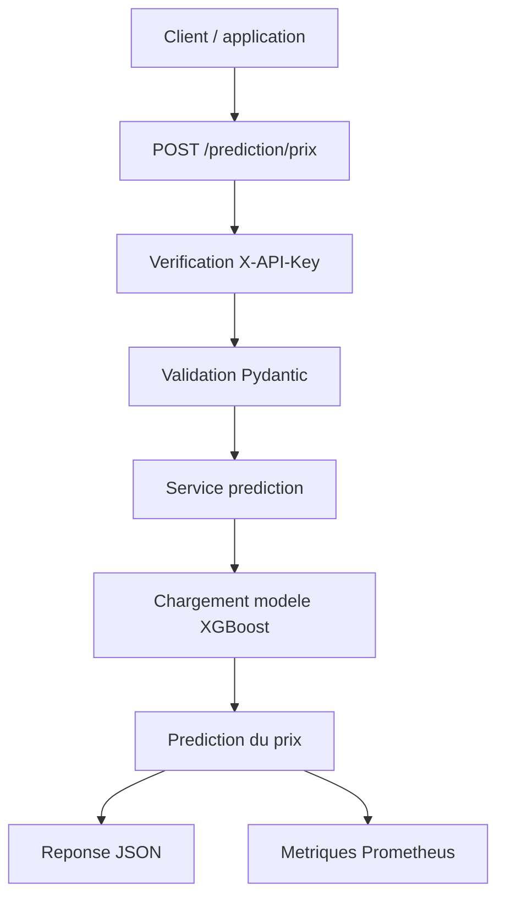

# Rapport competence C9 - API REST exposant le modele IA

## 1. Objectif de la competence C9

La competence C9 demande de developper une API REST qui expose un modele
d'intelligence artificielle.

Dans mon projet `immobilier-paris-ia`, le modele expose est le modele de
prediction du prix immobilier. L'utilisateur envoie les informations d'un
appartement, et l'API retourne un prix estime.

La route principale de cette competence est :

`POST /prediction/prix`

Important : ce rapport ne parle pas de toute l'API du projet. Ca, c'etait plutot
la competence C5. Ici, je parle seulement de la partie API qui expose le modele
IA.

## 2. Ce que demande le referentiel

Dans le PDF du referentiel, la competence C9 demande notamment :

- developper une API qui expose un modele d'intelligence artificielle ;
- utiliser une architecture REST ;
- restreindre l'acces au modele avec une authentification ;
- transformer les parametres recus au format attendu par le modele ;
- executer le modele a partir de la requete client ;
- retourner une reponse au client avec le resultat ;
- ajouter des tests d'integration ;
- versionner les sources dans Git ;
- documenter l'architecture et les points de terminaison ;
- documenter les regles d'authentification ;
- respecter un standard comme OpenAPI.

Mon projet repond a ces points avec FastAPI, la route `/prediction/prix`,
`X-API-Key`, les schemas Pydantic, les tests et Swagger.

## 3. Difference avec les autres competences

Pour ne pas melanger :

| Competence | Sujet |
|---|---|
| C5 | API REST pour mettre les donnees a disposition. |
| C7 | Choisir et recommander les solutions IA. |
| C8 | Parametrer le service OpenAI. |
| C9 | Exposer le modele de prediction via une API REST. |
| C10 | Integrer cette API dans l'application Streamlit. |

Donc ici, je me concentre sur :

**FastAPI + route de prediction + modele XGBoost + securite + tests.**

## 4. Architecture generale

L'architecture de la C9 est simple :

1. Le client envoie une requete HTTP a l'API.
2. FastAPI verifie la cle `X-API-Key`.
3. Pydantic valide les donnees envoyees.
4. Le service de prediction charge le modele XGBoost.
5. Le modele calcule un prix estime.
6. L'API ajoute une marge indicative avec la MAE.
7. L'API retourne une reponse JSON.
8. Les metriques Prometheus sont mises a jour.

Schema :



## 5. Fichiers concernes par la C9

| Fichier | Role dans la competence C9 |
|---|---|
| `api/main.py` | Cree l'application FastAPI, branche les routes et genere Swagger/OpenAPI. |
| `api/routers/prediction.py` | Expose la route `POST /prediction/prix`. |
| `api/services/prediction.py` | Charge le modele et lance la prediction. |
| `api/schemas.py` | Definit les schemas d'entree et de sortie de la prediction. |
| `api/core.py` | Verifie la cle API avec `X-API-Key`. |
| `api/metrics.py` | Suit le nombre de predictions, erreurs, duree et valeurs envoyees. |
| `tests/test_api.py` | Teste la route de prediction et les cas d'erreur. |
| `models/xgboost_prix_dvf.joblib` | Modele de prediction charge par l'API. |
| `models/xgboost_prix_dvf_metrics.json` | Metriques du modele, dont la MAE. |

## 6. Route API principale

La route principale est definie dans :

`api/routers/prediction.py`

Route :

```http
POST /prediction/prix
```

Cette route recoit les informations d'un appartement et retourne une estimation
de prix.

Elle utilise :

- `PredictionPrixRequest` pour verifier l'entree ;
- `predire_prix_xgboost()` pour lancer le modele ;
- `charger_mae_prediction()` pour recuperer l'erreur moyenne ;
- `PredictionPrixResponse` pour structurer la reponse.

## 7. Donnees envoyees par le client

Le client doit envoyer un JSON avec :

```json
{
  "surface": 50,
  "nombre_pieces": 2,
  "arrondissement": 11
}
```

Ces champs sont valides dans `api/schemas.py`.

| Champ | Regle |
|---|---|
| `surface` | Entre 9 et 300 m2. |
| `nombre_pieces` | Entre 1 et 12. |
| `arrondissement` | Entre 1 et 20. |

Si l'utilisateur envoie une valeur impossible, FastAPI/Pydantic retourne une
erreur `422`.

Exemples de valeurs refusees :

- surface negative ;
- surface trop grande ;
- 0 piece ;
- arrondissement 21.

## 8. Reponse retournee par l'API

La reponse contient :

```json
{
  "surface": 50,
  "nombre_pieces": 2,
  "arrondissement": 11,
  "prix_estime": 520000,
  "mae_euros": 111078.36,
  "prix_min_indicatif": 408921.64,
  "prix_max_indicatif": 631078.36,
  "modele": "XGBRegressor"
}
```

Les champs importants :

| Champ | Explication |
|---|---|
| `prix_estime` | Prix calcule par le modele. |
| `mae_euros` | Erreur moyenne du modele sur le test. |
| `prix_min_indicatif` | Prix estime moins la MAE. |
| `prix_max_indicatif` | Prix estime plus la MAE. |
| `modele` | Nom du modele utilise. |

La marge min/max permet de ne pas presenter le prix comme une certitude.

## 9. Securite de la route

La route utilise :

`X-API-Key`

La verification est faite dans :

`api/core.py`

Fonction :

`verifier_cle_api()`

Fonctionnement :

- si `API_KEY` n'est pas configure cote serveur, erreur `500` ;
- si le client n'envoie pas de cle, erreur `401` ;
- si la cle est fausse, erreur `403` ;
- si la cle est correcte, la prediction peut etre lancee.

La comparaison utilise `compare_digest`, plus propre qu'un simple `==` pour
comparer une cle.

Cette securite repond au critere du referentiel : l'API doit restreindre l'acces
au modele.

## 10. Transformation des donnees pour le modele

Le modele n'utilise pas directement le JSON envoye par le client.

Dans `api/services/prediction.py`, la fonction `predire_prix_xgboost()` transforme
les valeurs en `DataFrame` pandas :

```python
{
    "surface_reelle_bati": surface,
    "nombre_pieces_principales": nombre_pieces,
    "arrondissement": str(arrondissement),
}
```

C'est important parce que le modele a ete entraine avec ces colonnes. Si les
noms changent, le modele ne peut pas predire correctement.

## 11. Chargement du modele

Le modele est stocke dans :

`models/xgboost_prix_dvf.joblib`

Il est charge avec `joblib`.

Dans `api/services/prediction.py`, la variable globale `modele_prediction` garde
le modele en memoire. Comme ca, l'API ne relit pas le fichier `.joblib` a chaque
requete.

Si le modele n'existe pas, l'API retourne une erreur `503` avec un message clair :

```text
Modele de prediction introuvable. Lancez python3 -m src.prediction.entrainement_xgboost_prix.
```

## 12. Utilisation de la MAE

Le fichier :

`models/xgboost_prix_dvf_metrics.json`

contient les metriques du modele, dont :

`mae_euros`

La MAE est utilisee pour afficher une marge indicative :

- prix minimum indicatif = prix estime - MAE ;
- prix maximum indicatif = prix estime + MAE.

Ca permet d'etre plus honnete avec l'utilisateur. Une prediction IA reste une
estimation, pas une valeur exacte.

## 13. Documentation OpenAPI / Swagger

FastAPI genere automatiquement la documentation de l'API.

Quand l'API est lancee, la documentation Swagger est disponible ici :

```text
http://127.0.0.1:8000/docs
```

Le fichier OpenAPI brut est disponible ici :

```text
http://127.0.0.1:8000/openapi.json
```

Cette documentation montre :

- la route `POST /prediction/prix` ;
- les champs attendus ;
- les types de donnees ;
- la structure de la reponse ;
- les erreurs possibles ;
- le standard OpenAPI genere par FastAPI.

## 14. Monitoring de la route

Dans `api/metrics.py`, plusieurs metriques suivent la prediction :

| Metrique | Utilite |
|---|---|
| `model_predictions_total` | Nombre total de predictions. |
| `model_predictions_by_arrondissement_total` | Nombre de predictions par arrondissement. |
| `model_prediction_errors_total` | Nombre d'erreurs pendant les predictions. |
| `model_prediction_duration_seconds` | Temps pris par une prediction. |
| `model_predicted_price_euros` | Dernier prix estime. |
| `model_input_surface_m2` | Derniere surface envoyee. |

Ces metriques sont utiles pour voir si l'API fonctionne bien, si elle est lente
ou si elle a beaucoup d'erreurs.

Elles sont visibles avec :

```text
GET /metrics
```

## 15. Tests de la route

Les tests sont dans :

`tests/test_api.py`

Les tests importants pour C9 verifient :

- que la route `/prediction/prix` retourne un prix estime ;
- que le nom du modele retourne est `XGBRegressor` ;
- que la route refuse une requete sans cle API ;
- que la route refuse une mauvaise cle API ;
- que les valeurs irrealisables sont refusees ;
- que les predictions connectees sont enregistrees dans l'historique ;
- que les metriques du modele sont exposees ;
- que les routes protegees demandent une cle API.

Les tests permettent de verifier que le point de terminaison fonctionne et que les
cas d'erreur sont geres.

## 16. Comment lancer l'API

Avant de lancer l'API, il faut avoir une cle dans `.env` :

```env
API_KEY=ma-cle-api
```

Puis lancer :

```bash
uvicorn api.main:app --reload
```

L'API est ensuite disponible sur :

```text
http://127.0.0.1:8000
```

La documentation Swagger :

```text
http://127.0.0.1:8000/docs
```

## 17. Exemple d'appel avec curl

Exemple :

```bash
curl -X POST "http://127.0.0.1:8000/prediction/prix" \
  -H "Content-Type: application/json" \
  -H "X-API-Key: ma-cle-api" \
  -d '{"surface": 50, "nombre_pieces": 2, "arrondissement": 11}'
```

Reponse attendue :

```json
{
  "surface": 50,
  "nombre_pieces": 2,
  "arrondissement": 11,
  "prix_estime": 520000,
  "mae_euros": 111078.36,
  "prix_min_indicatif": 408921.64,
  "prix_max_indicatif": 631078.36,
  "modele": "XGBRegressor"
}
```

Le prix exact peut changer selon le modele et les donnees, donc l'exemple sert
surtout a montrer le format.

## 18. Comment lancer les tests

Pour lancer les tests API :

```bash
python3 -m unittest discover -s tests -p 'test_api.py' -v
```

Pour verifier seulement la partie prediction, les tests concernes sont :

- `test_prediction_prix_retourne_un_prix_estime` ;
- `test_prediction_prix_demande_une_cle_api` ;
- `test_prediction_prix_refuse_une_mauvaise_cle_api` ;
- `test_prediction_prix_refuse_les_valeurs_irrealistes` ;
- `test_prediction_connectee_est_enregistree_dans_l_historique` ;
- `test_metrics_expose_les_metriques_du_modele`.

## 19. Bibliotheques utilisees

| Bibliotheque | Utilisation |
|---|---|
| `fastapi` | Creer la route REST et gerer les dependances. |
| `pydantic` | Valider les champs d'entree et structurer la reponse. |
| `joblib` | Charger le modele `.joblib`. |
| `pandas` | Transformer la requete en `DataFrame`. |
| `prometheus_client` | Exposer les metriques. |
| `hmac.compare_digest` | Comparer la cle API proprement. |
| `unittest` | Tester la route et les erreurs. |

## 20. Recommandations OWASP prises en compte

Le referentiel parle du Top 10 OWASP API quand c'est necessaire. Dans mon projet,
j'ai applique surtout des regles simples :

- acces protege avec `X-API-Key` ;
- validation des entrees avec Pydantic ;
- messages d'erreur controles ;
- pas de cle API ecrite dans le code ;
- metriques pour voir les erreurs ;
- Swagger/OpenAPI pour documenter les routes.

Ce n'est pas une securite d'une grande entreprise, mais pour mon projet etudiant,
c'est coherent avec le besoin.

## 21. Versionnement Git

Commandes de versionnement :

```bash
git add "docs/bloc2/Rapport competence C9.md"
git add api/routers/prediction.py
git add api/services/prediction.py
git add api/schemas.py
git add api/core.py
git add api/main.py
git add api/metrics.py
git add tests/test_api.py
git commit -m "docs: ajouter le rapport competence C9"
```

Verification Git :

```bash
git status --short
git ls-files "docs/bloc2/Rapport competence C9.md"
```

## 22. Conclusion

La competence C9 est couverte par la route `POST /prediction/prix`.

Cette route expose le modele XGBoost avec une API REST. Elle verifie la cle API,
valide les entrees, transforme les donnees au format attendu, execute le modele
et retourne une reponse structuree.

La documentation Swagger, les schemas Pydantic, les metriques et les tests
montrent que l'API est utilisable et securisee simplement.
