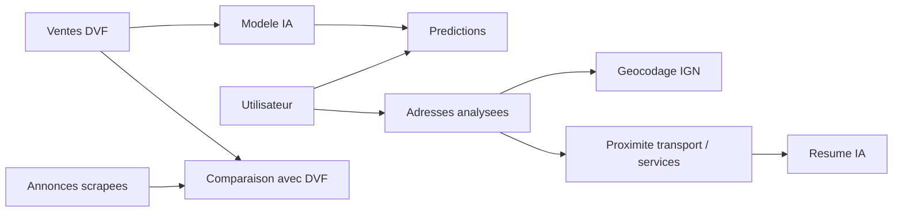

# Rapport competence C14 - Analyse du besoin de l'application

## 1. Objectif de la competence C14

La competence C14 demande d'analyser le besoin de l'application avant de parler
de technique.

Pour mon projet, cela veut dire expliquer :

- pourquoi l'application existe ;
- pour quels utilisateurs elle est faite ;
- quels problemes elle doit resoudre ;
- quelles fonctionnalites sont attendues ;
- comment l'utilisateur doit parcourir l'application ;
- quelles donnees sont utilisees ;
- quelles regles d'accessibilite sont prises en compte.

Cette competence concerne surtout les specifications fonctionnelles. Elle ne
concerne pas directement les commentaires dans le code.

## 2. Contexte du projet

Le projet s'appelle :

`immobilier-paris-ia`

L'application aide a analyser le marche immobilier a Paris.

Elle utilise plusieurs types de donnees :

- les ventes immobilieres DVF ;
- des annonces immobilieres recuperees par scraping ;
- des donnees de commerces par arrondissement ;
- des donnees de transport et de proximite autour d'une adresse ;
- un modele IA pour estimer un prix ;
- un resume OpenAI pour expliquer simplement l'environnement d'une adresse.

Le but n'est pas de remplacer un professionnel de l'immobilier. Le but est de
donner une aide a la lecture du marche : prix, localisation, environnement,
comparaison et estimation.

## 3. Probleme a resoudre

Chercher un appartement a Paris peut etre complique.

Il y a beaucoup d'informations a comparer :

- le prix du bien ;
- le prix au m2 ;
- l'arrondissement ;
- les ventes recentes ;
- les annonces du marche ;
- la proximite des transports ;
- la proximite des commerces, ecoles ou services de sante ;
- la difference entre un prix demande et les prix vendus.

Sans outil, l'utilisateur doit ouvrir plusieurs sites, comparer les chiffres a
la main et se faire sa propre idee.

Mon application regroupe ces informations dans une interface unique.

## 4. Objectif de l'application

L'objectif principal est :

**Aider un utilisateur a comprendre le marche immobilier parisien et a obtenir
une estimation indicative du prix d'un appartement.**

L'application doit permettre de :

- consulter les ventes immobilieres a Paris ;
- filtrer les donnees par arrondissement, annee, surface et nombre de pieces ;
- visualiser les ventes sur une carte ;
- comparer les annonces avec les ventes DVF ;
- analyser une adresse exacte ;
- obtenir une estimation de prix avec un modele IA ;
- lire un resume simple de l'environnement d'une adresse ;
- sauvegarder un historique pour les utilisateurs connectes.

## 5. Utilisateurs cibles

| Utilisateur | Besoin principal | Exemple d'utilisation |
|---|---|---|
| Acheteur particulier | Comprendre si un prix semble coherent. | Il entre une surface, des pieces et un arrondissement pour obtenir une estimation. |
| Locataire ou futur habitant | Comprendre l'environnement d'une adresse. | Il saisit une adresse pour voir les transports et services proches. |
| Investisseur immobilier | Comparer rapidement plusieurs arrondissements. | Il regarde les prix moyens, les annonces et les zones plus actives. |
| Agent ou analyste immobilier | Explorer les donnees plus rapidement. | Il filtre DVF, observe la carte et compare avec les annonces. |
| Administrateur | Suivre les comptes et l'utilisation. | Il consulte les utilisateurs, predictions et adresses enregistrees. |

## 6. Personas simples

| Persona | Description | Attente |
|---|---|---|
| Sarah, acheteuse | Elle cherche un 2 pieces a Paris. | Elle veut savoir si le prix demande est logique. |
| Karim, investisseur | Il compare plusieurs arrondissements. | Il veut voir les prix, les annonces et les tendances. |
| Ines, future habitante | Elle veut comprendre un quartier avant une visite. | Elle veut voir les transports et les services autour d'une adresse. |
| Admin projet | Il gere la partie utilisateurs. | Il veut consulter les comptes et les historiques. |

## 7. Perimetre fonctionnel

Les fonctionnalites principales sont :

| Fonctionnalite | Description simple |
|---|---|
| Authentification | L'utilisateur peut creer un compte et se connecter. |
| Tableau de bord immobilier | L'utilisateur consulte les statistiques DVF et les annonces. |
| Filtres | L'utilisateur filtre par arrondissement, annee, surface ou pieces. |
| Carte | L'utilisateur visualise les ventes sur une carte de Paris. |
| Annonces | L'utilisateur consulte les annonces scrapees et leurs prix. |
| Comparaison DVF / annonces | L'utilisateur compare les prix vendus et les prix demandes. |
| Prediction de prix | L'utilisateur obtient une estimation avec le modele XGBoost. |
| Analyse d'adresse | L'utilisateur saisit une adresse et obtient les transports et services proches. |
| Resume IA | L'utilisateur lit un petit resume OpenAI base sur les donnees de proximite. |
| Historique | L'utilisateur connecte retrouve ses predictions et adresses. |
| Administration | L'admin consulte les utilisateurs, predictions et adresses. |

## 8. Hors perimetre

Certaines choses ne sont pas dans le besoin principal.

| Element non prevu | Raison |
|---|---|
| Acheter un bien directement dans l'application | Ce n'est pas une plateforme de transaction. |
| Donner un prix officiel ou juridique | Le modele donne une estimation indicative. |
| Couvrir toute la France | Le projet est centre sur Paris. |
| Remplacer une visite du quartier | L'application aide a analyser, mais ne remplace pas le terrain. |
| Garantir une prediction parfaite | Le modele a une marge d'erreur. |

## 9. Donnees utilisees

| Donnee | Role dans l'application |
|---|---|
| DVF Paris | Base principale pour les ventes reelles. |
| Annonces scrapees | Comparer les prix demandes avec les ventes. |
| Donnees commerces | Evaluer la vie quotidienne par arrondissement. |
| Geocodage IGN | Transformer une adresse en coordonnees. |
| Transports IDFM | Trouver les arrets et stations proches. |
| OpenStreetMap / Overpass | Trouver commerces, ecoles et services de sante proches. |
| Utilisateurs | Permettre connexion, historique et administration. |
| Predictions | Garder l'historique des estimations d'un utilisateur. |
| Adresses sauvegardees | Garder l'historique des adresses analysees. |

## 10. Modele simple des donnees

Le besoin fonctionnel peut se resumer avec ces objets principaux.

| Objet | Description | Lien avec l'application |
|---|---|---|
| Utilisateur | Personne connectee a l'application. | Peut faire des predictions et sauvegarder des adresses. |
| Prediction | Estimation faite par le modele IA. | Liee a un utilisateur connecte. |
| Adresse | Adresse parisienne analysee. | Peut etre sauvegardee dans l'historique. |
| Vente DVF | Vente immobiliere reelle. | Sert aux statistiques, cartes et entrainement du modele. |
| Annonce | Bien immobilier trouve par scraping. | Sert a comparer le marche affiche avec les ventes reelles. |
| Proximite | Transports et services autour d'une adresse. | Sert a expliquer l'environnement d'un lieu. |

Relation simple :



## 11. Parcours utilisateur principal

### 11.1 Parcours prediction de prix

1. L'utilisateur se connecte.
2. Il ouvre la page **Predire appartement**.
3. Il saisit la surface, le nombre de pieces et l'arrondissement.
4. Il lance la prediction.
5. L'application appelle l'API.
6. Le modele XGBoost retourne un prix estime.
7. L'application affiche une fourchette indicative.
8. La prediction est sauvegardee dans l'historique si l'utilisateur est connecte.

### 11.2 Parcours analyse d'adresse

1. L'utilisateur ouvre la page d'analyse de localisation.
2. Il saisit une adresse parisienne complete.
3. L'application verifie l'adresse avec IGN.
4. L'application recupere les transports et services proches.
5. L'application affiche une carte autour de l'adresse.
6. OpenAI genere un resume court a partir des donnees deja calculees.
7. L'adresse peut etre sauvegardee dans l'historique.

### 11.3 Parcours exploration du marche

1. L'utilisateur consulte les statistiques DVF.
2. Il filtre par arrondissement, annee, surface ou pieces.
3. Il visualise les ventes sur une carte.
4. Il consulte les annonces scrapees.
5. Il compare les prix demandes avec les prix vendus.

### 11.4 Parcours administration

1. Un administrateur se connecte.
2. Il ouvre l'espace admin.
3. Il consulte le nombre d'utilisateurs, predictions et adresses.
4. Il peut modifier certains roles.
5. Il peut supprimer un utilisateur si les regles le permettent.

## 12. User stories

| ID | User story | Critere d'acceptation |
|---|---|---|
| US1 | En tant qu'utilisateur, je veux creer un compte pour retrouver mes recherches. | L'inscription demande un email et un mot de passe valide. |
| US2 | En tant qu'utilisateur, je veux me connecter pour sauvegarder mes predictions. | Une connexion valide donne acces a l'application. |
| US3 | En tant qu'utilisateur, je veux filtrer les ventes par arrondissement. | Le tableau de bord change selon l'arrondissement choisi. |
| US4 | En tant qu'utilisateur, je veux voir les ventes sur une carte. | La carte affiche les points correspondant aux filtres. |
| US5 | En tant qu'utilisateur, je veux comparer annonces et ventes DVF. | L'application affiche les prix des annonces et les prix DVF. |
| US6 | En tant qu'utilisateur, je veux predire le prix d'un appartement. | Le formulaire retourne un prix estime et une fourchette. |
| US7 | En tant qu'utilisateur, je veux analyser une adresse. | L'adresse retourne une position, des transports et des services proches. |
| US8 | En tant qu'utilisateur, je veux lire un resume simple du quartier. | Le resume utilise uniquement les donnees de proximite calculees. |
| US9 | En tant qu'utilisateur connecte, je veux voir mon historique. | Les predictions et adresses precedentes sont visibles. |
| US10 | En tant qu'administrateur, je veux suivre l'activite. | L'admin voit les utilisateurs, predictions et adresses. |

## 13. Criteres d'acceptation detailles

| Fonctionnalite | Criteres d'acceptation |
|---|---|
| Connexion | Un utilisateur sans compte ne peut pas acceder aux pages principales. |
| Prediction | Les valeurs irrealisables sont refusees avant l'appel API. |
| Prediction | La reponse affiche un prix estime, une fourchette et le nom du modele. |
| Carte | La carte affiche les points apres generation demandee par l'utilisateur. |
| Adresse | Une adresse hors Paris ou incomplete est refusee proprement. |
| Resume IA | Si OpenAI n'est pas configure, l'application continue sans bloquer. |
| Historique | L'utilisateur ne voit que ses propres predictions et adresses. |
| Admin | Les fonctions admin sont reservees aux roles `admin` et `super_admin`. |
| Sources | Une page explique les sources de donnees et les limites des resultats. |

## 14. Accessibilite et utilisabilite

L'application doit rester simple a utiliser.

Objectifs d'accessibilite pris en compte :

| Objectif | Application dans le projet |
|---|---|
| Texte clair | Les titres, messages et erreurs doivent etre comprehensibles. |
| Formulaires simples | Les champs ont des libelles visibles : surface, pieces, arrondissement. |
| Erreurs lisibles | Les erreurs API sont transformees en messages utilisateur. |
| Contrastes | L'interface utilise des blocs et titres lisibles. |
| Navigation claire | Les vues principales sont separees dans la navigation. |
| Donnees expliquees | La page sources explique d'ou viennent les donnees. |
| Pas de blocage IA | Si OpenAI ne marche pas, l'application reste utilisable. |

Le referentiel parle de standards comme WCAG ou RGAA. Pour mon projet, j'ai
applique des objectifs simples : lisibilite, messages d'erreur clairs,
navigation visible et formulaire comprehensible.

## 15. Contraintes fonctionnelles

| Contrainte | Explication |
|---|---|
| Donnees limitees a Paris | L'application travaille sur Paris et ses arrondissements. |
| Prediction indicative | Le prix estime n'est pas un prix officiel. |
| Compte utilisateur | L'historique demande une connexion. |
| Services externes | IGN, IDFM, OpenStreetMap et OpenAI peuvent etre indisponibles. |
| Donnees personnelles | Les adresses et historiques doivent rester lies au bon utilisateur. |
| Performance carte | La carte doit rester utilisable meme avec beaucoup de points. |

## 16. Fichiers de l'application lies au besoin

Ces fichiers ne sont pas a commenter pour C14, mais ils montrent ou le besoin
est applique dans l'application.

| Fichier | Lien avec le besoin |
|---|---|
| `streamlit/frontend/application.py` | Navigation principale de l'application. |
| `streamlit/frontend/views/prediction.py` | Besoin de prediction de prix. |
| `streamlit/frontend/views/location_rating.py` | Besoin d'analyse d'adresse et de quartier. |
| `streamlit/frontend/views/listings.py` | Besoin de consultation des annonces. |
| `streamlit/frontend/map_view.py` | Besoin de visualisation cartographique. |
| `streamlit/frontend/views/sources.py` | Besoin d'explication des sources et limites. |
| `streamlit/frontend/auth_ui.py` | Besoin de compte utilisateur. |
| `streamlit/frontend/views/admin.py` | Besoin d'administration. |
| `api/routers/prediction.py` | Service API pour la prediction. |
| `api/routers/location.py` | Service API pour l'adresse et la proximite. |
| `api/routers/dvf.py` | Service API pour les donnees DVF. |
| `api/routers/scraping.py` | Service API pour les annonces scrapees. |

## 17. Faisabilite du besoin

Le besoin est faisable parce que :

- les donnees DVF sont disponibles ;
- les annonces scrapees sont deja nettoyees ;
- le modele XGBoost est deja entraine ;
- l'API FastAPI expose les donnees et la prediction ;
- Streamlit permet de construire une interface rapidement ;
- les services externes sont appeles avec des timeouts et des erreurs gerees.

La limite principale est que certaines donnees dependent de services externes.
L'application doit donc afficher un message clair si un service est indisponible.

## 18. Versionnement Git

Commandes de versionnement :

```bash
git add "docs/bloc3/Rapport competence C14.md"
git commit -m "docs: ajouter le rapport competence C14"
```

Verification Git :

```bash
git status --short
git ls-files "docs/bloc3/Rapport competence C14.md"
```

## 19. Conclusion

La competence C14 est couverte par l'analyse du besoin fonctionnel de
l'application.

Le projet repond a un besoin simple : aider a comprendre le marche immobilier
parisien avec des donnees, une carte, une analyse d'adresse et une estimation de
prix par IA.

Le besoin est decoupe en utilisateurs, parcours, user stories, criteres
d'acceptation, donnees et objectifs d'accessibilite. Cela donne une base claire
pour concevoir et developper l'application.
