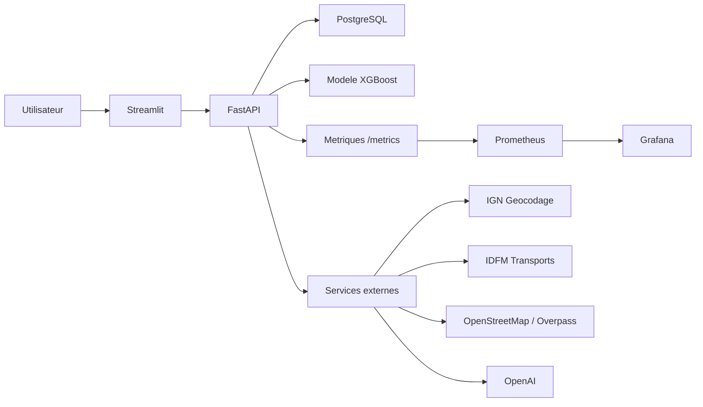
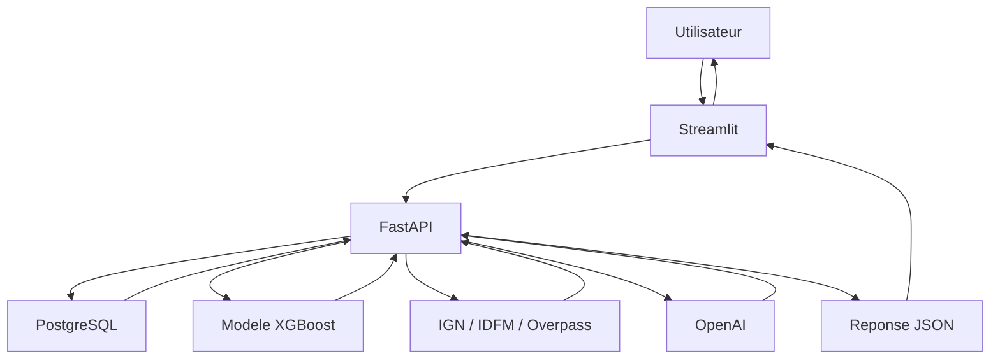

# Rapport competence C15 - Cadre technique de l'application

## 1. Objectif de la competence C15

La competence C15 demande de concevoir le cadre technique de l'application.

Pour mon projet, cela veut dire expliquer comment l'application est construite
techniquement :

- architecture generale ;
- langage utilise ;
- frameworks ;
- base de donnees ;
- API ;
- interface utilisateur ;
- modele IA ;
- services externes ;
- Docker ;
- flux de donnees ;
- zones de stockage ;
- monitoring.

C14 explique le besoin fonctionnel.  
C15 explique la solution technique choisie pour realiser ce besoin.
C17 explique ensuite les composants developpes dans l'application : pages,
formulaires, routes API, droits d'acces et tests.

## 2. Resume technique du projet

Le projet `immobilier-paris-ia` est une application web qui analyse le marche
immobilier parisien.

Elle est composee de plusieurs parties :

| Partie | Role |
|---|---|
| Streamlit | Interface utilisateur. |
| FastAPI | API REST entre l'interface, la base et le modele IA. |
| PostgreSQL | Base de donnees principale. |
| XGBoost | Modele IA pour estimer le prix d'un appartement. |
| Folium | Cartes interactives dans l'application. |
| OpenAI | Resume court de l'environnement d'une adresse. |
| Services externes | Geocodage, transports, commerces et proximite. |
| Docker Compose | Lancement de tous les services ensemble. |
| Prometheus / Grafana | Monitoring technique et metriques. |

## 3. Architecture generale

L'application suit une architecture en plusieurs couches.



Explication simple :

- l'utilisateur utilise Streamlit ;
- Streamlit appelle FastAPI ;
- FastAPI lit la base PostgreSQL ;
- FastAPI lance le modele IA quand il faut predire un prix ;
- FastAPI appelle les services externes pour une adresse ;
- Prometheus lit les metriques de FastAPI ;
- Grafana affiche les tableaux de bord.

## 4. Pourquoi une architecture en couches

J'ai separe l'application en couches pour eviter de tout melanger.

| Couche | Pourquoi elle existe |
|---|---|
| Interface Streamlit | Afficher les pages, formulaires, cartes et graphiques. |
| API FastAPI | Centraliser les routes, les controles et les appels metier. |
| Services Python | Isoler la logique : prediction, geocodage, proximite, auth. |
| Base PostgreSQL | Stocker les donnees structurees. |
| Modele IA | Predire le prix immobilier. |
| Monitoring | Surveiller l'API et le modele. |

Cette separation rend le projet plus facile a comprendre et a maintenir.

## 5. Langage principal : Python

Le langage principal est :

`Python`

Je l'ai choisi parce qu'il est adapte a tout mon projet :

- traitement de donnees ;
- machine learning ;
- API web ;
- interface Streamlit ;
- scripts de nettoyage ;
- tests automatises.

Python permet aussi d'utiliser facilement `pandas`, `scikit-learn`, `xgboost`,
`FastAPI`, `Streamlit` et `Folium`.

## 6. Interface utilisateur : Streamlit

La partie interface est faite avec :

`Streamlit`

Fichiers principaux :

- `streamlit/app.py` ;
- `streamlit/frontend/application.py` ;
- `streamlit/frontend/views/prediction.py` ;
- `streamlit/frontend/views/location_rating.py` ;
- `streamlit/frontend/views/listings.py` ;
- `streamlit/frontend/map_view.py`.

J'ai choisi Streamlit parce que :

- il permet de faire une interface rapidement en Python ;
- il est pratique pour afficher des tableaux, graphiques et formulaires ;
- il fonctionne bien pour un projet data / IA ;
- il evite de devoir creer un frontend complet en React.

Dans l'application, Streamlit sert a :

- afficher la navigation ;
- afficher les filtres ;
- afficher les graphiques ;
- afficher les cartes ;
- lancer une prediction ;
- afficher l'historique ;
- afficher l'espace admin.

## 7. API : FastAPI

La partie API est faite avec :

`FastAPI`

Fichier principal :

`api/main.py`

FastAPI expose plusieurs routes :

| Route | Role |
|---|---|
| `/health` | Verifier que l'API et la base repondent. |
| `/metrics` | Exposer les metriques Prometheus. |
| `/prediction/prix` | Predire un prix avec le modele IA. |
| `/geocodage/adresse` | Analyser une adresse parisienne. |
| `/commerces/paris` | Retourner les commerces par arrondissement. |
| `/dvf/points` | Retourner les points DVF pour la carte. |
| `/scraping/annonces` | Retourner les annonces scrapees. |
| `/auth/login` | Connecter un utilisateur. |
| `/users/me/predictions` | Retourner l'historique utilisateur. |
| `/admin/...` | Routes reservees a l'administration. |

J'ai choisi FastAPI parce que :

- il est rapide ;
- il genere une documentation Swagger automatiquement ;
- il utilise des schemas de validation ;
- il est simple a connecter avec Streamlit ;
- il fonctionne bien avec Uvicorn et Docker.

## 8. Serveur API : Uvicorn

L'API FastAPI est lancee avec :

`Uvicorn`

Commande locale :

```bash
uvicorn api.main:app --reload
```

Dans Docker, le conteneur API lance :

```bash
uvicorn api.main:app --host 0.0.0.0 --port 8000
```

Uvicorn sert de serveur web pour FastAPI.

## 8.1 Validation des donnees : Pydantic

FastAPI utilise des schemas de validation avec Pydantic.

Fichier principal :

`api/schemas.py`

Pydantic sert a :

- verifier les donnees envoyees a l'API ;
- refuser les valeurs invalides ;
- structurer les reponses JSON ;
- garder une documentation API claire dans Swagger.

Exemple : pour la prediction, l'API verifie que la surface, le nombre de pieces
et l'arrondissement sont valides avant d'appeler le modele IA.

## 8.2 Appels HTTP : requests

La bibliotheque :

`requests`

est utilisee pour faire des appels HTTP.

Elle sert a deux endroits :

| Endroit | Role |
|---|---|
| `streamlit/frontend/api_client.py` | Streamlit appelle l'API FastAPI. |
| `api/services/address.py`, `api/services/proximity.py`, `api/services/commerces.py` | FastAPI appelle les services externes. |

J'utilise `requests` parce que c'est simple pour appeler une API, ajouter des
headers, envoyer des parametres et gerer les erreurs.

## 9. Base de donnees : PostgreSQL

La base de donnees utilisee est :

`PostgreSQL`

Elle sert a stocker :

- les ventes DVF ;
- les annonces scrapees ;
- les utilisateurs ;
- les historiques de predictions ;
- les historiques d'adresses.

J'ai choisi PostgreSQL parce que :

- les donnees sont relationnelles ;
- les requetes SQL sont suffisantes pour mon volume de donnees ;
- le projet n'a pas besoin d'un systeme Big Data ;
- DBeaver permet de consulter les tables facilement ;
- Docker permet de lancer PostgreSQL avec le projet.

Dans Docker, PostgreSQL est configure dans :

`compose.yml`

Port local :

`5434`

Port dans le conteneur :

`5432`

Outil utilise pour consulter la base :

`DBeaver`

DBeaver me permet de voir les tables, tester des requetes SQL et verifier les
donnees importees dans PostgreSQL.

## 10. Connexion base : SQLAlchemy et psycopg2

Pour connecter Python a PostgreSQL, j'utilise :

- `SQLAlchemy` ;
- `psycopg2-binary`.

Fichier principal :

`api/core.py`

SQLAlchemy sert a creer le moteur de connexion.  
`psycopg2-binary` est le driver PostgreSQL utilise par Python.

Dans mon projet, les routes utilisent aussi `pandas.read_sql()` pour recuperer
les resultats SQL sous forme de tableau.

## 11. Traitement de donnees : pandas

La bibliotheque principale pour manipuler les donnees est :

`pandas`

Elle sert a :

- lire des CSV ;
- manipuler les donnees DVF ;
- convertir des resultats SQL en DataFrame ;
- preparer les donnees du modele ;
- organiser les statistiques pour Streamlit.

Pandas est adapte parce que les donnees du projet sont surtout des tableaux :
prix, surface, arrondissement, date, latitude, longitude.

## 12. Visualisation graphique : Plotly, Matplotlib et Seaborn

L'application utilise plusieurs bibliotheques de visualisation.

| Bibliotheque | Role |
|---|---|
| `plotly` | Graphiques interactifs dans Streamlit. |
| `matplotlib` | Graphiques ou exports classiques pendant l'analyse. |
| `seaborn` | Graphiques statistiques, notamment pendant l'analyse exploratoire. |

Plotly est surtout utile dans l'application finale, car les graphiques sont
interactifs.

Matplotlib et Seaborn sont plus utiles pendant l'analyse et la generation de
visuels.

## 13. Cartographie : Folium

La cartographie est faite avec :

`Folium`

Fichier principal :

`streamlit/frontend/map_view.py`

Folium permet de creer des cartes interactives avec Python.

Je l'utilise pour :

- afficher Paris ;
- afficher les arrondissements ;
- colorer les zones selon les prix ;
- afficher les ventes DVF sur une carte ;
- afficher une adresse exacte ;
- afficher les transports, commerces, ecoles et services proches ;
- regrouper les points avec des clusters.

Technos liees a Folium :

| Technologie | Role |
|---|---|
| `Folium` | Creation de cartes interactives. |
| `Leaflet` | Moteur JavaScript utilise par Folium pour la carte. |
| `OpenStreetMap` | Fond de carte. |
| `FastMarkerCluster` | Regrouper beaucoup de points de ventes. |
| `MarkerCluster` | Regrouper les points proches autour d'une adresse. |
| `GeoJsonTooltip` | Afficher des infos quand on survole une zone. |
| `branca` | Couleurs et elements visuels utilises avec Folium. |
| `streamlit-folium` | Integration possible entre Folium et Streamlit. |

J'ai choisi Folium parce que :

- il fonctionne bien avec Python ;
- il est adapte a des donnees geographiques ;
- il utilise OpenStreetMap ;
- il permet de faire des cartes sans developper du JavaScript a la main ;
- il gere les marqueurs, cercles, couches et clusters.

## 14. Modele IA : XGBoost

Le modele IA utilise est :

`XGBRegressor`

Fichiers principaux :

- `models/xgboost_prix_dvf.joblib` ;
- `models/xgboost_prix_dvf_metrics.json` ;
- `src/prediction/entrainement_xgboost_prix.py` ;
- `api/services/prediction.py`.

XGBoost sert a predire un prix immobilier avec :

- surface ;
- nombre de pieces ;
- arrondissement.

J'ai choisi XGBoost parce que :

- il fonctionne bien sur des donnees tabulaires ;
- il est plus performant que Random Forest dans mon benchmark ;
- il peut etre sauvegarde localement ;
- il ne demande pas d'envoyer les donnees utilisateur a un service externe.

## 15. Machine learning : scikit-learn et joblib

`scikit-learn` est utilise pour :

- construire un pipeline ;
- encoder l'arrondissement ;
- separer les donnees train/test ;
- calculer les metriques `MAE`, `RMSE` et `R2`.

`joblib` est utilise pour :

- sauvegarder le modele dans un fichier `.joblib` ;
- recharger le modele dans l'API.

Ces deux bibliotheques rendent le modele plus simple a reutiliser dans
l'application.

## 16. Resume IA : OpenAI

OpenAI est utilise pour generer un resume court d'une adresse.

Fichier principal :

`api/services/location_summary.py`

OpenAI ne sert pas a inventer les donnees.  
L'application calcule d'abord les informations de proximite, puis OpenAI reformule
ces informations en texte simple.

J'ai choisi cette approche parce que :

- les faits viennent des sources de donnees ;
- OpenAI sert seulement a rendre le resultat plus lisible ;
- les coordonnees exactes ne sont pas envoyees dans le prompt ;
- si OpenAI n'est pas configure, l'application continue a fonctionner.

Variables utiles :

- `OPENAI_API_KEY` ;
- `OPENAI_MODEL`.

## 17. Services externes

L'application utilise plusieurs services externes.

| Service | Role | Fichier principal |
|---|---|---|
| IGN / Geoplateforme | Geocoder une adresse parisienne. | `api/services/address.py` |
| Ile-de-France Mobilites | Trouver les transports proches. | `api/services/proximity.py` |
| OpenStreetMap / Overpass | Trouver commerces, ecoles et services de sante. | `api/services/proximity.py` |
| OpenAI | Generer un resume court. | `api/services/location_summary.py` |
| Open Data commerces | Recuperer les commerces par arrondissement. | `api/services/commerces.py` |

Les appels externes utilisent des timeouts et des erreurs controlees. Le but est
d'eviter que toute l'application soit bloquee si un service ne repond pas.

## 17.1 Suivi des essais : MLflow

La dependance `mlflow` est presente dans le projet pour garder une trace des
essais de modeles quand l'environnement le permet.

Dans ce projet, MLflow est surtout utile pendant la comparaison des modeles. Il
peut enregistrer :

- le nom du modele teste ;
- les parametres ;
- les metriques ;
- les fichiers de resultat.

Il n'est pas obligatoire pour lancer l'application finale. Le benchmark peut
continuer meme si MLflow n'est pas installe.

## 18. Authentification et securite

L'application gere des utilisateurs.

Technologies utilisees :

| Technologie | Role |
|---|---|
| `PyJWT` | Creer et verifier les tokens de connexion. |
| `argon2-cffi` | Hasher les mots de passe. |
| `X-API-Key` | Proteger les routes API appelees par Streamlit. |
| `hmac.compare_digest` | Comparer la cle API proprement. |

Fichiers principaux :

- `api/services/auth.py` ;
- `api/routers/auth.py` ;
- `api/routers/users.py` ;
- `api/routers/admin.py` ;
- `streamlit/frontend/auth_ui.py`.

Les mots de passe ne sont pas stockes en clair. Les routes sensibles sont
controlees par utilisateur, role ou cle API.

## 19. Docker et Docker Compose

Le projet peut etre lance avec Docker Compose.

Fichier principal :

`compose.yml`

Services Docker :

| Service | Role | Port local |
|---|---|---|
| `database` | PostgreSQL | `5434` |
| `api` | FastAPI | `8002` |
| `streamlit` | Interface utilisateur | `8501` |
| `prometheus` | Collecte des metriques | `9090` |
| `grafana` | Dashboard monitoring | `3000` |

Dockerfiles :

| Fichier | Role |
|---|---|
| `Dockerfile.api` | Image Docker de l'API FastAPI. |
| `Dockerfile.streamlit` | Image Docker de l'interface Streamlit. |

J'utilise Docker parce que :

- tous les services peuvent etre lances ensemble ;
- l'environnement est plus reproductible ;
- PostgreSQL, API et Streamlit communiquent dans le meme reseau Docker ;
- les volumes permettent de garder les donnees PostgreSQL, Prometheus et Grafana.

Commande :

```bash
docker compose up -d --build
```

## 20. Monitoring : Prometheus et Grafana

Le monitoring est compose de :

- `prometheus-client` dans Python ;
- Prometheus ;
- Grafana.

Fichiers principaux :

- `api/metrics.py` ;
- `api/routers/system.py` ;
- `monitoring/prometheus.yml` ;
- `monitoring/alerts.yml` ;
- `monitoring/grafana/dashboards/immobilier-paris.json` ;
- `monitoring/grafana/dashboards/immobilier-paris-application.json`.

Prometheus lit la route :

`GET /metrics`

Grafana affiche ensuite les metriques sous forme de tableaux de bord.

Cela permet de suivre :

- les requetes HTTP ;
- les erreurs ;
- la sante de la base ;
- les predictions ;
- les temps de reponse ;
- les appels OpenAI.

## 21. Flux de donnees principaux



Exemples de flux :

| Flux | Description |
|---|---|
| Prediction | Streamlit envoie surface, pieces et arrondissement a FastAPI, puis FastAPI lance XGBoost. |
| Carte DVF | Streamlit demande les points a FastAPI, FastAPI lit PostgreSQL, puis Streamlit affiche Folium. |
| Adresse | Streamlit envoie une adresse a FastAPI, FastAPI appelle IGN, IDFM, Overpass et OpenAI. |
| Historique | FastAPI sauvegarde les predictions et adresses dans PostgreSQL. |
| Monitoring | Prometheus lit `/metrics`, Grafana affiche les resultats. |

## 22. Zones de stockage

| Zone | Donnees stockees |
|---|---|
| PostgreSQL | DVF, annonces, utilisateurs, predictions, adresses. |
| `data/final/` | CSV nettoyes et fichiers de secours. |
| `models/` | Modele XGBoost et metriques. |
| `monitoring/grafana/dashboards/` | Dashboards Grafana. |
| Volume `postgres_data` | Donnees persistantes PostgreSQL en Docker. |
| Volume `prometheus_data` | Donnees Prometheus. |
| Volume `grafana_data` | Configuration et donnees Grafana. |

## 23. Variables d'environnement

Les variables importantes sont :

| Variable | Role |
|---|---|
| `DB_USER` | Utilisateur PostgreSQL. |
| `DB_PASSWORD` | Mot de passe PostgreSQL. |
| `DB_HOST` | Hote PostgreSQL. |
| `DB_PORT` | Port PostgreSQL. |
| `DB_NAME` | Nom de la base. |
| `API_KEY` | Cle entre Streamlit et FastAPI. |
| `JWT_SECRET_KEY` | Secret pour les tokens utilisateur. |
| `OPENAI_API_KEY` | Cle OpenAI. |
| `OPENAI_MODEL` | Modele OpenAI utilise. |
| `IDFM_API_KEY` | Cle Ile-de-France Mobilites si disponible. |
| `GRAFANA_ADMIN_PASSWORD` | Mot de passe Grafana. |

Ces variables evitent d'ecrire les secrets directement dans le code.

## 24. Environnement local

Pour lancer en local sans Docker :

1. lancer PostgreSQL ;
2. configurer le fichier `.env` ;
3. lancer l'API ;
4. lancer Streamlit.

Commandes :

```bash
uvicorn api.main:app --reload
streamlit run streamlit/app.py
```

Adresses locales :

| Service | URL |
|---|---|
| API FastAPI | `http://127.0.0.1:8000` |
| Documentation Swagger | `http://127.0.0.1:8000/docs` |
| Streamlit | `http://127.0.0.1:8501` |

## 25. Environnement Docker

Pour lancer avec Docker :

```bash
docker compose up -d --build
```

Adresses Docker exposees :

| Service | URL |
|---|---|
| API FastAPI | `http://127.0.0.1:8002` |
| Streamlit | `http://127.0.0.1:8501` |
| PostgreSQL | `localhost:5434` |
| Prometheus | `http://127.0.0.1:9090` |
| Grafana | `http://127.0.0.1:3000` |

## 26. Choix techniques responsables

Certains choix reduisent la complexite ou les dependances inutiles.

| Choix | Raison |
|---|---|
| Modele local XGBoost | Pas besoin d'envoyer les donnees utilisateur a un service de prediction externe. |
| PostgreSQL | Suffisant pour le volume, pas besoin d'une architecture Big Data. |
| Docker Compose | Lancement reproductible sans gros cloud. |
| OpenAI limite au resume | Les faits restent calcules par les sources de donnees. |
| Fichiers de secours commerces | L'application peut continuer si une source externe est indisponible. |
| Tests dans Dockerfile API | Le modele est verifie pendant la construction de l'image API. |

## 26.1 Outils de versionnement et livraison

| Outil | Role |
|---|---|
| Git | Suivre les modifications du projet. |
| GitHub | Heberger le depot et garder l'historique. |
| GitHub Actions | Lancer les tests et livraisons automatiques sur certaines parties du projet. |

Ces outils ne remplacent pas l'application, mais ils aident a garder un projet
organise et reproductible.

## 27. Fichiers concernes par C15

| Fichier | Role |
|---|---|
| `compose.yml` | Architecture locale Docker. |
| `compose.prod.yml` | Architecture serveur / production. |
| `Dockerfile.api` | Image de l'API FastAPI. |
| `Dockerfile.streamlit` | Image de l'interface Streamlit. |
| `requirements.txt` | Liste des dependances Python. |
| `api/main.py` | Point d'entree FastAPI. |
| `api/core.py` | Configuration base, chemins et securite API. |
| `api/routers/` | Routes REST. |
| `api/services/` | Logique metier. |
| `api/schemas.py` | Schemas de validation. |
| `streamlit/app.py` | Point d'entree Streamlit. |
| `streamlit/frontend/application.py` | Navigation et pages principales. |
| `streamlit/frontend/api_client.py` | Client HTTP entre Streamlit et FastAPI. |
| `streamlit/frontend/map_view.py` | Cartographie Folium. |
| `sql/creation_tables.sql` | Creation des tables metier. |
| `sql/creation_tables_utilisateurs.sql` | Creation des tables utilisateurs. |
| `monitoring/` | Configuration Prometheus et Grafana. |

## 28. Conclusion technique

Le cadre technique choisi est coherent avec le besoin du projet.

L'application utilise une architecture simple :

- Streamlit pour l'interface ;
- FastAPI pour l'API ;
- PostgreSQL pour la base ;
- XGBoost pour la prediction ;
- Folium pour la carte ;
- Docker Compose pour lancer les services ;
- Prometheus et Grafana pour surveiller.

Cette architecture permet d'avoir une application utilisable, explicable,
testable et assez proche d'un fonctionnement reel.

## 29. Versionnement Git

Commandes de versionnement :

```bash
git add "docs/bloc3/Rapport competence C15.md"
git commit -m "docs: ajouter le rapport competence C15"
```

Verification Git :

```bash
git status --short
git ls-files "docs/bloc3/Rapport competence C15.md"
```
