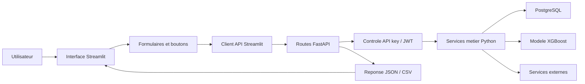

# Rapport competence C17 - Developpement des composants et interfaces

## 1. Objectif de la competence C17

La competence C17 demande de montrer que j'ai developpe les composants
techniques et les interfaces de mon application.

Dans mon projet, cela veut dire expliquer :

- les pages visibles par l'utilisateur ;
- les formulaires ;
- les boutons et interactions ;
- les routes API ;
- les composants metier ;
- les controles de saisie ;
- la connexion utilisateur ;
- les droits administrateur ;
- les flux de donnees entre Streamlit, FastAPI et PostgreSQL ;
- les tests qui verifient que l'application fonctionne.

Cette competence parle donc surtout de ce que j'ai code dans l'application.


## 3. Contexte dans mon projet

Mon projet s'appelle :

`immobilier-paris-ia`

L'application sert a analyser le marche immobilier a Paris.

J'ai developpe une application web avec :

- une interface Streamlit pour l'utilisateur ;
- une API FastAPI pour organiser les traitements ;
- une base PostgreSQL pour stocker les donnees ;
- un modele XGBoost pour predire un prix ;
- des services externes pour l'adresse, les transports et les commerces ;
- des tests Python pour verifier certaines parties.

Le but est que l'utilisateur puisse utiliser l'application sans toucher au code.
Il peut se connecter, filtrer les donnees, consulter une carte, lancer une
prediction, analyser une adresse et voir son historique.

## 4. Schema simple du fonctionnement



Explication simple :

1. L'utilisateur clique ou remplit un formulaire dans Streamlit.
2. Streamlit envoie une requete a FastAPI.
3. FastAPI verifie la cle API ou le token utilisateur.
4. FastAPI appelle le bon service Python.
5. Le service lit PostgreSQL, appelle le modele ou appelle une API externe.
6. FastAPI retourne une reponse.
7. Streamlit affiche le resultat dans une page, une carte, un tableau ou un graphique.

## 5. Interface Streamlit developpee

L'interface utilisateur est dans le dossier :

`streamlit/`

Fichiers principaux :

| Fichier | Role dans C17 |
|---|---|
| `streamlit/app.py` | Point d'entree de l'interface Streamlit. |
| `streamlit/frontend/application.py` | Organise la navigation principale de l'application. |
| `streamlit/frontend/auth_ui.py` | Affiche connexion, inscription, profil et deconnexion. |
| `streamlit/frontend/api_client.py` | Fait le lien entre Streamlit et FastAPI. |
| `streamlit/frontend/filters.py` | Affiche les filtres de recherche. |
| `streamlit/frontend/map_view.py` | Cree les cartes Folium. |
| `streamlit/frontend/views/prediction.py` | Affiche le formulaire de prediction et l'historique. |
| `streamlit/frontend/views/location_rating.py` | Analyse une adresse exacte et affiche les lieux proches. |
| `streamlit/frontend/views/listings.py` | Affiche les annonces scrapees sous forme de cartes. |
| `streamlit/frontend/views/market.py` | Affiche le resume, les graphiques et le tableau DVF. |
| `streamlit/frontend/views/admin.py` | Affiche l'espace administrateur. |
| `streamlit/frontend/views/sources.py` | Explique les sources visibles dans l'application. |

J'ai separe les vues dans plusieurs fichiers pour eviter d'avoir un seul gros
fichier difficile a lire.

Chaque vue a une responsabilite simple :

- `prediction.py` gere la prediction ;
- `location_rating.py` gere l'analyse d'adresse ;
- `listings.py` gere les annonces ;
- `market.py` gere le marche DVF ;
- `admin.py` gere l'administration.

## 6. Navigation developpee

La navigation principale est creee dans :

`streamlit/frontend/application.py`

Les pages principales sont :

- Carte ;
- Appartements a vendre ;
- Tableau ;
- Predire appartement ;
- Analyser votre endroit ;
- Sources ;
- Admin, seulement pour les comptes admin.

La page admin n'est pas affichee pour un utilisateur normal.
Elle est ajoutee seulement si le role de l'utilisateur est `admin` ou
`super_admin`.

Cela montre que l'interface change selon le droit de l'utilisateur.

## 7. Formulaires developpes

J'ai developpe plusieurs formulaires dans l'application.

| Formulaire | Fichier | Ce qu'il fait |
|---|---|---|
| Connexion | `streamlit/frontend/auth_ui.py` | Envoie email et mot de passe a l'API. |
| Inscription | `streamlit/frontend/auth_ui.py` | Cree un compte utilisateur. |
| Modification profil | `streamlit/frontend/auth_ui.py` | Modifie prenom et nom. |
| Changement mot de passe | `streamlit/frontend/auth_ui.py` | Verifie puis change le mot de passe. |
| Prediction prix | `streamlit/frontend/views/prediction.py` | Envoie surface, pieces et arrondissement. |
| Analyse adresse | `streamlit/frontend/views/location_rating.py` | Envoie une adresse exacte a l'API. |
| Filtres DVF | `streamlit/frontend/filters.py` | Filtre les ventes par arrondissement, annees, surface et pieces. |
| Filtres annonces | `streamlit/frontend/filters.py` | Filtre les annonces par arrondissement, surface, pieces et source. |
| Gestion admin | `streamlit/frontend/views/admin.py` | Permet de changer un role ou supprimer un utilisateur autorise. |

J'ai aussi ajoute des messages d'erreur simples quand l'utilisateur oublie une
information ou quand une valeur n'est pas correcte.

Exemples :

- si l'adresse est vide, l'application demande de renseigner une adresse ;
- si les deux mots de passe sont differents, l'application affiche une erreur ;
- si la surface est en dehors des limites, la prediction n'est pas envoyee ;
- si l'API ne repond pas, l'utilisateur voit un message clair.

## 8. Client API cote Streamlit

Le fichier :

`streamlit/frontend/api_client.py`

sert a faire communiquer Streamlit avec FastAPI.

Il contient des fonctions pour :

- faire des requetes `GET` ;
- faire des requetes `POST` ;
- faire des requetes `PATCH` ;
- faire des requetes `DELETE` ;
- recuperer un CSV ;
- ajouter la cle `X-API-Key` ;
- ajouter le token `Authorization` si l'utilisateur est connecte ;
- transformer les erreurs API en messages lisibles.

J'ai fait ce fichier pour ne pas repeter le meme code dans toutes les pages
Streamlit.

Par exemple, la page prediction n'appelle pas directement `requests.post`.
Elle utilise `api_post_json`, ce qui rend le code plus propre.

## 9. API FastAPI developpee

L'API est dans le dossier :

`api/`

Le point d'entree est :

`api/main.py`

Ce fichier cree l'application FastAPI et branche les routeurs.

Routeurs principaux :

| Routeur | Fichier | Role dans C17 |
|---|---|---|
| System | `api/routers/system.py` | Routes de sante et metriques. |
| Auth | `api/routers/auth.py` | Connexion, inscription, profil et deconnexion. |
| Users | `api/routers/users.py` | Profil, mot de passe, historiques personnels. |
| Admin | `api/routers/admin.py` | Espace admin et gestion des utilisateurs. |
| Prediction | `api/routers/prediction.py` | Prediction du prix avec le modele. |
| Location | `api/routers/location.py` | Adresse, proximite et commerces. |
| DVF | `api/routers/dvf.py` | Points carte, filtres et export CSV. |
| Scraping | `api/routers/scraping.py` | Annonces et statistiques annonces. |
| Stats | `api/routers/stats.py` | Statistiques DVF pour graphiques. |

J'ai utilise des routeurs pour separer les sujets.
Cela permet de ne pas mettre toutes les routes dans `api/main.py`.

## 10. Routes API principales

Voici les routes importantes developpees pour l'application.

| Route | Methode | Utilite |
|---|---|---|
| `/health` | GET | Verifier que l'API et la base repondent. |
| `/dvf/filtres` | GET | Recuperer les valeurs des filtres. |
| `/dvf/points` | GET | Recuperer les ventes pour la carte. |
| `/dvf/export.csv` | GET | Exporter les ventes filtrees. |
| `/stats/dvf/resume` | GET | Recuperer les indicateurs DVF. |
| `/stats/dvf/arrondissement` | GET | Regrouper les ventes par arrondissement. |
| `/stats/dvf/evolution-mensuelle` | GET | Afficher l'evolution du prix au m2. |
| `/scraping/annonces` | GET | Afficher les annonces nettoyees. |
| `/stats/scraping/resume` | GET | Afficher les indicateurs annonces. |
| `/stats/scraping/comparaison-dvf-2025` | GET | Comparer annonces et ventes DVF 2025. |
| `/prediction/prix` | POST | Predire le prix d'un appartement. |
| `/geocodage/adresse` | POST | Analyser une adresse exacte. |
| `/commerces/paris` | GET | Retourner les commerces par arrondissement. |
| `/auth/register` | POST | Creer un compte. |
| `/auth/login` | POST | Connecter un utilisateur. |
| `/auth/logout` | POST | Deconnecter un utilisateur. |
| `/users/me/predictions` | GET / DELETE | Voir ou supprimer son historique de predictions. |
| `/users/me/addresses` | GET / DELETE | Voir ou supprimer son historique d'adresses. |
| `/admin/users` | GET / PATCH / DELETE | Gerer les utilisateurs cote admin. |

Ces routes ne servent pas seulement a afficher des donnees.
Elles controlent aussi les entrees, les droits et les erreurs.

## 11. Composants metier developpes

Les services metier sont dans :

`api/services/`

Ils contiennent la logique principale de l'application.

| Service | Role |
|---|---|
| `api/services/auth.py` | Gere les mots de passe, les tokens JWT et les roles. |
| `api/services/prediction.py` | Charge le modele XGBoost et calcule un prix. |
| `api/services/address.py` | Appelle IGN pour normaliser une adresse. |
| `api/services/proximity.py` | Cherche les transports et lieux proches. |
| `api/services/commerces.py` | Charge les commerces par arrondissement. |
| `api/services/location_summary.py` | Genere le resume de lieu avec OpenAI. |
| `api/services/prediction_history.py` | Sauvegarde et liste les predictions utilisateur. |
| `api/services/address_history.py` | Sauvegarde et liste les adresses utilisateur. |

J'ai utilise cette separation pour que les routes restent courtes.
Une route recoit la demande, puis elle appelle le bon service.

## 12. Acces aux donnees

L'acces aux donnees est centralise dans :

`api/core.py`

Ce fichier contient :

- la connexion PostgreSQL avec SQLAlchemy ;
- la fonction `lire_sql` ;
- les filtres SQL communs pour DVF ;
- les filtres SQL communs pour les annonces ;
- la verification de la cle API.

Pour les donnees DVF, les filtres possibles sont :

- arrondissement ;
- annee ;
- mois ;
- prix minimum et maximum ;
- prix au m2 minimum et maximum ;
- surface minimum et maximum ;
- nombre de pieces ;
- code postal ;
- zone visible sur la carte avec latitude et longitude.

Pour les annonces, les filtres sont :

- arrondissement ;
- surface ;
- nombre de pieces ;
- source de scraping.

Les valeurs envoyees par l'utilisateur ne sont pas collees directement dans le
SQL. Elles passent dans des parametres SQLAlchemy.

C'est important pour reduire les risques d'injection SQL.

## 13. Gestion de la carte

La carte est developpee dans :

`streamlit/frontend/map_view.py`

J'ai utilise Folium pour creer deux types de cartes :

- une carte DVF avec les ventes immobilieres ;
- une carte d'adresse exacte avec les transports, commerces, ecoles et sante.

Pour la carte DVF :

- les arrondissements sont colores selon le prix median au m2 ;
- les ventes sont affichees comme points noirs ;
- les points sont regroupes pour garder une carte plus fluide ;
- au zoom, les points deviennent plus lisibles ;
- les popups affichent prix, surface, date et nombre de pieces.

Pour la carte d'adresse :

- l'adresse recherchee est au centre ;
- un cercle montre le rayon analyse ;
- les transports, commerces, ecoles et lieux de sante sont places sur la carte ;
- les marqueurs sont regroupes par categorie.

Cette partie fait partie de C17 car c'est une interface developpee et
interactive.

## 14. Prediction developpee dans l'application

La prediction est visible dans :

`streamlit/frontend/views/prediction.py`

La route API correspondante est :

`api/routers/prediction.py`

Le service metier est :

`api/services/prediction.py`

Fonctionnement :

1. L'utilisateur saisit la surface, le nombre de pieces et l'arrondissement.
2. Streamlit verifie les valeurs simples.
3. Streamlit envoie les donnees a `/prediction/prix`.
4. FastAPI verifie la cle API.
5. Pydantic verifie les limites des champs.
6. Le service charge le modele XGBoost.
7. Le prix estime est calcule.
8. L'API retourne le prix, le MAE et une fourchette indicative.
9. Streamlit affiche le resultat de maniere lisible.
10. Si l'utilisateur est connecte, la prediction est sauvegardee.

Le but n'est pas d'afficher un JSON brut.
Le but est de donner un resultat compréhensible pour l'utilisateur.

## 15. Analyse d'adresse developpee

L'analyse d'adresse est visible dans :

`streamlit/frontend/views/location_rating.py`

La route API correspondante est :

`api/routers/location.py`

Les services principaux sont :

- `api/services/address.py` ;
- `api/services/proximity.py` ;
- `api/services/location_summary.py`.

Fonctionnement :

1. L'utilisateur saisit une adresse exacte a Paris.
2. Streamlit envoie l'adresse a l'API.
3. L'API appelle IGN pour verifier et normaliser l'adresse.
4. Si l'adresse est valide, l'API recupere latitude et longitude.
5. L'API cherche les transports proches avec Ile-de-France Mobilites.
6. L'API cherche les commerces, ecoles et sante avec OpenStreetMap Overpass.
7. L'API demande un resume court a OpenAI avec les donnees deja trouvees.
8. Streamlit affiche la carte, les compteurs, les tableaux et le resume.
9. Si l'utilisateur est connecte, l'adresse est sauvegardee dans l'historique.

J'ai ajoute des cas d'erreur pour eviter d'accepter une adresse vague ou hors
Paris.

## 16. Espace utilisateur

L'utilisateur peut :

- creer un compte ;
- se connecter ;
- modifier son profil ;
- changer son mot de passe ;
- voir ses predictions ;
- supprimer une prediction ;
- voir ses adresses exactes ;
- supprimer une adresse.

Cette partie utilise :

- `streamlit/frontend/auth_ui.py` cote interface ;
- `api/routers/auth.py` cote API ;
- `api/routers/users.py` cote API ;
- `api/services/auth.py` cote service metier.

Le mot de passe n'est pas stocke en clair.
Il est transforme avec `argon2-cffi`.

La connexion retourne un token JWT.
Ce token permet ensuite a l'API de savoir quel utilisateur fait la demande.

## 17. Espace administrateur

L'espace administrateur est dans :

`streamlit/frontend/views/admin.py`

Les routes admin sont dans :

`api/routers/admin.py`

L'administrateur peut :

- voir le nombre d'utilisateurs ;
- voir le nombre de comptes actifs ;
- voir le nombre de predictions ;
- voir le nombre d'adresses sauvegardees ;
- consulter les utilisateurs ;
- changer le role d'un utilisateur ;
- supprimer un utilisateur autorise ;
- voir l'historique global des predictions ;
- voir l'historique global des adresses.

J'ai aussi ajoute des protections simples :

- un admin ne peut pas supprimer son propre compte ;
- le super admin ne peut pas etre supprime ;
- le role du super admin ne peut pas etre modifie ;
- un utilisateur normal ne voit pas la page admin.

## 18. Securite prise en compte

La securite fait partie de C17 car elle concerne le developpement de
l'application.

Ce que j'ai mis en place :

| Element | Explication simple |
|---|---|
| `X-API-Key` | Streamlit doit envoyer une cle pour appeler l'API. |
| JWT | Un utilisateur connecte recoit un token temporaire. |
| Argon2 | Les mots de passe sont hashes, pas stockes en clair. |
| Roles | Certaines routes sont reservees aux admins. |
| Pydantic | Les donnees envoyees a l'API sont controlees. |
| Parametres SQL | Les valeurs utilisateur ne sont pas collees directement dans le SQL. |
| `escape()` | Certains textes affiches en HTML sont echappes. |
| CORS limite | L'API accepte seulement les origines Streamlit prevues. |

J'ai aussi mis des controles sur les donnees :

- surface minimum et maximum ;
- nombre de pieces minimum et maximum ;
- arrondissement entre 1 et 20 ;
- email valide ;
- mot de passe minimum 8 caracteres ;
- adresse exacte dans Paris.

## 19. Accessibilite prise en compte

Je n'ai pas fait une application parfaite sur l'accessibilite, mais j'ai pris en
compte plusieurs points simples pendant le developpement :

- les formulaires ont des labels visibles ;
- les erreurs sont affichees proche de l'action ;
- les boutons ont des textes clairs ;
- les pages sont separees par sections ;
- les tableaux ont des noms de colonnes lisibles ;
- les cartes sont accompagnees de tableaux et de textes ;
- les informations importantes ne sont pas seulement dans une couleur ;
- les pages principales restent utilisables sans ouvrir le code.

Dans Streamlit, une grande partie des composants de formulaire est deja
accessible de base, car ce sont des composants standards.

## 20. Eco-conception simple

J'ai aussi fait attention a quelques points pour eviter de charger trop de
donnees inutilement.

Exemples :

- les appels API Streamlit sont caches avec `st.cache_data` ;
- les points de carte sont limites avec `MAX_POINTS` ;
- les annonces sont paginees ;
- les routes retournent seulement les colonnes utiles ;
- les marqueurs de carte sont regroupes avec des clusters ;
- les graphiques sont calcules a partir des filtres ;
- les requetes API externes utilisent des timeouts ;
- la carte DVF est generee seulement quand l'utilisateur clique sur le bouton.

Ce n'est pas une ecoconception complete, mais ce sont des choix simples pour
eviter des calculs inutiles.

## 21. Tests lies a C17

Les tests utiles pour C17 sont surtout :

| Fichier | Ce qu'il verifie |
|---|---|
| `tests/test_api.py` | Routes API, cle API, DVF, scraping, prediction, geocodage. |
| `tests/test_auth.py` | Inscription, connexion, JWT, mot de passe, profil. |
| `tests/test_streamlit_frontend.py` | Client API Streamlit, formatage, securite HTML. |
| `tests/test_prediction.py` | Modele disponible et prediction utilisable. |

Ces tests montrent que certaines parties de l'application sont verifiees sans
devoir tout tester a la main.

Commandes utiles :

```bash
python -m pytest tests/test_api.py
python -m pytest tests/test_auth.py
python -m pytest tests/test_streamlit_frontend.py
python -m pytest tests/test_prediction.py
```

## 22. Comment lancer les composants C17

Pour lancer l'API en local :

```bash
uvicorn api.main:app --reload
```

Pour lancer l'interface Streamlit :

```bash
streamlit run streamlit/app.py
```

Avec Docker Compose :

```bash
docker compose up --build
```

Ensuite :

- API locale : `http://127.0.0.1:8000` ;
- documentation API Swagger : `http://127.0.0.1:8000/docs` ;
- interface Streamlit : `http://127.0.0.1:8501`.

## 23. Fichiers principaux de C17

| Zone | Fichiers |
|---|---|
| Interface principale | `streamlit/app.py`, `streamlit/frontend/application.py` |
| Appels API frontend | `streamlit/frontend/api_client.py`, `streamlit/frontend/config.py` |
| Authentification frontend | `streamlit/frontend/auth_ui.py` |
| Filtres | `streamlit/frontend/filters.py` |
| Carte | `streamlit/frontend/map_view.py` |
| Vues utilisateur | `streamlit/frontend/views/*.py` |
| API principale | `api/main.py`, `api/core.py` |
| Schemas | `api/schemas.py`, `api/auth_schemas.py` |
| Routes API | `api/routers/*.py` |
| Services metier | `api/services/*.py` |
| Tests | `tests/test_api.py`, `tests/test_auth.py`, `tests/test_streamlit_frontend.py`, `tests/test_prediction.py` |

## 24. Versionnement Git

Les fichiers de l'application sont dans le projet Git.

Les commandes utiles pour verifier sont :

```bash
git status
git ls-files streamlit api tests
```

Cela permet de voir les fichiers suivis dans le depot.

## 25. Ce que j'ai appris avec C17

Cette competence m'a permis de comprendre qu'une application ne se limite pas a
un modele IA.

Il faut aussi developper :

- une interface lisible ;
- des formulaires utilisables ;
- une API organisee ;
- des controles de saisie ;
- une gestion des utilisateurs ;
- des droits d'acces ;
- des connexions propres avec la base ;
- des messages d'erreur ;
- des tests.

Dans mon projet, C17 correspond donc a la partie application complete :
l'utilisateur peut utiliser les fonctionnalites sans executer les scripts Python
manuellement.

## 26. Conclusion

Pour la competence C17, j'ai developpe une application avec une interface
Streamlit et une API FastAPI.

L'application permet de consulter les donnees immobilieres, filtrer les ventes,
voir une carte, afficher des annonces, predire un prix, analyser une adresse,
sauvegarder un historique et gerer certains comptes administrateur.

La C15 explique le cadre technique choisi.
La C17 montre comment ce cadre technique a ete utilise pour construire les
composants et les interfaces de l'application.
