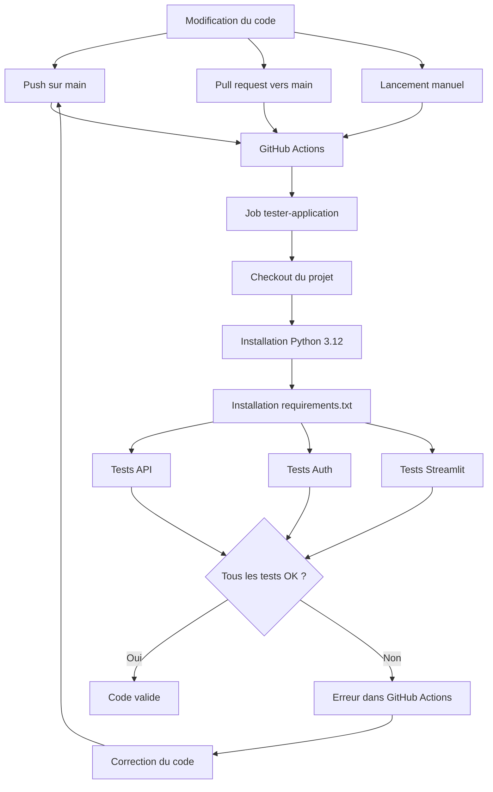

# Rapport competence C18 - Automatisation des tests avec une CI

## 1. Objectif de la competence C18

La competence C18 demande de mettre en place une chaine d'integration continue.

Dans mon projet, cela veut dire que les tests de l'application peuvent se lancer
automatiquement avec GitHub Actions.

Le but est simple :

- verifier le code automatiquement ;
- eviter de garder une erreur sans la voir ;
- tester les routes API ;
- tester la connexion utilisateur ;
- tester une partie de l'interface Streamlit ;
- lancer toujours les memes commandes dans un environnement propre.

C18 ne parle pas encore de deploiement complet.
Le deploiement et la livraison de l'application sont plutot dans C19.

## 2. Difference entre C18 et C19

Je separe C18 et C19 pour ne pas melanger.

| Competence | Sujet principal |
|---|---|
| C18 | Integration continue : lancer les tests automatiquement. |
| C19 | Livraison continue : construire, publier et deployer l'application. |

Dans C18, je parle surtout de :

- GitHub Actions ;
- le fichier `tests-application.yml` ;
- les tests Python ;
- les declencheurs ;
- les dependances ;
- le resultat OK ou erreur.

Dans C19, je parlerai plus de Docker, images, registry, serveur et livraison.

## 3. Outil choisi : GitHub Actions

J'ai choisi GitHub Actions comme outil de CI.

Je l'ai choisi parce que :

- mon projet est versionne avec Git et GitHub ;
- GitHub Actions est directement integre au depot ;
- il n'y a pas besoin d'installer un autre serveur de CI ;
- le fichier de configuration reste dans le projet ;
- les workflows peuvent se lancer automatiquement ;
- il fonctionne bien avec Python ;
- il permet de voir rapidement si un test echoue.

Le fichier principal de C18 est :

`.github/workflows/tests-application.yml`

Ce fichier dit a GitHub quoi faire pour tester l'application.

## 4. Schema general de la CI



## 5. Emplacement du workflow

Le workflow est stocke ici :

`.github/workflows/tests-application.yml`

Je le stocke dans `.github/workflows` parce que c'est le dossier attendu par
GitHub Actions.

GitHub lit automatiquement les fichiers `.yml` dans ce dossier.
Si le fichier est ailleurs, GitHub Actions ne le lancera pas.

## 6. Declencheurs de la CI

Dans le fichier `tests-application.yml`, la CI se lance avec :

```yaml
on:
  push:
    branches:
      - main
  pull_request:
    branches:
      - main
  workflow_dispatch:
```

Cela veut dire :

| Declencheur | Explication |
|---|---|
| `push` sur `main` | La CI se lance quand du code est envoye sur la branche principale. |
| `pull_request` vers `main` | La CI se lance avant de fusionner une modification. |
| `workflow_dispatch` | La CI peut etre lancee manuellement depuis GitHub. |

J'ai garde ces trois declencheurs parce qu'ils couvrent les cas simples :

- tester quand je pousse du code ;
- tester avant de fusionner ;
- relancer a la main si besoin.

## 7. Job principal

Le job principal s'appelle :

`tester-application`

Il tourne sur :

`ubuntu-latest`

J'utilise Ubuntu parce que c'est l'environnement classique dans GitHub Actions.
C'est simple, rapide, et suffisant pour lancer des tests Python.

## 8. Variables d'environnement de test

Dans le workflow, j'ai defini des variables :

```yaml
env:
  API_KEY: test-api-key
  JWT_SECRET_KEY: secret-de-test-jwt-avec-32-caracteres-minimum
  DB_USER: postgres
  DB_PASSWORD: postgres
  DB_HOST: localhost
  DB_PORT: 5432
  DB_NAME: immobilier_paris_test
```

Ces variables servent a donner un environnement minimal aux tests.

| Variable | Utilite |
|---|---|
| `API_KEY` | Tester les routes protegees par `X-API-Key`. |
| `JWT_SECRET_KEY` | Creer et verifier les tokens JWT pendant les tests. |
| `DB_USER` | Utilisateur PostgreSQL de test. |
| `DB_PASSWORD` | Mot de passe PostgreSQL de test. |
| `DB_HOST` | Adresse de la base de test. |
| `DB_PORT` | Port de la base de test. |
| `DB_NAME` | Nom de la base de test. |

Dans les tests, beaucoup de parties sont simulees avec des mocks.
Cela evite d'avoir besoin d'une vraie base complete pour tester toutes les
routes.

## 9. Etapes du workflow

Le workflow fait plusieurs etapes.

| Etape | Commande ou action | Role |
|---|---|---|
| Recuperer le projet | `actions/checkout@v4` | GitHub recupere les fichiers du depot. |
| Installer Python | `actions/setup-python@v5` | Installe Python dans le runner. |
| Version Python | `3.12` | Utilise une version moderne de Python. |
| Cache pip | `cache: pip` | Accelere l'installation des dependances. |
| Installer dependances | `pip install -r requirements.txt` | Installe les bibliotheques du projet. |
| Tester API | `python -m unittest discover -s tests -p "test_api.py" -v` | Lance les tests API. |
| Tester auth | `python -m unittest discover -s tests -p "test_auth.py" -v` | Lance les tests de connexion. |
| Tester Streamlit | `python -m unittest discover -s tests -p "test_streamlit_frontend.py" -v` | Lance les tests frontend. |

## 10. Pourquoi utiliser `unittest`

J'utilise `unittest` pour ces tests.

Je l'ai choisi parce que :

- il est deja integre dans Python ;
- il ne demande pas d'installer un outil de test en plus ;
- il marche bien avec GitHub Actions ;
- il suffit pour tester mes routes et mes fonctions ;
- il fonctionne avec `unittest.mock` pour simuler les appels externes.

Dans mon environnement local, `pytest` n'etait pas installe.
Avec `unittest`, les tests peuvent quand meme se lancer.

## 11. Fichier `requirements.txt`

Le fichier :

`requirements.txt`

sert a installer les bibliotheques Python dans la CI.

La commande utilisee est :

```bash
pip install -r requirements.txt
```

Exemples de bibliotheques utiles aux tests :

| Bibliotheque | Utilite dans le projet |
|---|---|
| `fastapi` | Tester l'API avec `TestClient`. |
| `streamlit` | Importer les fichiers frontend. |
| `requests` | Tester les appels HTTP simules. |
| `pandas` | Manipuler les DataFrames dans les tests. |
| `sqlalchemy` | Simuler ou tester les requetes SQL. |
| `PyJWT` | Tester les tokens JWT. |
| `argon2-cffi` | Tester le hash des mots de passe. |
| `xgboost` | Garder le modele disponible si besoin. |
| `prometheus-client` | Tester les metriques exposees par l'API. |

## 12. Tests API

Le fichier principal est :

`tests/test_api.py`

La commande CI est :

```bash
python -m unittest discover -s tests -p "test_api.py" -v
```

Ce fichier teste beaucoup de routes de l'application.

### 12.1 Tests de base API

Il verifie :

- que la route d'accueil repond ;
- que `/health` retourne un statut OK ;
- que `/metrics` expose les metriques ;
- que les anciennes routes non utilisees ne sont plus exposees.

### 12.2 Tests de securite API

Il verifie :

- qu'une route protegee refuse une requete sans cle API ;
- qu'une mauvaise cle API est refusee ;
- qu'une bonne cle API permet d'acceder aux donnees ;
- que certaines routes admin refusent un utilisateur simple.

### 12.3 Tests DVF

Il verifie :

- que `/dvf/points` retourne des points de carte ;
- que les filtres sont pris en compte ;
- que l'export CSV demande une cle API ;
- que les statistiques DVF retournent les bons champs.

### 12.4 Tests annonces scraping

Il verifie :

- que `/scraping/annonces` utilise la table `golden_data_scraping` ;
- que les filtres arrondissement, source, limit et offset sont envoyes ;
- que le nombre total d'annonces est renvoye ;
- que les statistiques annonces retournent les bons indicateurs ;
- que la comparaison scraping / DVF limite DVF a 2025.

### 12.5 Tests prediction

Il verifie :

- que `/prediction/prix` retourne un prix estime ;
- que la route demande une cle API ;
- qu'une mauvaise cle API est refusee ;
- que Pydantic refuse les valeurs irreelles ;
- que la prediction connectee peut etre sauvegardee ;
- que les metriques du modele sont exposees.

### 12.6 Tests adresse et proximite

Il verifie :

- que le geocodage retourne une adresse normalisee ;
- qu'une adresse connectee est sauvegardee ;
- qu'une adresse invalide n'est pas sauvegardee ;
- que l'historique des adresses retourne les adresses du bon utilisateur ;
- que la suppression d'adresse ne supprime pas les donnees d'un autre compte.

### 12.7 Tests services externes simules

Il verifie aussi :

- que IGN normalise une adresse parisienne exacte ;
- qu'une adresse hors Paris est refusee ;
- qu'une adresse sans numero demande plus de precision ;
- que IDFM retourne les arrets, modes et lignes ;
- que la source open data IDFM peut servir si PRIM ne repond pas ;
- que Overpass normalise commerces, ecoles et sante ;
- que l'analyse de proximite continue meme si un service est indisponible ;
- que les commerces peuvent venir du cache ou du fichier local.

### 12.8 Tests OpenAI

Il verifie :

- que le resume OpenAI utilise seulement les donnees de proximite ;
- que OpenAI reste optionnel si la cle n'est pas configuree ;
- que les erreurs OpenAI sont tracees dans les metriques.

## 13. Tests authentification

Le fichier est :

`tests/test_auth.py`

La commande CI est :

```bash
python -m unittest discover -s tests -p "test_auth.py" -v
```

Ce fichier teste la partie connexion utilisateur.

Il verifie :

- l'inscription d'un utilisateur simple ;
- le refus d'un mot de passe trop court ;
- le refus du role admin choisi depuis l'inscription ;
- le refus d'un email deja utilise ;
- le hash du mot de passe ;
- la creation ou reparation du super admin ;
- la connexion avec email et mot de passe ;
- le refus des mauvais identifiants ;
- le contenu du token JWT ;
- l'acces a `/auth/me` avec token valide ;
- le refus sans token ;
- le refus d'un token invalide ;
- le refus d'un token expire ;
- la deconnexion.

Ces tests sont importants parce que la connexion protege plusieurs parties de
l'application.

## 14. Tests Streamlit frontend

Le fichier est :

`tests/test_streamlit_frontend.py`

La commande CI est :

```bash
python -m unittest discover -s tests -p "test_streamlit_frontend.py" -v
```

Ce fichier ne lance pas toute l'interface dans un navigateur.
Il teste les fonctions Python utilisees par l'interface.

Il verifie :

- le formatage des nombres ;
- le formatage des euros ;
- le formatage des dates ;
- l'ajout du token utilisateur dans les headers ;
- le nettoyage des parametres envoyes a l'API ;
- la transformation des erreurs de validation ;
- l'envoi d'une prediction vers l'API ;
- l'echappement HTML pour eviter d'afficher du code dangereux.

Cela permet de tester une partie de Streamlit sans ouvrir l'application.

## 15. Ce qui se passe si un test echoue

Si un test echoue, GitHub Actions met le workflow en erreur.

Dans ce cas :

1. GitHub affiche l'etape qui a echoue.
2. Je regarde le message d'erreur.
3. Je corrige le code ou le test.
4. Je relance la CI avec un nouveau push ou manuellement.

Cela evite de penser que le code marche alors qu'une route ou une fonction est
cassee.

## 16. Comment lancer les memes tests en local

Je peux lancer les memes tests sur mon ordinateur.

Commandes :

```bash
python3 -m unittest discover -s tests -p "test_api.py" -v
python3 -m unittest discover -s tests -p "test_auth.py" -v
python3 -m unittest discover -s tests -p "test_streamlit_frontend.py" -v
```

Pour lancer tous les tests Python du dossier `tests` :

```bash
python3 -m unittest discover -s tests -p "test_*.py"
```

## 17. Fichiers concernes par C18

| Fichier | Role |
|---|---|
| `.github/workflows/tests-application.yml` | Workflow principal de CI pour tester l'application. |
| `requirements.txt` | Dependances installees dans la CI. |
| `tests/test_api.py` | Tests des routes API, securite, prediction, geocodage et admin. |
| `tests/test_auth.py` | Tests de l'inscription, connexion, JWT et mots de passe. |
| `tests/test_streamlit_frontend.py` | Tests du client Streamlit et du HTML affiche. |

## 18. Fichiers proches mais plutot pour autres competences

Il y a aussi d'autres workflows dans le projet.

| Fichier | Pourquoi je ne le mets pas au centre de C18 |
|---|---|
| `.github/workflows/livraison-modele.yml` | Il concerne surtout la livraison du modele IA, donc C13. |
| `.github/workflows/livraison-application.yml` | Il contient aussi des tests, mais il va surtout avec C19 car il construit et publie les images Docker. |

Pour C18, le fichier principal reste donc :

`.github/workflows/tests-application.yml`

## 19. Versionnement Git

La configuration de la CI est dans le projet.

Les commandes utiles pour verifier sont :

```bash
git status
git ls-files .github/workflows/tests-application.yml
git ls-files tests/test_api.py tests/test_auth.py tests/test_streamlit_frontend.py
```

Comme ces fichiers sont dans le depot, la configuration de test suit le code.

## 20. Schema Draw.io

J'ai aussi cree un schema Draw.io pour representer la CI et les tests executes.

Fichier :

`docs/bloc3/schema_c18_ci_tests.drawio`

Le schema montre :

- les trois declencheurs ;
- les etapes GitHub Actions ;
- les trois fichiers de tests ;
- les choses verifiees dans chaque fichier ;
- le resultat OK ou erreur.

## 21. Conclusion

Pour la competence C18, j'ai mis en place une CI avec GitHub Actions.

Cette CI installe l'environnement Python, installe les dependances, puis lance
les tests de l'application.

Les tests couvrent les routes API, l'authentification, une partie du frontend
Streamlit, la securite de base, les donnees renvoyees, les erreurs et certains
services externes simules.

Cela aide a garder un projet plus stable, car les erreurs sont detectees plus
rapidement quand le code change.
