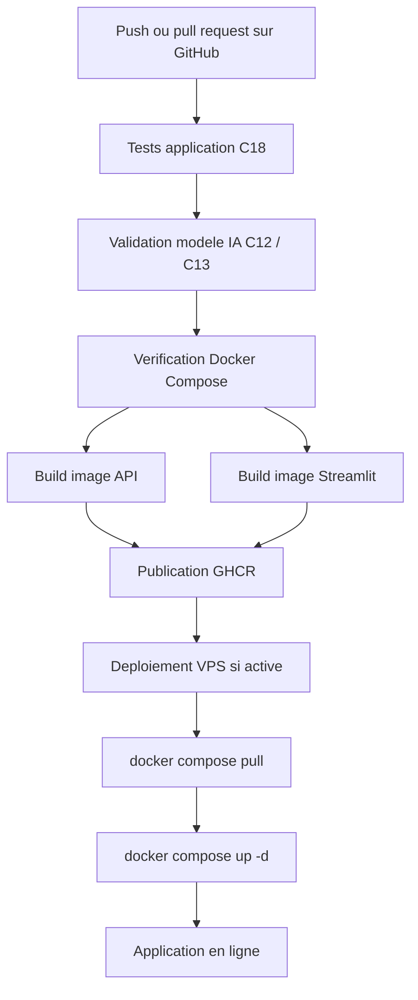

# Rapport competence C19 - Livraison continue de l'application

## 1. Objectif de la competence C19

La competence C19 demande de creer un processus de livraison continue.

Dans mon projet, cela veut dire :

- tester l'application avant de la livrer ;
- verifier que le modele IA est encore valide ;
- verifier les fichiers Docker ;
- construire les images Docker de l'API et de Streamlit ;
- publier ces images dans GitHub Container Registry ;
- mettre a jour le serveur avec Docker Compose ;
- rendre l'application disponible en ligne.

La livraison continue ne veut pas dire seulement lancer des tests.
Les tests sont deja traites dans C18.
C19 commence apres les tests, quand il faut preparer l'application pour etre
livree.

## 2. Difference entre C18 et C19

| Competence | Sujet |
|---|---|
| C18 | Integration continue : lancer les tests automatiquement. |
| C19 | Livraison continue : construire, publier et deployer l'application. |

Dans C18, je verifie que le code fonctionne.

Dans C19, je vais plus loin :

- je construis l'application avec Docker ;
- je publie les images ;
- je prepare les fichiers de production ;
- je mets a jour le serveur.

## 3. Depot GitHub du projet

Le projet est relie au depot GitHub :

`https://github.com/sabderma/immobilier-paris-ia.git`

La branche principale utilisee est :

`main`

Les workflows GitHub Actions sont dans :

`.github/workflows/`

Le workflow principal de C19 est :

`.github/workflows/livraison-application.yml`

Ce fichier automatise les tests, la validation du modele, la construction des
images Docker, la publication des images et le deploiement serveur.

## 4. Schema simple de la livraison continue



## 5. Workflow principal

Le fichier :

`.github/workflows/livraison-application.yml`

se lance avec :

- `push` sur `main` ;
- `pull_request` vers `main` ;
- `workflow_dispatch`, donc lancement manuel.

Cela permet de verifier la livraison dans plusieurs cas :

- quand je pousse du code ;
- quand je prepare une modification avant de la fusionner ;
- quand je veux relancer la chaine manuellement depuis GitHub.

## 6. Variables globales du workflow

Dans le workflow, il y a des variables globales.

| Variable | Role |
|---|---|
| `REGISTRY` | Registre Docker utilise, ici `ghcr.io`. |
| `API_IMAGE_NAME` | Nom de l'image Docker de l'API. |
| `STREAMLIT_IMAGE_NAME` | Nom de l'image Docker de Streamlit. |
| `DB_USER`, `DB_PASSWORD`, `DB_HOST`, `DB_PORT`, `DB_NAME` | Variables de test pour la base. |
| `API_KEY` | Cle de test entre Streamlit et FastAPI. |
| `JWT_SECRET_KEY` | Cle de test pour les tokens JWT. |
| `IDFM_API_KEY` | Cle de test pour les transports IDFM. |
| `OPENAI_API_KEY` | Cle de test pour OpenAI. |
| `OPENAI_MODEL` | Modele OpenAI utilise par defaut. |
| `GRAFANA_ADMIN_PASSWORD` | Mot de passe de test Grafana. |

Ces variables permettent de lancer les tests et de verifier les configurations
sans utiliser les vrais secrets de production.

Les vrais secrets de production sont stockes dans GitHub Secrets ou dans le
fichier `.env` du serveur.

## 7. Job 1 : tester l'application

Le premier job est :

`tester-application`

Il reprend les tests de C18.

Il fait :

1. recuperer le projet ;
2. installer Python 3.12 ;
3. installer les dependances avec `requirements.txt` ;
4. lancer les tests API ;
5. lancer les tests auth.

Commandes lancees :

```bash
python -m unittest discover -s tests -p "test_api.py" -v
python -m unittest discover -s tests -p "test_auth.py" -v
```

Ces tests verifient :

- les routes API ;
- la securite avec `X-API-Key` ;
- la connexion utilisateur ;
- les tokens JWT ;
- les routes admin ;
- le geocodage ;
- la prediction ;

Si ce job echoue, la livraison s'arrete.
L'application n'est pas construite ni publiee.

## 8. Job 2 : valider le modele IA

Le deuxieme job est :

`valider-modele-ia`

Il reprend la logique de C12 et C13.

Il sert a verifier que le modele IA peut etre livre avec l'application.

Etapes :

1. recuperer le projet ;
2. installer Python ;
3. installer les dependances ;
4. tester les donnees d'entrainement ;
5. entrainer un nouveau modele ;
6. tester le modele ;
7. generer un rapport de validation.

Variables utilisees :

| Variable | Role |
|---|---|
| `DONNEES_ENTRAINEMENT` | CSV DVF utilise pour entrainer le modele. |
| `DOSSIER_LIVRAISON` | Dossier temporaire de livraison. |
| `MODELE_LIVRE` | Chemin du modele cree. |
| `METRIQUES_LIVREES` | Chemin des metriques du modele. |
| `RAPPORT_LIVRAISON` | Chemin du rapport de validation. |

Tests lances :

```bash
python -m unittest discover -s tests -p "test_donnees_livraison.py" -v
python -m unittest discover -s tests -p "test_prediction.py" -v
```

Le fichier `tests/test_donnees_livraison.py` verifie :

- que le fichier DVF existe ;
- qu'il contient assez de ventes ;
- que les colonnes obligatoires existent ;
- que les valeurs importantes ne sont pas vides ;
- que les surfaces, pieces et prix sont positifs ;
- que les 20 arrondissements de Paris sont presents.

Le fichier `tests/test_prediction.py` verifie :

- que les donnees invalides sont supprimees ;
- que le format de prediction est correct ;
- que l'entrainement cree un modele et des metriques ;
- que le modele sauvegarde retourne un prix positif ;
- que le `R2` est au moins a `0.80` ;
- que le fichier de metriques contient les champs obligatoires.

Le script :

`scripts/generer_rapport_livraison_modele.py`

lit les metriques et refuse la livraison si le score `R2` est trop faible.

Si le modele n'est pas valide, la chaine s'arrete avant la construction Docker.

## 9. Job 3 : construire et publier les images Docker

Le troisieme job est :

`construire-et-publier`

Il depend des deux jobs precedents :

- `tester-application` ;
- `valider-modele-ia`.

Cela veut dire que les images Docker sont construites seulement si :

- les tests de l'application passent ;
- le modele IA est valide.

Etapes principales :

1. recuperer le projet ;
2. preparer le nom du proprietaire GitHub ;
3. verifier `compose.yml` ;
4. verifier `compose.prod.yml` ;
5. preparer Docker Buildx ;
6. se connecter a GitHub Container Registry ;
7. construire et publier l'image API ;
8. construire et publier l'image Streamlit.

## 10. Verification Docker Compose

Le workflow lance :

```bash
docker compose -f compose.yml config
docker compose -f compose.prod.yml config
```

Ces commandes ne lancent pas toute l'application.
Elles verifient que les fichiers Docker Compose sont lisibles et corrects.

`compose.yml` sert surtout pour le local.

`compose.prod.yml` sert pour la production.

## 11. Dockerfile de l'API

Le fichier :

`Dockerfile.api`

construit l'image Docker de l'API FastAPI.

Ce qu'il fait :

- part de l'image `python:3.12-slim` ;
- definit le dossier `/app` ;
- installe `libgomp1`, utile pour certaines bibliotheques de machine learning ;
- copie `requirements.txt` ;
- installe les dependances Python ;
- copie les dossiers `api`, `src`, `models` ;
- copie le fichier de secours des commerces ;
- copie `tests/test_prediction.py` ;
- lance un test du modele pendant le build ;
- expose le port `8000` ;
- demarre FastAPI avec `uvicorn`.

Commande finale :

```bash
uvicorn api.main:app --host 0.0.0.0 --port 8000
```

J'ai mis le test de prediction dans le Dockerfile API pour eviter de construire
une image API avec un modele inutilisable.

## 12. Dockerfile de Streamlit

Le fichier :

`Dockerfile.streamlit`

construit l'image Docker de l'interface.

Ce qu'il fait :

- part de `python:3.12-slim` ;
- definit le dossier `/app` ;
- installe les dependances Python ;
- configure `PYTHONPATH` ;
- copie le dossier `streamlit` ;
- copie `src` ;
- copie le GeoJSON des arrondissements ;
- expose le port `8501` ;
- lance Streamlit.

Commande finale :

```bash
streamlit run app.py --server.address=0.0.0.0 --server.port=8501
```

Cette image contient donc l'interface utilisateur.

## 13. Compose local

Le fichier :

`compose.yml`

sert a lancer l'application localement avec Docker.

Services :

| Service | Role |
|---|---|
| `database` | Base PostgreSQL avec les scripts SQL et les CSV. |
| `api` | API FastAPI construite avec `Dockerfile.api`. |
| `streamlit` | Interface Streamlit construite avec `Dockerfile.streamlit`. |
| `prometheus` | Collecte les metriques de l'API. |
| `grafana` | Affiche les dashboards de monitoring. |

Le service `database` a un healthcheck.
Cela permet d'attendre que PostgreSQL soit pret avant de lancer l'API.

Commande locale :

```bash
docker compose up -d --build
```

## 14. Compose production

Le fichier :

`compose.prod.yml`

sert sur le serveur.

La difference importante avec `compose.yml` est que :

- en local, Docker construit les images avec les Dockerfiles ;
- en production, Docker recupere les images publiees dans `ghcr.io`.

Exemple pour l'API :

```yaml
image: ${REGISTRY:-ghcr.io}/${IMAGE_OWNER}/immobilier-paris-api:${IMAGE_TAG:-latest}
```

Exemple pour Streamlit :

```yaml
image: ${REGISTRY:-ghcr.io}/${IMAGE_OWNER}/immobilier-paris-streamlit:${IMAGE_TAG:-latest}
```

Les ports sont limites a `127.0.0.1`.

Exemples :

- `127.0.0.1:8501:8501` pour Streamlit ;
- `127.0.0.1:8002:8000` pour l'API ;
- `127.0.0.1:9090:9090` pour Prometheus ;
- `127.0.0.1:3000:3000` pour Grafana.

Cela evite d'exposer directement ces services sur Internet.
Les visiteurs passent par le domaine public et Nginx.

## 15. Publication dans GitHub Container Registry

Le workflow utilise :

`ghcr.io`

C'est GitHub Container Registry.

Les images publiees sont :

```text
ghcr.io/<owner>/immobilier-paris-api:latest
ghcr.io/<owner>/immobilier-paris-api:<commit>
ghcr.io/<owner>/immobilier-paris-streamlit:latest
ghcr.io/<owner>/immobilier-paris-streamlit:<commit>
```

Le tag `latest` represente la derniere version validee.

Le tag `<commit>` permet de retrouver une version exacte du code.

Pour publier, le workflow utilise :

- `docker/setup-buildx-action@v3` ;
- `docker/login-action@v3` ;
- `docker/build-push-action@v6`.

Lors d'une pull request, les images sont construites pour verifier que tout
marche, mais elles ne sont pas publiees.

Lors d'un push sur `main`, les images peuvent etre publiees.

## 16. Job 4 : deploiement serveur

Le dernier job est :

`deployer-serveur`

Il depend de :

`construire-et-publier`

Il se lance seulement si :

```yaml
github.event_name == 'push'
github.ref == 'refs/heads/main'
vars.DEPLOY_APPLICATION == 'true'
```

Cela veut dire :

- le code doit etre pousse sur `main` ;
- ce n'est pas une pull request ;
- la variable GitHub `DEPLOY_APPLICATION` doit etre activee.

Cette condition evite de deployer par accident.

## 17. Secrets GitHub pour le deploiement

Le deploiement serveur utilise des secrets GitHub.

| Secret | Role |
|---|---|
| `DEPLOY_HOST` | Adresse du serveur. |
| `DEPLOY_USER` | Utilisateur SSH. |
| `DEPLOY_SSH_KEY` | Cle SSH privee utilisee par GitHub Actions. |
| `DEPLOY_PATH` | Dossier de production sur le serveur. |

Ces informations ne sont pas ecrites directement dans le code.
Elles restent dans GitHub Secrets.

## 18. Fichiers envoyes au serveur

Avant de mettre a jour Docker, GitHub Actions cree une archive avec :

- `compose.prod.yml` ;
- `sql/` ;
- `data/final/` ;
- `monitoring/`.

Ces fichiers sont envoyes sur le VPS.

Le fichier `.env` n'est pas envoye par GitHub.
Il reste seulement sur le serveur, car il contient les variables sensibles :

- mots de passe ;
- cles API ;
- secrets JWT ;
- configuration de production.

## 19. Commandes executees sur le serveur

Apres l'envoi des fichiers, GitHub Actions se connecte au serveur en SSH.

Ensuite, il lance :

```bash
docker compose -f compose.prod.yml pull
docker compose -f compose.prod.yml up -d
docker compose -f compose.prod.yml ps
```

Explication :

| Commande | Role |
|---|---|
| `docker compose pull` | Recupere les nouvelles images Docker publiees. |
| `docker compose up -d` | Lance ou met a jour les conteneurs. |
| `docker compose ps` | Affiche l'etat des services. |

## 20. VPS et application en ligne

Le projet contient une documentation de deploiement VPS.

Serveur utilise :

```text
Utilisateur SSH : ubuntu
Adresse : 164.132.42.47
Dossier : /home/ubuntu/immobilier-paris-ia
```

L'application est mise en ligne avec le domaine :

```text
https://dvfvisionparis.fr
```

En production, les conteneurs tournent en local sur le VPS.
Nginx gere l'acces public HTTPS et redirige vers Streamlit.

Services internes :

| Service | Adresse interne |
|---|---|
| Streamlit | `http://127.0.0.1:8501` |
| API | `http://127.0.0.1:8002` |
| Grafana | `http://127.0.0.1:3000` |
| Prometheus | `http://127.0.0.1:9090` |
| PostgreSQL | `127.0.0.1:5434` |

Cela permet de ne pas exposer directement la base, l'API, Prometheus ou Grafana
sur Internet.

## 21. Lien avec C20

C19 livre aussi les fichiers de monitoring :

- `monitoring/prometheus.yml` ;
- `monitoring/alerts.yml` ;
- `monitoring/grafana/provisioning/` ;
- `monitoring/grafana/dashboards/`.

Ces fichiers servent surtout a C20.

Mais dans C19, ils sont importants parce qu'ils sont envoyes au serveur avec
l'application.

Donc apres la livraison, le serveur a aussi Prometheus et Grafana pour surveiller
l'application.

## 22. Technologies utilisees

Pour cette competence, j'ai utilise plusieurs technologies ensemble.

| Technologie | Pourquoi je l'utilise |
|---|---|
| GitHub | Pour garder le code du projet et lancer les workflows. |
| GitHub Actions | Pour automatiser les tests, Docker et le deploiement. |
| Docker | Pour mettre l'API et Streamlit dans des images propres. |
| Docker Compose | Pour lancer plusieurs services ensemble. |
| GitHub Container Registry | Pour stocker les images Docker publiees. |
| SSH | Pour connecter GitHub Actions au serveur VPS. |
| SCP | Pour envoyer les fichiers de production au serveur. |
| VPS Ubuntu | Pour heberger l'application en ligne. |
| Nginx | Pour recevoir les visiteurs avec le domaine public. |
| HTTPS | Pour avoir une adresse securisee. |
| FastAPI | Pour exposer les routes API de l'application. |
| Streamlit | Pour afficher l'interface utilisateur. |
| PostgreSQL | Pour stocker les donnees de l'application. |
| Prometheus | Pour collecter les metriques apres la livraison. |
| Grafana | Pour afficher les tableaux de bord de monitoring. |

J'ai choisi cette organisation parce que chaque outil a un role simple.
GitHub garde le code, GitHub Actions automatise, Docker emballe l'application,
GHCR stocke les images, puis le VPS lance les services avec Docker Compose.

## 23. Fichiers principaux de C19

| Fichier | Role |
|---|---|
| `.github/workflows/livraison-application.yml` | Chaine principale de livraison application. |
| `Dockerfile.api` | Image Docker de l'API FastAPI. |
| `Dockerfile.streamlit` | Image Docker de l'interface Streamlit. |
| `compose.yml` | Lancement Docker local. |
| `compose.prod.yml` | Lancement Docker production avec images publiees. |
| `requirements.txt` | Dependances Python installees dans les images. |
| `scripts/generer_rapport_livraison_modele.py` | Controle le score du modele avant livraison. |
| `tests/test_api.py` | Tests application avant livraison. |
| `tests/test_auth.py` | Tests connexion avant livraison. |
| `tests/test_donnees_livraison.py` | Tests donnees modele avant livraison. |
| `tests/test_prediction.py` | Tests modele avant livraison. |
| `sql/` | Scripts SQL envoyes au serveur. |
| `data/final/` | Donnees finales envoyees au serveur. |
| `monitoring/` | Configuration Prometheus et Grafana envoyee au serveur. |
| `docs/livraison_continue_application.md` | Documentation globale de la livraison. |
| `docs/deploiement_vps_github_actions.md` | Documentation de la mise en ligne VPS. |

## 24. Commandes utiles

Verifier la configuration Docker locale :

```bash
docker compose -f compose.yml config
```

Verifier la configuration Docker production :

```bash
IMAGE_OWNER=sabderma IMAGE_TAG=latest docker compose -f compose.prod.yml config
```

Lancer localement :

```bash
docker compose up -d --build
```

Lancer en production sur le serveur :

```bash
docker compose -f compose.prod.yml pull
docker compose -f compose.prod.yml up -d
docker compose -f compose.prod.yml ps
```

## 25. Ce que j'ai fait pour C19

Pour cette competence, j'ai mis en place une chaine complete autour de GitHub
Actions et Docker.

J'ai fait :

- un workflow GitHub Actions pour la livraison application ;
- une verification des tests applicatifs ;
- une verification du modele IA ;
- une verification de `compose.yml` et `compose.prod.yml` ;
- une image Docker pour l'API ;
- une image Docker pour Streamlit ;
- une publication des images dans GitHub Container Registry ;
- une configuration de deploiement par SSH vers un VPS ;
- une mise a jour du serveur avec `docker compose pull` et `docker compose up -d` ;
- une mise en ligne avec le domaine `https://dvfvisionparis.fr`.

## 26. Conclusion

La competence C19 montre que mon application peut etre livree de maniere
continue.

Avant de livrer, la chaine verifie les tests de l'application et le modele IA.
Ensuite elle construit les images Docker, les publie dans GitHub Container
Registry, puis peut mettre a jour le VPS.

L'application est mise en ligne avec Docker Compose, Nginx et HTTPS sur :

`https://dvfvisionparis.fr`

Cela rend la livraison plus propre, plus reproductible et plus facile a refaire
qu'une installation manuelle complete.
