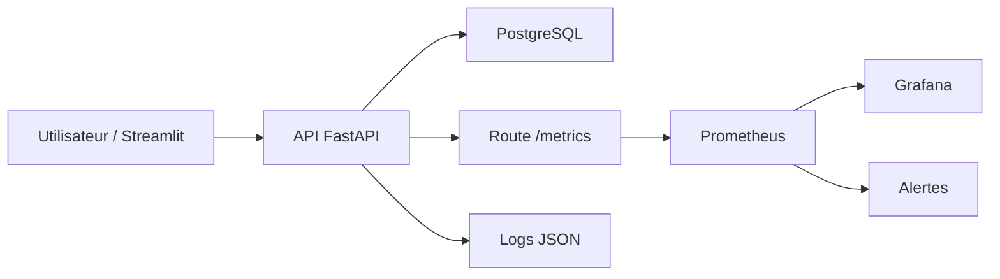

# Rapport competence C20 - Monitoring de l'application

## 1. Objectif de la competence C20

La competence C20 concerne la surveillance de l'application apres la livraison.

Dans mon projet, cela veut dire que je dois pouvoir savoir si l'application
fonctionne bien une fois lancee, en local ou en ligne.

Je surveille surtout :

- si l'API FastAPI repond ;
- si la base PostgreSQL est accessible ;
- combien de requetes arrivent sur l'API ;
- combien de requetes retournent une erreur ;
- combien de temps les routes prennent pour repondre ;
- si des exceptions arrivent dans le code ;
- si Prometheus et Grafana affichent bien les informations.

La C20 ne parle pas seulement du modele IA.
Elle parle de l'application complete.

## 2. Difference entre C11 et C20

Dans mon projet, il y a deja une partie monitoring pour le modele IA.
Cette partie correspond surtout a la C11.

La C20 est plus large.
Elle surveille l'application complete.

| Competence | Ce que je surveille |
|---|---|
| C11 | Le modele IA, les predictions, les erreurs du modele, les scores. |
| C20 | L'API, la base de donnees, les requetes HTTP, les erreurs, la latence et les logs. |

Donc dans ce rapport, je parle surtout du monitoring applicatif.
Je ne refais pas tout le rapport C11.

## 3. Ce que j'ai mis en place

Pour la C20, j'ai mis en place une chaine de monitoring avec :

- FastAPI ;
- `prometheus-client` en Python ;
- Prometheus ;
- Grafana ;
- Docker Compose ;
- des alertes Prometheus ;
- des logs JSON.

L'idee est simple :

1. L'API FastAPI mesure ce qui se passe.
2. L'API expose les mesures sur la route `/metrics`.
3. Prometheus lit cette route automatiquement.
4. Grafana affiche les chiffres dans un dashboard.
5. Les alertes Prometheus indiquent si quelque chose ne va pas.

## 4. Schema simple du fonctionnement



Ce schema montre que l'API est au centre.
Elle repond aux utilisateurs, parle avec PostgreSQL, produit des logs et expose
les metriques pour Prometheus.

## 5. Application en ligne

L'application est aussi mise en ligne.

Adresse :

```text
https://dvfvisionparis.fr
```

Sur le serveur, les conteneurs tournent avec Docker Compose.
Nginx gere l'acces public en HTTPS et redirige vers Streamlit.

Les services internes restent sur le VPS :

| Service | Adresse interne |
|---|---|
| Streamlit | `127.0.0.1:8501` |
| API FastAPI | `127.0.0.1:8002` |
| Prometheus | `127.0.0.1:9090` |
| Grafana | `127.0.0.1:3000` |
| PostgreSQL | `127.0.0.1:5434` |

Je n'expose pas directement Prometheus, Grafana, PostgreSQL ou l'API sur
Internet.
C'est mieux pour la securite.

## 6. Fichiers principaux de la C20

| Fichier | Role |
|---|---|
| `api/metrics.py` | Cree les metriques Prometheus de l'API et du modele. |
| `api/main.py` | Mesure chaque requete HTTP avec un middleware FastAPI. |
| `api/routers/system.py` | Expose `/health` et `/metrics`. |
| `api/logging_config.py` | Ecrit les logs au format JSON. |
| `monitoring/prometheus.yml` | Configure Prometheus pour lire l'API. |
| `monitoring/alerts.yml` | Contient les alertes Prometheus. |
| `monitoring/grafana/dashboards/immobilier-paris-application.json` | Dashboard Grafana C20. |
| `monitoring/grafana/provisioning/datasources/prometheus.yml` | Connecte Grafana a Prometheus. |
| `monitoring/grafana/provisioning/dashboards/dashboards.yml` | Dit a Grafana ou trouver les dashboards. |
| `compose.yml` | Lance Prometheus et Grafana en local. |
| `compose.prod.yml` | Lance Prometheus et Grafana en production. |
| `tests/test_api.py` | Verifie que `/health` et `/metrics` fonctionnent. |

## 7. Route `/health`

La route `/health` sert a verifier si l'API et la base PostgreSQL fonctionnent.

Fichier :

```text
api/routers/system.py
```

Quand on appelle :

```http
GET /health
```

L'API fait un petit test SQL :

```sql
SELECT 1
```

Si PostgreSQL repond, l'API retourne :

```json
{
  "status": "ok",
  "database": "connectée"
}
```

Si la base ne repond pas, l'API retourne une erreur.
Cela permet de savoir vite si l'application peut vraiment travailler avec ses
donnees.

## 8. Route `/metrics`

La route `/metrics` sert a donner les metriques a Prometheus.

Fichier :

```text
api/routers/system.py
```

Quand Prometheus appelle :

```http
GET /metrics
```

FastAPI retourne un texte au format Prometheus.
Ce texte contient les compteurs, les jauges et les histogrammes.

Prometheus ne lit pas directement la base.
Il lit seulement l'API.

## 9. Metriques applicatives

Les metriques C20 sont creees dans :

```text
api/metrics.py
```

Les metriques importantes sont :

| Metrique | Ce que ca veut dire |
|---|---|
| `api_http_requests_total` | Nombre de requetes HTTP recues par l'API. |
| `api_http_request_duration_seconds` | Temps de reponse des routes API. |
| `api_http_requests_in_progress` | Nombre de requetes en cours. |
| `api_exceptions_total` | Nombre d'erreurs non gerees dans l'API. |
| `api_database_health_status` | Etat de PostgreSQL : `1` si OK, `0` si KO. |

Ces metriques permettent de comprendre si l'application est stable ou pas.

Par exemple :

- si `api_database_health_status` vaut `0`, la base a un probleme ;
- si les erreurs 5xx montent, une route API peut etre cassee ;
- si la latence augmente, l'application devient lente ;
- si trop de requetes sont en cours, l'API peut etre surchargee.

## 10. Middleware FastAPI

Le fichier :

```text
api/main.py
```

contient un middleware FastAPI.

Un middleware est un code qui passe autour de chaque requete HTTP.

Dans mon projet, il sert a :

- mesurer le temps de chaque requete ;
- compter les requetes par route ;
- compter les statuts HTTP ;
- compter les exceptions ;
- ecrire un log quand une requete se termine ;
- ecrire un log quand une requete echoue.

La route `/metrics` est ignoree par ce middleware.
C'est volontaire.

Sinon, Prometheus polluerait les statistiques a chaque fois qu'il vient lire les
metriques.

## 11. Logs JSON

Les logs sont configures dans :

```text
api/logging_config.py
```

J'ai choisi des logs JSON car ils sont plus faciles a lire par des outils de
monitoring ou d'exploitation.

Un log de requete peut contenir :

- la date ;
- le niveau du log ;
- le nom du logger ;
- le message ;
- la methode HTTP ;
- la route ;
- le statut HTTP ;
- la duree ;
- l'adresse IP cliente.

Exemple de donnees suivies :

```text
event = api_request_completed
http_method = GET
http_route = /health
http_status_code = 200
duration_ms = 12.5
```

Je n'ecris pas les mots de passe, les cles API ou les tokens JWT dans les logs.
C'est important pour eviter de stocker des informations sensibles.

## 12. Prometheus

Prometheus est configure dans :

```text
monitoring/prometheus.yml
```

Il lit la route :

```text
api:8000/metrics
```

Il lit les metriques toutes les 5 secondes.

Configuration importante :

```yaml
scrape_interval: 5s
metrics_path: "/metrics"
targets: ["api:8000"]
```

Dans Docker Compose, `api:8000` fonctionne parce que les conteneurs sont sur le
meme reseau Docker.

## 13. Alertes Prometheus

Les alertes sont dans :

```text
monitoring/alerts.yml
```

Les alertes C20 sont dans le groupe :

```text
immobilier-paris-application
```

Alertes principales :

| Alerte | Quand elle se declenche |
|---|---|
| `ApiIndisponible` | Prometheus ne peut plus lire `/metrics`. |
| `BaseDonneesIndisponible` | PostgreSQL ne repond plus. |
| `TauxErreursHttpEleve` | Trop de reponses 5xx sur l'API. |
| `LatenceHttpP95Elevee` | 95 % des requetes prennent plus de 2 secondes. |

Ces alertes sont simples, mais elles couvrent les problemes importants :

- application arretee ;
- base de donnees arretee ;
- route qui plante ;
- application trop lente.

## 14. Grafana

Grafana permet de lire les metriques avec un dashboard.

Le dashboard C20 est dans :

```text
monitoring/grafana/dashboards/immobilier-paris-application.json
```

Son titre est :

```text
C20 - Monitoring application
```

Il affiche :

- disponibilite de l'API ;
- etat PostgreSQL ;
- nombre de requetes ;
- erreurs 5xx ;
- latence P95 ;
- trafic par route ;
- statuts HTTP ;
- temps moyen par route ;
- requetes en cours ;
- exceptions.

Grafana utilise Prometheus comme source de donnees.
La source Prometheus est configuree dans :

```text
monitoring/grafana/provisioning/datasources/prometheus.yml
```

Les dashboards sont charges automatiquement grace a :

```text
monitoring/grafana/provisioning/dashboards/dashboards.yml
```

## 15. Docker Compose

Le monitoring est lance avec Docker Compose.

En local, le fichier est :

```text
compose.yml
```

En production, le fichier est :

```text
compose.prod.yml
```

Les services importants pour C20 sont :

| Service | Role |
|---|---|
| `api` | Expose `/health` et `/metrics`. |
| `database` | Base PostgreSQL surveillee par l'API. |
| `prometheus` | Collecte les metriques. |
| `grafana` | Affiche le dashboard. |

Prometheus utilise :

```text
./monitoring/prometheus.yml:/etc/prometheus/prometheus.yml:ro
./monitoring/alerts.yml:/etc/prometheus/alerts.yml:ro
```

Grafana utilise :

```text
./monitoring/grafana/provisioning/datasources
./monitoring/grafana/provisioning/dashboards
./monitoring/grafana/dashboards
```

## 16. Comment lancer le monitoring en local

Depuis la racine du projet :

```bash
docker compose up -d --build
```

Ensuite, les services sont accessibles ici :

| Service | URL locale |
|---|---|
| Streamlit | `http://127.0.0.1:8501` |
| API | `http://127.0.0.1:8002` |
| Route health | `http://127.0.0.1:8002/health` |
| Route metrics | `http://127.0.0.1:8002/metrics` |
| Prometheus | `http://127.0.0.1:9090` |
| Grafana | `http://127.0.0.1:3000` |

Dans Grafana, le dashboard se trouve dans le dossier :

```text
Immobilier Paris
```

Dashboard :

```text
C20 - Monitoring application
```

## 17. Comment verifier que ca marche

Je peux verifier le monitoring avec plusieurs etapes simples.

Verifier l'API :

```bash
curl http://127.0.0.1:8002/health
```

Verifier les metriques :

```bash
curl http://127.0.0.1:8002/metrics
```

Dans `/metrics`, je dois voir par exemple :

```text
api_http_requests_total
api_http_request_duration_seconds
api_database_health_status
api_exceptions_total
```

Verifier Prometheus :

```text
http://127.0.0.1:9090
```

Dans Prometheus, il est possible de chercher :

```text
up{job="immobilier-paris-api"}
```

Verifier Grafana :

```text
http://127.0.0.1:3000
```

Puis ouvrir :

```text
C20 - Monitoring application
```

## 18. Tests automatises

Une partie du monitoring est testee dans :

```text
tests/test_api.py
```

Les tests verifient notamment :

- que `/health` retourne un statut OK quand la base repond ;
- que `/metrics` retourne bien les metriques Prometheus ;
- que la metrique `api_database_health_status` passe a `1` quand la base repond ;
- que les requetes HTTP sont comptees.

Commande utile :

```bash
python -m unittest discover -s tests -p "test_api.py" -v
```

## 19. Securite et logs

Pour la C20, il faut aussi faire attention aux logs.

Les logs peuvent contenir une adresse IP.
Une adresse IP peut etre une donnee personnelle.

Donc j'ai garde des logs techniques :

- route appelee ;
- statut HTTP ;
- duree ;
- evenement ;
- IP cliente.

Mais je n'ecris pas :

- mot de passe ;
- token JWT ;
- cle API ;
- contenu complet des formulaires ;
- donnees sensibles utilisateur.

Cela permet de surveiller l'application sans mettre trop d'informations dans les
logs.

## 20. Ce que j'ai fait pour C20

Pour cette competence, j'ai mis en place un monitoring applicatif.

J'ai fait :

- des metriques Prometheus dans Python ;
- une route `/metrics` pour que Prometheus lise les metriques ;
- une route `/health` pour tester l'API et PostgreSQL ;
- un middleware FastAPI qui mesure les requetes ;
- des logs JSON pour suivre les appels API ;
- un fichier Prometheus ;
- un fichier d'alertes ;
- un dashboard Grafana C20 ;
- une configuration Docker Compose pour lancer Prometheus et Grafana ;
- une configuration aussi presente en production ;
- une application mise en ligne sur `https://dvfvisionparis.fr`.

## 21. Conclusion

La competence C20 montre que mon application n'est pas seulement livree.
Elle est aussi surveillee.

Avec `/health`, je sais si l'API et PostgreSQL repondent.
Avec `/metrics`, Prometheus recupere les informations techniques.
Avec Grafana, les problemes sont plus faciles a voir.
Avec les alertes, une API arretee, une base indisponible, trop d'erreurs ou une
latence trop elevee peuvent etre detectees.

Pour moi, cette partie est importante parce qu'une application en ligne doit etre
suivie apres son deploiement.
