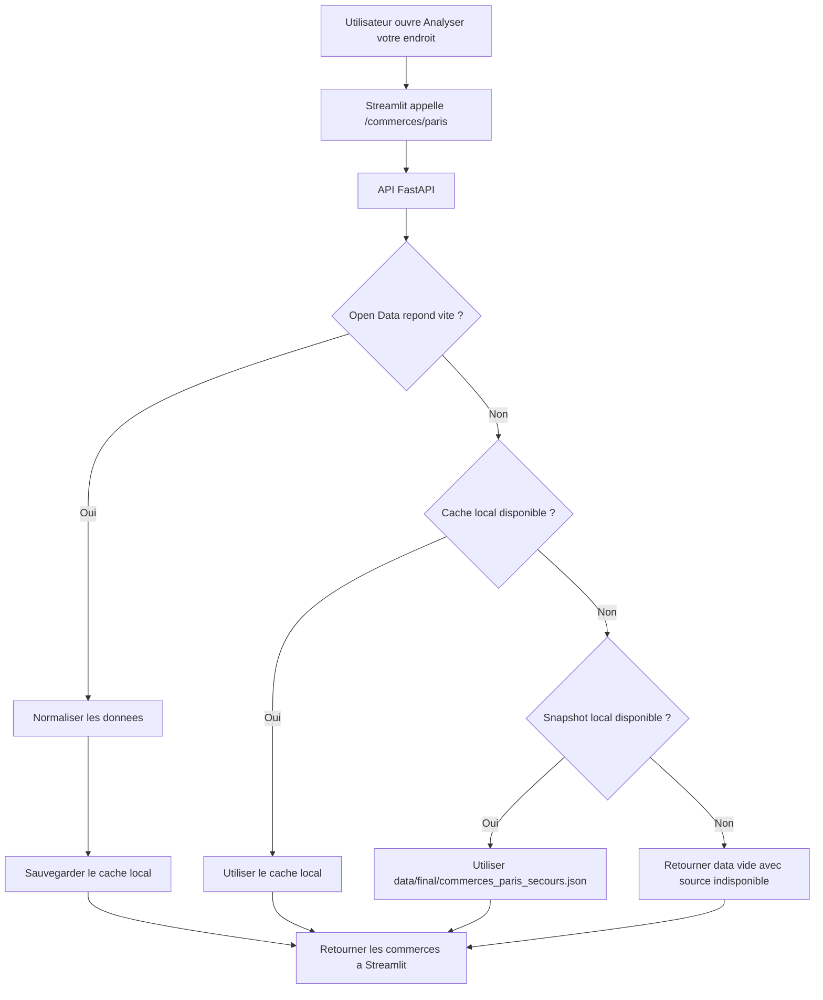
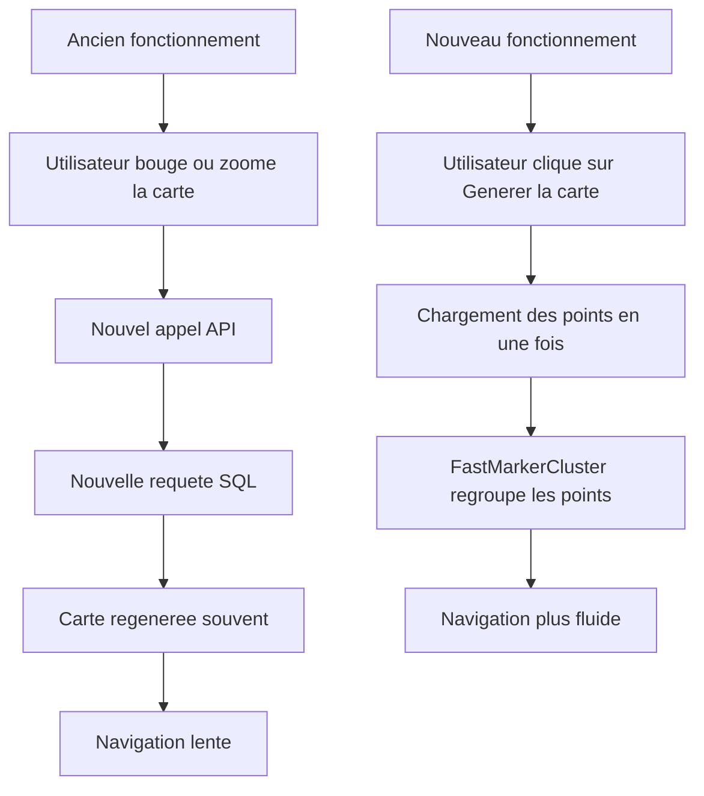

# Rapport competence C21 - Resolution des incidents applicatifs

## 1. Objectif de la competence C21

La competence C21 concerne la resolution d'incidents.

Pour moi, cela veut dire que je ne dois pas seulement developper
l'application. Je dois aussi etre capable de voir quand il y a un probleme,
comprendre d'ou il vient, corriger le code, puis verifier que l'application
fonctionne mieux apres.

Dans mon projet immobilier Paris, j'ai eu plusieurs problemes importants :

- la route `/commerces/paris` etait trop dependante d'une API externe ;
- l'ancienne utilisation de Gemini n'etait pas assez stable pour les donnees
  autour d'une adresse ;
- la carte Folium etait trop lente quand elle rechargeait les points avec SQL
  pendant la navigation ;
- il fallait garder l'application utilisable meme si une dependance externe ne
  repond pas.

Le document de base pour cette competence est :

```text
docs/resolution_incident_c21_commerces_paris.md
```

Dans ce nouveau rapport, je reprends cet incident principal et j'explique aussi
les autres incidents que j'ai rencontres pendant le projet.

## 2. Resume des incidents traites

| Incident | Probleme observe | Correction faite |
|---|---|---|
| Commerces Paris | La page attendait trop longtemps la route `/commerces/paris`. | Ajout d'un timeout, d'un cache et d'un fichier local de secours. |
| Ancienne solution Gemini | Gemini donnait parfois des reponses differentes pour la meme adresse et posait un probleme de token/utilisation. | Remplacement par des API de donnees + OpenAI seulement pour reformuler un resume. |
| Carte Folium | La carte rechargeait les points avec SQL pendant les deplacements et ce n'etait pas fluide. | Chargement des points en une fois au moment du clic, puis affichage avec clustering. |
| Application en ligne | Un service externe lent pouvait casser l'experience utilisateur. | Degradation controlee : l'application continue avec cache ou donnees locales. |

L'idee generale est que l'application ne doit pas s'arreter completement a cause
d'un service externe lent ou instable.

## 3. Incident principal : route `/commerces/paris`

L'incident principal de la C21 concerne la route :

```http
GET /commerces/paris
```

Cette route sert a afficher des statistiques sur les commerces par
arrondissement de Paris.

Elle est utilisee dans la page :

```text
Analyser votre endroit
```

Elle permet de noter l'arrondissement avec des criteres comme :

- le total des commerces ;
- les commerces alimentaires ;
- les commerces specialises ;
- les grandes surfaces ;
- la densite de commerces par habitant ;
- le score de proximite quotidienne ;
- le score de diversite commerciale ;
- le score global de l'arrondissement.

Avant la correction, cette route appelait directement l'Open Data
Ile-de-France au moment ou l'utilisateur ouvrait la page.

Le probleme est que si l'Open Data etait lent, mon API FastAPI restait bloquee.
Ensuite Streamlit attendait la reponse, puis affichait une erreur.

## 4. Log observe pour les commerces Paris

Sur l'application en ligne, la page affichait une erreur de ce type :

```text
Erreur API sur /commerces/paris :
HTTPConnectionPool(host='api', port=8000): Read timed out. (read timeout=60)
```

Ce message veut dire que Streamlit a bien essaye d'appeler l'API interne, mais
l'API n'a pas repondu assez vite.

Ce n'etait pas une erreur simple comme "API eteinte".
L'API fonctionnait, mais une route restait bloquee trop longtemps.

Dans le monitoring C20, le dashboard montrait aussi :

- l'API et PostgreSQL etaient disponibles ;
- il y avait des erreurs 5xx pendant la periode ;
- la latence etait elevee sur la route concernee ;
- il n'y avait pas forcement une grosse exception Python visible ;
- le probleme venait surtout d'une attente trop longue.

Donc le diagnostic etait :

```text
La route /commerces/paris depend trop d'une API externe lente.
```

## 5. Test de reproduction

Pour comprendre le probleme, l'appel a la source externe a ete teste avec
`curl`.

Commande utilisee :

```bash
curl -L --max-time 12 \
  "https://data.iledefrance.fr/api/explore/v2.1/catalog/datasets/les-commerces-par-commune-ou-arrondissement-base-permanente-des-equipements/records?where=departement%3D75&limit=20&order_by=departement_commune"
```

Resultat observe :

```text
curl: (28) Connection timed out after 12004 milliseconds
HTTP_STATUS:000
TIME_TOTAL:12.004988
```

Ce test montre que la source externe pouvait ne pas repondre dans un delai
correct.

Donc si mon application attend cette source en direct, elle peut devenir lente
ou afficher une erreur.

## 6. Cause racine de l'incident commerces

La cause racine etait la dependance directe a l'Open Data Ile-de-France.

Avant la correction :

1. l'utilisateur ouvrait la page Streamlit ;
2. Streamlit appelait l'API FastAPI ;
3. FastAPI appelait directement `data.iledefrance.fr` ;
4. si Open Data etait lent, FastAPI attendait ;
5. Streamlit attendait aussi ;
6. au bout d'un moment, l'utilisateur voyait un timeout.

Le probleme n'etait pas la base PostgreSQL.
Le probleme n'etait pas le modele IA.
Le probleme venait d'une dependance externe qui pouvait ralentir toute la page.

## 7. Premiere correction et regression

Apres une premiere correction, l'erreur bloquante avait disparu.

Mais un autre probleme etait visible :

```text
Les statistiques commerces par arrondissement sont temporairement indisponibles.
L'analyse d'adresse exacte reste disponible.
```

Cela voulait dire que la route repondait, mais qu'elle renvoyait parfois :

```json
{
  "data": []
}
```

Donc l'application ne plantait plus, mais le bloc de notation des
arrondissements ne pouvait plus s'afficher correctement.

La correction n'etait donc pas encore suffisante.

Il fallait que l'application ait une vraie source de secours, meme quand
Open Data et le cache ne sont pas disponibles.

## 8. Solution finale pour `/commerces/paris`

La correction finale a ete faite dans le service :

```text
api/services/commerces.py
```

J'ai mis plusieurs niveaux de protection.

### Timeout court

Avant, l'appel externe pouvait bloquer trop longtemps.

Maintenant, le timeout est court et configurable avec :

```text
COMMERCES_API_TIMEOUT_SECONDS
```

La valeur par defaut est de 5 secondes.

Donc si Open Data ne repond pas assez vite, mon API arrete d'attendre et passe a
une autre solution.

### Cache disque local

Quand l'Open Data repond correctement, les resultats sont sauvegardes dans un
cache local.

Chemin par defaut :

```text
/tmp/immobilier_paris_commerces_cache.json
```

Ce cache sert de secours.

Si l'Open Data ne repond plus, l'application peut reutiliser les dernieres
donnees connues.

### Cache memoire

Le service utilise aussi un cache en memoire.

Il evite de refaire tout le temps le meme appel.

Il y a deux durees :

```text
COMMERCES_CACHE_SUCCESS_TTL_SECONDS
COMMERCES_CACHE_FAILURE_TTL_SECONDS
```

Le premier sert quand la source fonctionne.
Le deuxieme sert quand la source echoue.

Cela evite de frapper l'API externe a chaque affichage de page.

### Snapshot local de secours

J'ai aussi ajoute un fichier local de secours :

```text
data/final/commerces_paris_secours.json
```

Ce fichier contient les donnees pour les 20 arrondissements de Paris.

Il est important parce que l'application peut continuer a afficher la notation
des arrondissements meme si :

- l'Open Data est lent ;
- le cache disque n'existe pas ;
- le serveur vient d'etre redemarre ;
- l'application tourne dans Docker.

Le fichier est aussi copie dans l'image Docker API avec :

```text
Dockerfile.api
```

Comme ca, le conteneur API a toujours une source locale disponible.

### Etat de la source dans la reponse API

La route retourne aussi des informations sur l'origine des donnees.

Exemples :

```text
source_donnees = open_data
source_donnees = cache_local
source_donnees = snapshot_local
```

Et aussi :

```text
source_etat = disponible
source_etat = indisponible
```

Ce champ aide a comprendre si l'application utilise la source externe, le cache
ou le fichier de secours.

## 9. Logs ajoutes pour comprendre l'incident

Dans le service commerces, j'ai ajoute des logs pour savoir ce qui se passe.

Les logs importants sont :

| Log | Signification |
|---|---|
| `commerces_open_data_unavailable` | L'Open Data Ile-de-France ne repond pas ou retourne une erreur. |
| `commerces_cache_unavailable` | Le cache local ne peut pas etre lu. |
| `commerces_cache_write_failed` | L'application n'arrive pas a ecrire le cache. |
| `commerces_fallback_unavailable` | Le fichier local de secours n'est pas disponible. |
| `commerces_open_data_empty` | La source externe repond mais ne donne pas de resultat exploitable. |
| `commerces_using_local_fallback` | L'application utilise le fichier local de secours. |
| `invalid_float_environment_variable` | Une variable de timeout ou de TTL n'est pas un nombre valide. |

Ces logs sont utiles parce qu'ils expliquent le comportement de l'application.

Avant, il y avait surtout une erreur de timeout cote interface.
Maintenant, les logs permettent de savoir si le probleme vient :

- de l'Open Data ;
- du cache ;
- du fichier de secours ;
- d'une mauvaise variable d'environnement.

## 10. Fichiers concernes par l'incident commerces

| Fichier | Role dans la correction |
|---|---|
| `docs/resolution_incident_c21_commerces_paris.md` | Premier document de resolution de l'incident commerces Paris. |
| `api/services/commerces.py` | Contient le timeout, le cache, le snapshot local et les logs. |
| `api/routers/location.py` | Expose la route `/commerces/paris`. |
| `data/final/commerces_paris_secours.json` | Donnees locales de secours pour les 20 arrondissements. |
| `Dockerfile.api` | Copie le fichier de secours dans l'image Docker API. |
| `.gitignore` | Autorise le versionnement du fichier local important. |
| `.dockerignore` | Evite d'exclure le fichier local pendant la construction Docker. |
| `streamlit/frontend/views/location_rating.py` | Affiche la notation d'arrondissement et gere le cas indisponible. |
| `tests/test_api.py` | Contient les tests automatiques de la route commerces. |

## 11. Tests ajoutes pour valider la correction

Les tests sont dans :

```text
tests/test_api.py
```

Les tests verifient plusieurs cas.

| Test | Ce qu'il verifie |
|---|---|
| Open Data fonctionne | La route retourne les commerces d'un arrondissement. |
| Open Data timeout sans cache | La route retourne les 20 arrondissements avec le snapshot local. |
| Aucune source disponible | La route retourne quand meme HTTP 200 avec `data = []`. |
| Open Data timeout avec cache | La route utilise le cache local au lieu de planter. |

Commande pour lancer seulement les tests commerces :

```bash
python3 -m unittest discover -s tests -p test_api.py -k commerces
```

Commande pour lancer tous les tests API :

```bash
python3 -m unittest discover -s tests
```

Avec ces tests, je verifie que la correction ne marche pas seulement dans un cas
normal.
Elle marche aussi quand la source externe est lente ou absente.

## 12. Schema de resolution pour l'incident commerces



Ce schema montre que l'application essaye d'abord la source principale, puis le
cache, puis le fichier local.

Le but est d'eviter une erreur bloquante pour l'utilisateur.

## 13. Ancien incident : utilisation de Gemini

Au debut du projet, j'utilisais Gemini pour analyser une adresse.

L'idee etait simple :

1. l'utilisateur entrait une adresse ;
2. Gemini devait decrire les transports ;
3. Gemini devait parler des commerces ;
4. Gemini devait parler de la sante ;
5. Gemini devait parler des ecoles ;
6. Gemini devait faire un texte complet autour de l'adresse.

Mais j'ai rencontre plusieurs problemes.

Le premier probleme etait la stabilite.
Pour une meme adresse, Gemini pouvait donner des reponses differentes selon les
appels.

Par exemple, une fois il pouvait mettre beaucoup d'informations sur les
transports, et une autre fois il pouvait oublier certains elements.

Pour mon projet, ce n'etait pas ideal parce que les informations autour d'une
adresse doivent etre fiables.

Le deuxieme probleme etait l'usage des tokens.
Quand plusieurs utilisateurs peuvent utiliser l'application, il faut maitriser
les couts et les limites.

Gemini faisait trop de travail en une seule reponse :

- chercher les transports ;
- chercher les commerces ;
- chercher la sante ;
- chercher les ecoles ;
- rediger le resume ;
- parfois ajouter des informations difficiles a verifier.

Cela rendait le comportement moins controlable.

## 14. Solution choisie a la place de Gemini

J'ai donc change l'architecture.

Au lieu de demander a une IA de tout inventer ou tout rechercher, j'ai separe les
roles.

Les donnees factuelles viennent maintenant surtout de services specialises :

- BAN / geocodage pour trouver les coordonnees d'une adresse ;
- donnees de proximite pour les transports, commerces, sante et education ;
- API et fichiers internes pour calculer les resultats ;
- OpenAI seulement pour faire un resume court avec les donnees deja calculees.

Le fichier important pour le resume IA est :

```text
api/services/location_summary.py
```

OpenAI n'est pas utilise comme source principale de verite.

Il sert surtout a reformuler les donnees deja trouvees par l'application.

Dans ce service, j'ai ajoute plusieurs protections :

- la cle API reste cote serveur avec `OPENAI_API_KEY` ;
- le modele peut etre change avec `OPENAI_MODEL` ;
- l'appel a un timeout de 25 secondes ;
- le nombre de tokens de sortie est limite ;
- la consigne demande de ne pas inventer ;
- seulement les donnees utiles sont envoyees ;
- l'option `store=False` est utilisee pour ne pas stocker la requete chez le
  fournisseur.

Cela rend l'usage plus propre.

L'IA ne decide pas toute seule des commerces ou des transports.
Elle explique seulement les resultats calcules par le code.

## 15. Log/probleme lie au passage Gemini vers OpenAI

Le probleme Gemini n'etait pas seulement une erreur technique avec un message
rouge.

C'etait aussi un probleme de fiabilite.

Le log fonctionnel etait :

```text
Meme adresse, mais resultat different selon les appels.
```

Et aussi :

```text
Trop de dependance a une IA generative pour des donnees factuelles.
```

La correction a ete de changer la logique :

```text
APIs et calculs pour les faits
OpenAI pour un resume court
```

Ce choix est plus stable pour l'application.

Si OpenAI ne fonctionne pas, l'application peut quand meme afficher les
transports, commerces, ecoles et sante sous forme de tableaux et de cartes.

Donc l'IA devient une aide, pas un blocage.

## 16. Fichiers concernes par Gemini/OpenAI

| Fichier | Role |
|---|---|
| `api/services/location_summary.py` | Genere le resume OpenAI a partir des donnees deja calculees. |
| `api/services/proximity.py` | Recupere et organise les lieux proches de l'adresse. |
| `api/routers/location.py` | Appelle le geocodage, la proximite et le resume IA. |
| `streamlit/frontend/views/location_rating.py` | Affiche le resume IA ou l'erreur propre si OpenAI n'est pas configure. |
| `api/metrics.py` | Contient les metriques de configuration et d'appels OpenAI. |
| `tests/test_api.py` | Verifie les comportements de la partie adresse et proximite. |

## 17. Incident de performance : carte Folium et SQL

Un autre probleme important concernait la carte des appartements vendus.

Au debut, l'idee etait de charger les points selon la zone visible de la carte.

Donc quand l'utilisateur bougeait ou zoomait sur la carte :

1. la carte changeait de position ;
2. Streamlit recuperait les nouvelles limites de carte ;
3. l'application appelait l'API ;
4. l'API faisait une requete SQL ;
5. les points etaient retournes ;
6. la carte etait regeneree.

Sur le papier, cette idee etait logique.
Mais en pratique, ce n'etait pas fluide.

Le probleme etait que chaque mouvement pouvait provoquer trop de travail :

- appel Streamlit ;
- appel API ;
- requete SQL ;
- transformation des donnees ;
- regeneration de la carte Folium.

La navigation devenait lente.

Le ressenti utilisateur etait mauvais, surtout avec beaucoup de points DVF.

## 18. Log/probleme observe sur la carte

Le probleme de la carte peut se resumer comme ca :

```text
La carte recharge trop souvent les points avec SQL.
Le zoom et le deplacement ne sont pas fluides.
```

Ce n'etait pas une erreur 500.
Mais c'etait quand meme un incident de performance.

Une application peut etre techniquement "fonctionnelle", mais si elle est trop
lente, elle n'est pas agreable a utiliser.

## 19. Correction pour la carte Folium

J'ai change la logique.

Maintenant, l'utilisateur clique sur :

```text
Generer la carte des appartements vendus
```

Ensuite, l'application charge les points une fois avec une limite definie :

```text
MAX_POINTS = 200000
```

Ce parametre est dans :

```text
streamlit/frontend/config.py
```

Puis la carte est creee avec :

```text
streamlit/frontend/map_view.py
```

Dans ce fichier, j'utilise `FastMarkerCluster`.

`FastMarkerCluster` regroupe les points pour que la carte soit plus fluide quand
il y a beaucoup de donnees.

Le compromis est simple :

- le premier chargement peut prendre un peu plus de temps ;
- apres, la navigation sur la carte est plus fluide ;
- l'utilisateur ne relance pas une requete SQL a chaque petit mouvement.

## 20. Fichiers concernes par la carte Folium

| Fichier | Role |
|---|---|
| `streamlit/frontend/application.py` | Declenche la generation de la carte au clic. |
| `streamlit/frontend/map_view.py` | Cree la carte Folium et ajoute les clusters de points. |
| `streamlit/frontend/config.py` | Contient `MAX_POINTS` et les routes API utilisees. |
| `api/routers/dvf.py` | Expose les points DVF retournes a Streamlit. |
| `sql/` | Contient les scripts SQL de creation, d'import et d'analyse. |

## 21. Schema de l'ancien et du nouveau fonctionnement de la carte



Ce changement a permis d'ameliorer l'experience sur la carte.

## 22. Lien avec le monitoring C20

La C20 sert a surveiller.
La C21 sert a corriger.

Dans mon projet, les deux competences sont liees.

Avec le monitoring, les informations visibles sont :

- les erreurs 5xx ;
- la latence des routes ;
- l'etat de PostgreSQL ;
- les logs JSON ;
- les routes qui repondent lentement.

Ensuite, avec la C21, je transforme ces informations en correction.

Exemple avec `/commerces/paris` :

1. C20 montre une route lente et des erreurs.
2. Je reproduis le probleme.
3. Je trouve la cause externe.
4. Je corrige le code.
5. Je teste la correction.
6. Je relance l'application.

## 23. Bibliotheques et technologies utilisees

| Technologie | Utilisation dans la C21 |
|---|---|
| FastAPI | Routes API comme `/commerces/paris`. |
| Streamlit | Interface utilisateur qui affiche les erreurs et les resultats. |
| requests | Appels HTTP vers les sources externes. |
| pandas | Nettoyage et transformation des donnees commerces. |
| Folium | Affichage des cartes. |
| FastMarkerCluster | Regroupement rapide des points sur la carte. |
| PostgreSQL | Stockage des donnees DVF et donnees de l'application. |
| Docker | Execution de l'application avec les bons fichiers. |
| Prometheus | Suivi des metriques API. |
| Grafana | Visualisation des problemes de latence et erreurs. |
| unittest | Tests automatiques apres correction. |
| OpenAI API | Resume textuel controle a partir des donnees calculees. |

## 24. Comment lancer l'application pour verifier

En local, l'application se lance avec Docker Compose :

```bash
docker compose up -d --build
```

Ensuite l'API se verifie avec :

```bash
curl http://127.0.0.1:8002/health
```

Pour verifier la route commerces :

```bash
curl -H "X-API-Key: VOTRE_CLE_API" http://127.0.0.1:8002/commerces/paris
```

Pour lancer les tests commerces :

```bash
python3 -m unittest discover -s tests -p test_api.py -k commerces
```

Pour lancer tous les tests :

```bash
python3 -m unittest discover -s tests
```

Pour verifier l'application cote interface, il faut ouvrir Streamlit puis aller
sur la page :

```text
Analyser votre endroit
```

Ensuite il faut verifier :

- si la page ne bloque plus sur `/commerces/paris` ;
- si le tableau des arrondissements revient ;
- si le message est propre quand une source externe est indisponible ;
- si l'analyse d'adresse exacte reste utilisable ;
- si la carte est plus fluide apres generation.

## 25. Ce que cette competence montre dans mon projet

Avec cette competence, je montre que j'ai corrige des vrais problemes rencontres
pendant le projet.

Je n'ai pas seulement corrige une erreur de syntaxe.
J'ai corrige des problemes qui pouvaient gener l'utilisateur :

- une route API bloquee ;
- une source externe lente ;
- une IA generative pas assez stable pour des donnees factuelles ;
- une carte qui rechargeait trop souvent les donnees ;
- une application qui devait rester utilisable meme en cas de probleme externe.

Le plus important dans la C21, c'est la methode :

1. je constate le probleme ;
2. je regarde les logs et le monitoring ;
3. je reproduis l'erreur ;
4. je cherche la vraie cause ;
5. je corrige dans le code ;
6. je teste ;
7. je garde une trace dans la documentation.

## 26. Conclusion

La competence C21 correspond bien a mon projet parce que j'ai eu plusieurs
incidents reels pendant le developpement et la mise en ligne.

Le plus important etait l'incident `/commerces/paris`.

La correction a rendu l'application plus robuste :

- elle ne depend plus totalement de l'Open Data en direct ;
- elle utilise un timeout ;
- elle utilise un cache ;
- elle utilise un fichier local de secours ;
- elle explique mieux l'etat de la source ;
- elle garde l'interface utilisable.

J'ai aussi corrige des problemes de conception autour de Gemini et de la carte
Folium.

Au final, l'application est plus stable, plus claire a deboguer et plus agreable
a utiliser.
